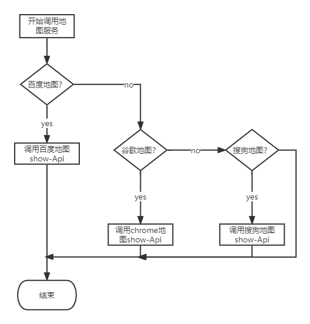
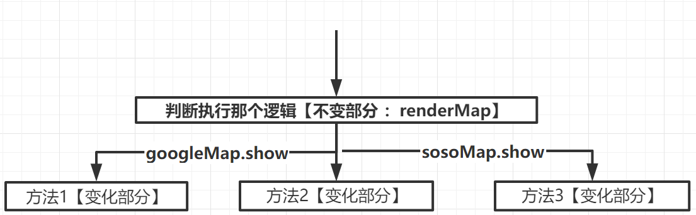

# 基础知识

## 面向对象的javascript_

### 多态

实际含义:统一操作作用于不同的对象上面，可以产生不同的解释和不同的执行结果。换句话说，给不同的对象发送同一消息的时候，这些对象会根据这个消息分别给出不同的反馈.

> **举个例子：** 主人让鸡、鸭分别发出叫声，但是各自发出的声音不同

```js
var makeSound = function( animal ){
if ( animal instanceof Duck ){
    console.log( '嘎嘎嘎' );
    }else if ( animal instanceof Chicken ){
    console.log( '咯咯咯' );
    }
};
var Duck = function(){};
var Chicken = function(){};
makeSound( new Duck() ); // 嘎嘎嘎
makeSound( new Chicken() ); // 咯咯咯

```

上面的代码体现了`多态性`当加入的动物越来越多，比如“狗” ， 则makeSound就会变得越来越大，变成一个巨大的函数


`多态`的背后思想就是 :  [ 做什么 ]  - [ 谁去做  ] - [  怎么做 ]  分离开来

换句话说：就是讲`不变的事物【动物发出叫声】`与`可能改变的事物【具体声音】`分离。


上述例子中：动物叫是不变的，但是不同类型的动物具体怎么叫是可变的，把不变的部分隔离出来，不可变的部分封装起来，具体操作如下：

```js
//  把不变的部分隔离出来：所有动物都会发出叫声
var makeSound = function( animal ){
	animal.sound();
};

// 把可变的部分各自封装起来

var Duck = function(){}
Duck.prototype.sound = function(){
    console.log( '嘎嘎嘎' );
};

var Chicken = function(){}
Chicken.prototype.sound = function(){
    console.log( '咯咯咯' );
};

makeSound( new Duck() ); // 嘎嘎嘎
makeSound( new Chicken() ); // 咯咯咯

```

现在我们可以向，鸡鸭发出叫唤，他们接收到消息后分别做出了不同的反应。

如果有一天，动物世界又加了一条狗，只需要添加如下代码，而不需要懂修改以前的`makeSound`函数

```js
var Dog = function(){}
Dog.prototype.sound = function(){
	console.log( '汪汪汪' );
};
makeSound( new Dog() ); // 汪汪汪
```

---


### 多态在面向对象程序设计中的作用

最根本的作用就是通过过程化的条件分支语句转换为对象的对泰兴，从而消除这些条件分支语句

假设要编写一个地图应用，google、百度，目前选择的是谷歌地图，谷歌地图API中提供了`show方法`，负责在页面上展示一整个地图，示例代码如下：

```js
var googleMap = {
    show: function(){
        console.log( '开始渲染谷歌地图' );
    }
};
var renderMap = function(){
    googleMap.show();
};
renderMap(); // 输出：开始渲染谷歌地图
```

后来因为某些原因，要把谷歌地图换成百度地图，为了让  `renderMap` 函数保持一定的弹性，
我们用一些条件分支来让  `renderMap` 函数同时支持谷歌地图和百度地图：  

```js
var googleMap = {
    show: function(){
    console.log( '开始渲染谷歌地图' );
    }
};
var baiduMap = {
    show: function(){
    console.log( '开始渲染百度地图' );
    }
};
var renderMap = function( type ){
    if ( type === 'google' ){
    	googleMap.show();
    }else if ( type === 'baidu' ){
        baiduMap.show();
    }
};
renderMap( 'google' ); // 输出：开始渲染谷歌地图
renderMap( 'baidu' ); // 输出：开始渲染百度地图
```

可以看到，虽然 `renderMap` 函数目前保持了一定的弹性，但这种弹性是很脆弱的，一旦需要替换成搜搜地图，那无疑必须得改动 `renderMap` 函数，继续往里面堆砌条件分支语句。


---

我们还是先把程序中相同的部分抽象出来，那就是显示某个地图

```js
var renderMap = function( map ){
    if ( map.show instanceof Function ){
 	   map.show();
    }
};

renderMap( googleMap ); // 输出：开始渲染谷歌地图
renderMap( baiduMap ); // 输出：开始渲染百度地图
```

上述代码，当我们想谷歌地图对象和百度地图对象发出‘展示地图’的消息时，会分别调用他们的`show方法`，就会产生不同的执行结果。


对象的多态性提示我们，‘做什么’、‘怎么做’ ，是可以分开的，即使以后增加了搜搜地图， `renderMap` 函数仍然不需要做任何改变，如下所示：

```js
var sosoMap = {
    show: function(){
  	  console.log( '开始渲染搜搜地图' );
    }
};
renderMap( sosoMap ); // 输出：开始渲染搜搜地图
```

流程图呈现前后比较：

* 前

  

  

* 后

  


### 封装

封装：目的是为了将信息隐藏


## this、call、apply

### this指向

具体到实际应用中，大致分为4种情况：

* 作为对象的方法调用
* 作为普通函数调用
* 构造器调用
* `Function.prototype.call `或者`Function.prototype.apply `


1、**作为对象的方法调用**

当函数作为对象的方法被调用时，this指向该对象

```js
// 声明
var obj = {
  a:1,
    getA:function(){
        alert(this === obj); // 输出true
        alert(this.a) // 输出1
    }
};

// 调用
obj.getA(); 

```

2、**作为普通函数调用**

当函数不作为对象的属性被调用时，也就是我们常说的普通函数方式，此时的 this 总是指
向全局对象。在浏览器的 JavaScript 里，这个全局对象是 window 对象。  

```js
 // 情况1
window.name = "globalName"

var getName = function(){
    return this.name;
}

console.log(getName())  // 输出：globaName

```

```js
 // 情况2
window.name = 'globalName'
var myObject = {
    name:'sven',
    getName:function(){
        return this.name
    }
}

var getName = myObject.getName;
console.log(getName())  // 输出：globaName
```

---

有时候我们会有一些困扰，比如在div节点的事件函数内部，有一个局部的`callback方法`，`callback方法`被作为普通函数调用时，`callback`内部的this指向了`window`,但我们往往是想让它指向该div节点，见如下代码：

```html
<html>
  <body>
    <div id="div1">我是一个 div</div>
  </body>
  <script>
    window.id = "window";
    document.getElementById("div1").onclick = function () {
      alert(this.id); // 输出： 'div1'
      var callback = function () {
        // 这里的this指向windows ， 因为是在function中，且赋值给了另一个变量callback
        // 因为并非作为一个对象的函数被调用、而是生命在全局下的fucntioin
        console.log(this); // 输出： 'window'
      };
      callback();
    };
  </script>
</html>

// 

```

如果想要callback中的this指向`dom`元素，可以用`that = this`，然后在其内部使用`that.id `代码如下

```js
document.getElementById( 'div1' ).onclick = function(){
    var that = this; // 保存 div 的引用
    var callback = function(){
        alert ( that.id ); // 输出： 'div1'
    }
    callback();
}
```

**3、构造器调用**

大部分javascript函数都可以当做构造器使用。构造器的外表跟普通函数一模一样，他们的区别在于被调用的方式。

- 当用new运算符调用函数是，该函数总会返回一个对象，而构造器中的this就只想返回的这个对象，代码如下：

  ```js
  var MyClass = function(){
      this.name = 'sven';
  };
  var obj = new MyClass();
  alert ( obj.name ); // 输出： sven
  ```

  但用 new 调用构造器时，还要注意一个问题，如果构造器显式地返回了一个 object 类型的对
  象，那么此次运算结果最终会返回这个对象，而不是我们之前期待的 this：  

  ```js
  var MyClass = function(){
      this.name = 'sven';
      return { // 显式地返回一个对象
     	  name: 'anne'
      }
  };
  var obj = new MyClass();
  alert ( obj.name ); // 输出： anne
  ```

  如果构造器不显式地返回任何数据，或者是返回一个非对象类型的数据，就不会造成上述问题：  

  ```js
  var MyClass = function(){
      this.name = 'sven'
      return 'anne'; // 返回 string 类型
  };
  var obj = new MyClass();
  alert ( obj.name ); // 输出： sven
  ```

  

**4、`Function.prototyp.call` 或者`Function.prototype.apply`调用**

  跟普通的函数调用相比，用 Function.prototype.call 或 Function.prototype.apply 可以动态地改变传入函数的 this：  

  ```js
  var obj1 = {
      name: 'sven',
      getName: function(){
    	  return this.name;
      }
  };
  var obj2 = {
      name: 'anne'
  };
  console.log( obj1.getName() ); // 输出: sven
  console.log( obj1.getName.call( obj2 ) ); // 输出： anne
  ```

---

  

### 丢失的this

  ```js
  var obj = {
      myName: 'sven',
      getName: function(){
    	  return this.myName;
      }
  };
  console.log( obj.getName() ); // 输出： 'sven'
  var getName2 = obj.getName;
  console.log( getName2() ); // 输出： undefined
  ```

  当调用 obj.getName 时， getName 方法是作为 obj 对象的属性被调用的，根据 2.1.1 节提到的规律，此时的 this 指向 obj 对象，所以 obj.getName()输出'sven'。  

---

  当用另外一个变量 getName2 来引用 obj.getName，并且调用 getName2 时，根据 2.1.2 节提到的规律，此时是普通函数调用方式， this 是指向全局 window 的，所以程序的执行结果是 undefined  

  >其实函数就是一段同步代码的语句集合，当将对象内部的函数赋值给全局变量`getName2`的时候，其实是将其内部打语句拷贝，然后进行赋值，如下所示

  ```js
  var getName2 = function(){
      return this.myName  
      // 因为全局作用域windows下并没有myName这个变量，所以this.myName = undefined【 注意这里的this指向window 】
  }
  ```

---

**例子2：**

`document.getElementById `这个方法名实在有点过长，我们大概尝试过用一个短的函数来代替它，如同 prototype.js 等一些框架所做过的事情：  

```js
var getId = function( id ){
	return document.getElementById( id );
};
getId( 'div1' );
```

我们也许思考过为什么不能用下面这种更简单的方式：  

```js
var getId = document.getElementById;
getId( 'div1' );
```

```html
<html>
    <body>
  	  <div id="div1">我是一个 div</div>
    </body>
<script>
    var getId = document.getElementById;
    getId( 'div1' );
</script>
</html>
```

​		在 Chrome、 Firefox、 IE10 中执行过后就会发现，这段代码抛出了一个异常。这是因为许多引擎的 `document.getElementById `方法的内部实现中需要用到 this。这个 this 本来被期望指向document，当 `getElementById `方法作为 document 对象的属性被调用时，方法内部的 this 确实是指向 document 的。

​		但当用 `getId `来引用`document.getElementById `之后， 再调用 `getId`，此时就成了普通函数调用，函数内部的 this 指向了 window，而不是原来的 document。我们可以尝试利用 apply 把 document 当作 this 传入 `getId `函数，帮助“修正” this：  

```js
document.getElementById = (function( func ){
    console.log(arguments,'arguments')  // 在js的function中，默认会有一个arguments参数，可接收函数传入的参数
    console.log(this,'this')  // 这里的this指向windows
    return function(){
   		 return func.apply( document, arguments );
    }
})( document.getElementById );
var getId = document.getElementById;
var div = getId( 'div1' );
alert (div.id); // 输出： div1
```

```html
<html>
  <body>
    <div id="div1">我是一个 div</div>
  </body>
  <script>
    document.getElementById = (function( func ){
        // 这里如果获取arguments，则表示func这个形参对应的实际参数
        return function(){
            console.log(this,'this')  // 这里的this指向windows
            return func.apply( document, arguments ); // 这里的arguments是指代getId传入的参数：比如div1
        }
    })( document.getElementById );
    var getId = document.getElementById;  // 其内部的this原本是指向windows
    var div = getId( 'div1' );
    console.dir(div)
    alert (div.id); // 输出： div1
  </script>
</html>

```


#### 拓展

```js
//函数声明：使用function声明函数，并指定函数名。　

function setFn() {    // coding   }

//函数表达式：使用function声明函数，但未指定函数名，将匿名函数赋予一个变量。

var setFn = function() {    // coding}

//匿名函数：使用function关键字声明函数，但未指定函数名。匿名函数属于函数表达式，匿名函数有很多作用，赋予一个变量则创建函数，赋予一个事件则成为事件处理程序或创建闭包等等。

function() {   } // coding
    
   
```

`(function(){})`是一个标准的函数定义、但是没有赋值给任何变量，所以是没有名字的函数，叫匿名函数，相当于一个匿名的function

```js
function foo() {...}     // 这是定义，Declaration；定义只是让解释器知道其存在，但是不会运行。
foo();                   // 这是语句，Statement；解释器遇到语句是会运行它的。
```


### call 和apply

#### 区别

`call` 和 `apply` 用法一模一样，区别在于传入参数形式不同

* `apply`接收2个参数，第一个参数指定了函数体内this对象的指向；第二个参数为一个带下标的集合，可以为类数组

  ```js
  var func = function( a, b, c ){
      alert ( [ a, b, c ] ); // 输出 [ 1, 2, 3 ]
  };
  func.apply( null, [ 1, 2, 3 ] ); 
  //参数 1、 2、 3 被放在数组中一起传入 func 函数，它们分别对应 func 参数列表中的 a、 b、 c。
  ```

* `call`传入的参数数量不固定，跟apply不同的是，第一个参数也是代表函数体内的this指向，第二个参数开始往后，每个参数被一次传入函数；

  ```js
  var func = function( a, b, c ){
      alert ( [ a, b, c ] ); // 输出 [ 1, 2, 3 ]
  };
  func.call( null, 1, 2, 3 );
  ```

​		  call 是包装在 apply 上面的一颗语法糖，如果我们明确地知道函数接受多少个参数，而且想一目了然地表达形参和实参的对应关系，那么也可以用 call 来传送参数。
​		当使用 call 或者 apply 的时候，如果我们传入的第一个参数为 null，函数体内的 this 会指
向默认的宿主对象，在浏览器中则是 window：  

  ```js
  
  var func = function( a, b, c ){
  	alert ( this === window ); // 输出 true
  };
  func.apply( null, [ 1, 2, 3 ] )
  ```

如果再严格模式下，函数体内的this还是`null`

  ```js
  var func = function( a, b, c ){
  "use strict";
  	alert ( this === null ); // 输出 true
  }
  func.apply( null, [ 1, 2, 3 ] );
  
  ```

#### call 和 apply 用途

【1】改变this指向

call 和 apply 最常见的用途是改变函数内部的 this 指向，我们来看个例子：  

```js
var obj1 = {
	name: 'sven'
};
var obj2 = {
	name: 'anne'
};

window.name = 'window';
var getName = function(){
	alert ( this.name );
};

getName(); // 输出: window
getName.call( obj1 ); // 输出: sven
getName.call( obj2 ); // 输出: anne
```

【2】

 

  

  

  ​				

