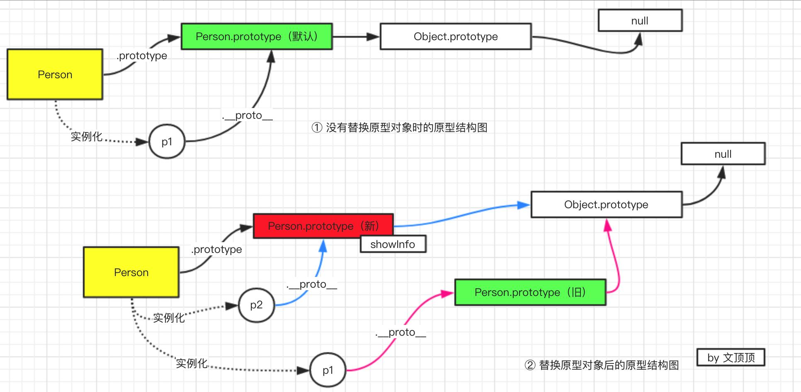
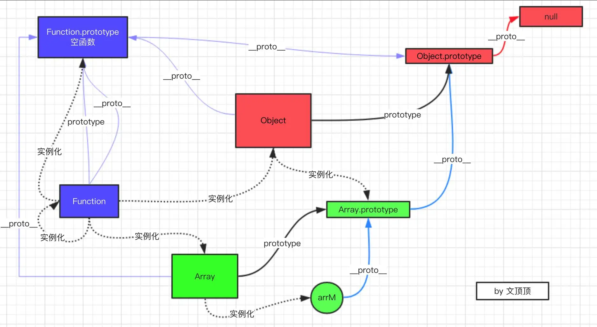

# 基础知识

## 面向对象的javascript_

### 多态

实际含义:统一操作作用于不同的对象上面，可以产生不同的解释和不同的执行结果。换句话说，给不同的对象发送同一消息的时候，这些对象会根据这个消息分别给出不同的反馈.

> **举个例子：** 主人让鸡、鸭分别发出叫声，但是各自发出的声音不同

```js
var makeSound = function( animal ){
if ( animal instanceof Duck ){
    console.log( '嘎嘎嘎' );
    }else if ( animal instanceof Chicken ){
    console.log( '咯咯咯' );
    }
};
var Duck = function(){};
var Chicken = function(){};
makeSound( new Duck() ); // 嘎嘎嘎
makeSound( new Chicken() ); // 咯咯咯

```

上面的代码体现了`多态性`当加入的动物越来越多，比如“狗” ， 则makeSound就会变得越来越大，变成一个巨大的函数


`多态`的背后思想就是 :  [ 做什么 ]  - [ 谁去做  ] - [  怎么做 ]  分离开来

换句话说：就是讲`不变的事物【动物发出叫声】`与`可能改变的事物【具体声音】`分离。


上述例子中：动物叫是不变的，但是不同类型的动物具体怎么叫是可变的，把不变的部分隔离出来，不可变的部分封装起来，具体操作如下：

```js
//  把不变的部分隔离出来：所有动物都会发出叫声
var makeSound = function( animal ){
	animal.sound();
};

// 把可变的部分各自封装起来

var Duck = function(){}
Duck.prototype.sound = function(){
    console.log( '嘎嘎嘎' );
};

var Chicken = function(){}
Chicken.prototype.sound = function(){
    console.log( '咯咯咯' );
};

makeSound( new Duck() ); // 嘎嘎嘎
makeSound( new Chicken() ); // 咯咯咯

```

现在我们可以向，鸡鸭发出叫唤，他们接收到消息后分别做出了不同的反应。

如果有一天，动物世界又加了一条狗，只需要添加如下代码，而不需要懂修改以前的`makeSound`函数

```js
var Dog = function(){}
Dog.prototype.sound = function(){
	console.log( '汪汪汪' );
};
makeSound( new Dog() ); // 汪汪汪
```

---


### 多态在面向对象程序设计中的作用

最根本的作用就是通过过程化的条件分支语句转换为对象的对泰兴，从而消除这些条件分支语句

假设要编写一个地图应用，google、百度，目前选择的是谷歌地图，谷歌地图API中提供了`show方法`，负责在页面上展示一整个地图，示例代码如下：

```js
var googleMap = {
    show: function(){
        console.log( '开始渲染谷歌地图' );
    }
};
var renderMap = function(){
    googleMap.show();
};
renderMap(); // 输出：开始渲染谷歌地图
```

后来因为某些原因，要把谷歌地图换成百度地图，为了让  `renderMap` 函数保持一定的弹性，
我们用一些条件分支来让  `renderMap` 函数同时支持谷歌地图和百度地图：  

```js
var googleMap = {
    show: function(){
    console.log( '开始渲染谷歌地图' );
    }
};
var baiduMap = {
    show: function(){
    console.log( '开始渲染百度地图' );
    }
};
var renderMap = function( type ){
    if ( type === 'google' ){
    	googleMap.show();
    }else if ( type === 'baidu' ){
        baiduMap.show();
    }
};
renderMap( 'google' ); // 输出：开始渲染谷歌地图
renderMap( 'baidu' ); // 输出：开始渲染百度地图
```

可以看到，虽然 `renderMap` 函数目前保持了一定的弹性，但这种弹性是很脆弱的，一旦需要替换成搜搜地图，那无疑必须得改动 `renderMap` 函数，继续往里面堆砌条件分支语句。


---

我们还是先把程序中相同的部分抽象出来，那就是显示某个地图

```js
var renderMap = function( map ){
    if ( map.show instanceof Function ){
 	   map.show();
    }
};

renderMap( googleMap ); // 输出：开始渲染谷歌地图
renderMap( baiduMap ); // 输出：开始渲染百度地图
```

上述代码，当我们想谷歌地图对象和百度地图对象发出‘展示地图’的消息时，会分别调用他们的`show方法`，就会产生不同的执行结果。


对象的多态性提示我们，‘做什么’、‘怎么做’ ，是可以分开的，即使以后增加了搜搜地图， `renderMap` 函数仍然不需要做任何改变，如下所示：

```js
var sosoMap = {
    show: function(){
  	  console.log( '开始渲染搜搜地图' );
    }
};
renderMap( sosoMap ); // 输出：开始渲染搜搜地图
```

流程图呈现前后比较：

* 前

  

  

* 后

  


### 封装

**封装：**指代 ‘ 任何形式的封装 ’，包括隐藏实现细节、设计细节、以及隐藏对象类型...

> **封装细节：**封装使得内部变化对于外部来说，是不可见的，对象对自己的行为负责。其他对象不关心它的内部实现

#### 封装数据

由于javascript没有private、public、protected等关键字来提供不同的访问权限，所以只能通过依赖变量的作用域来实现封装特性，模拟出相同的效果

除了es6提供的let外，一般可以通过函数来创建作用域：

```js
var myObject = (function(){
    var __name = 'sven' //私有变量（private）
    return {
        getName:function(){
        		return __name
    	}
    }
})();

console.log(myObject.getName())  // sven
console.log(myObject.__name)  // undefined
```

另外值得一提的是：es6中可以通过`Symbol`创建私有属性

#### 封装类型（暂不介绍）

#### 封装变化（暂不介绍）

### 原型模式和基于原型继承的Javascript对象系统

在以类为中心的面向对象编程语言中，类和对象的关系可以想象成【铸模】 - 【铸件】的关系，对象总是从类中创建而来。


## this、call、apply

### this指向

具体到实际应用中，大致分为4种情况：

* 作为对象的方法调用
* 作为普通函数调用
* 构造器调用
* `Function.prototype.call `或者`Function.prototype.apply `


1、**作为对象的方法调用**

当函数作为对象的方法被调用时，this指向该对象

```js
// 声明
var obj = {
  a:1,
    getA:function(){
        alert(this === obj); // 输出true
        alert(this.a) // 输出1
    }
};

// 调用
obj.getA(); 

```

2、**作为普通函数调用**

当函数不作为对象的属性被调用时，也就是我们常说的普通函数方式，此时的 this 总是指
向全局对象。在浏览器的 JavaScript 里，这个全局对象是 window 对象。  

```js
 // 情况1
window.name = "globalName"

var getName = function(){
    return this.name;
}

console.log(getName())  // 输出：globaName

```

```js
 // 情况2
window.name = 'globalName'
var myObject = {
    name:'sven',
    getName:function(){
        return this.name
    }
}

var getName = myObject.getName;
console.log(getName())  // 输出：globaName
```

---

有时候我们会有一些困扰，比如在div节点的事件函数内部，有一个局部的`callback方法`，`callback方法`被作为普通函数调用时，`callback`内部的this指向了`window`,但我们往往是想让它指向该div节点，见如下代码：

```html
<html>
  <body>
    <div id="div1">我是一个 div</div>
  </body>
  <script>
    window.id = "window";
    document.getElementById("div1").onclick = function () {
      alert(this.id); // 输出： 'div1'
      var callback = function () {
        // 这里的this指向windows ， 因为是在function中，且赋值给了另一个变量callback
        // 因为并非作为一个对象的函数被调用、而是生命在全局下的fucntioin
        console.log(this); // 输出： 'window'
      };
      callback();
    };
  </script>
</html>

// 

```

如果想要callback中的this指向`dom`元素，可以用`that = this`，然后在其内部使用`that.id `代码如下

```js
document.getElementById( 'div1' ).onclick = function(){
    var that = this; // 保存 div 的引用
    var callback = function(){
        alert ( that.id ); // 输出： 'div1'
    }
    callback();
}
```

**3、构造器调用**

大部分javascript函数都可以当做构造器使用。构造器的外表跟普通函数一模一样，他们的区别在于被调用的方式。

- 当用new运算符调用函数是，该函数总会返回一个对象，而构造器中的this就只想返回的这个对象，代码如下：

  ```js
  var MyClass = function(){
      this.name = 'sven';
  };
  var obj = new MyClass();
  alert ( obj.name ); // 输出： sven
  ```

  但用 new 调用构造器时，还要注意一个问题，如果构造器显式地返回了一个 object 类型的对
  象，那么此次运算结果最终会返回这个对象，而不是我们之前期待的 this：  

  ```js
  var MyClass = function(){
      this.name = 'sven';
      return { // 显式地返回一个对象
     	  name: 'anne'
      }
  };
  var obj = new MyClass();
  alert ( obj.name ); // 输出： anne
  ```

  如果构造器不显式地返回任何数据，或者是返回一个非对象类型的数据，就不会造成上述问题：  

  ```js
  var MyClass = function(){
      this.name = 'sven'
      return 'anne'; // 返回 string 类型
  };
  var obj = new MyClass();
  alert ( obj.name ); // 输出： sven
  ```

  

**4、`Function.prototyp.call` 或者`Function.prototype.apply`调用**

  跟普通的函数调用相比，用 Function.prototype.call 或 Function.prototype.apply 可以动态地改变传入函数的 this：  

  ```js
  var obj1 = {
      name: 'sven',
      getName: function(){
    	  return this.name;
      }
  };
  var obj2 = {
      name: 'anne'
  };
  console.log( obj1.getName() ); // 输出: sven
  console.log( obj1.getName.call( obj2 ) ); // 输出： anne
  ```

---

  原型链图：





### 丢失的this

  ```js
  var obj = {
      myName: 'sven',
      getName: function(){
    	  return this.myName;
      }
  };
  console.log( obj.getName() ); // 输出： 'sven'
  var getName2 = obj.getName;
  console.log( getName2() ); // 输出： undefined
  ```

  当调用 obj.getName 时， getName 方法是作为 obj 对象的属性被调用的，根据 2.1.1 节提到的规律，此时的 this 指向 obj 对象，所以 obj.getName()输出'sven'。  

---

  当用另外一个变量 getName2 来引用 obj.getName，并且调用 getName2 时，根据 2.1.2 节提到的规律，此时是普通函数调用方式， this 是指向全局 window 的，所以程序的执行结果是 undefined  

  >其实函数就是一段同步代码的语句集合，当将对象内部的函数赋值给全局变量`getName2`的时候，其实是将其内部打语句拷贝，然后进行赋值，如下所示

  ```js
  var getName2 = function(){
      return this.myName  
      // 因为全局作用域windows下并没有myName这个变量，所以this.myName = undefined【 注意这里的this指向window 】
  }
  ```

---

**例子2：**

`document.getElementById `这个方法名实在有点过长，我们大概尝试过用一个短的函数来代替它，如同 prototype.js 等一些框架所做过的事情：  

```js
var getId = function( id ){
	return document.getElementById( id );
};
getId( 'div1' );
```

我们也许思考过为什么不能用下面这种更简单的方式：  

```js
var getId = document.getElementById;
getId( 'div1' );
```

```html
<html>
    <body>
  	  <div id="div1">我是一个 div</div>
    </body>
<script>
    var getId = document.getElementById;
    getId( 'div1' );
</script>
</html>
```

​		在 Chrome、 Firefox、 IE10 中执行过后就会发现，这段代码抛出了一个异常。这是因为许多引擎的 `document.getElementById `方法的内部实现中需要用到 this。这个 this 本来被期望指向document，当 `getElementById `方法作为 document 对象的属性被调用时，方法内部的 this 确实是指向 document 的。

​		但当用 `getId `来引用`document.getElementById `之后， 再调用 `getId`，此时就成了普通函数调用，函数内部的 this 指向了 window，而不是原来的 document。我们可以尝试利用 apply 把 document 当作 this 传入 `getId `函数，帮助“修正” this：  

```js
document.getElementById = (function( func ){
    console.log(arguments,'arguments')  // 在js的function中，默认会有一个arguments参数，可接收函数传入的参数
    console.log(this,'this')  // 这里的this指向windows
    return function(){
   		 return func.apply( document, arguments );
    }
})( document.getElementById );
var getId = document.getElementById;
var div = getId( 'div1' );
alert (div.id); // 输出： div1
```

```html
<html>
  <body>
    <div id="div1">我是一个 div</div>
  </body>
  <script>
    document.getElementById = (function( func ){
        // 这里如果获取arguments，则表示func这个形参对应的实际参数
        return function(){
            console.log(this,'this')  // 这里的this指向windows
            return func.apply( document, arguments ); // 这里的arguments是指代getId传入的参数：比如div1
        }
    })( document.getElementById );
    var getId = document.getElementById;  // 其内部的this原本是指向windows
    var div = getId( 'div1' );
    console.dir(div)
    alert (div.id); // 输出： div1
  </script>
</html>

```


#### 拓展

```js
//函数声明：使用function声明函数，并指定函数名。　

function setFn() {    // coding   }

//函数表达式：使用function声明函数，但未指定函数名，将匿名函数赋予一个变量。

var setFn = function() {    // coding}

//匿名函数：使用function关键字声明函数，但未指定函数名。匿名函数属于函数表达式，匿名函数有很多作用，赋予一个变量则创建函数，赋予一个事件则成为事件处理程序或创建闭包等等。

function() {   } // coding
    
   
```

`(function(){})`是一个标准的函数定义、但是没有赋值给任何变量，所以是没有名字的函数，叫匿名函数，相当于一个匿名的function

```js
function foo() {...}     // 这是定义，Declaration；定义只是让解释器知道其存在，但是不会运行。
foo();                   // 这是语句，Statement；解释器遇到语句是会运行它的。
```


### call 和apply

#### 区别

`call` 和 `apply` 用法一模一样，区别在于传入参数形式不同

* `apply`接收2个参数，第一个参数指定了函数体内this对象的指向；第二个参数为一个带下标的集合，可以为类数组

  ```js
  var func = function( a, b, c ){
      alert ( [ a, b, c ] ); // 输出 [ 1, 2, 3 ]
  };
  func.apply( null, [ 1, 2, 3 ] ); 
  //参数 1、 2、 3 被放在数组中一起传入 func 函数，它们分别对应 func 参数列表中的 a、 b、 c。
  ```

* `call`传入的参数数量不固定，跟apply不同的是，第一个参数也是代表函数体内的this指向，第二个参数开始往后，每个参数被一次传入函数；

  ```js
  var func = function( a, b, c ){
      alert ( [ a, b, c ] ); // 输出 [ 1, 2, 3 ]
  };
  func.call( null, 1, 2, 3 );
  ```

​		  call 是包装在 apply 上面的一颗语法糖，如果我们明确地知道函数接受多少个参数，而且想一目了然地表达形参和实参的对应关系，那么也可以用 call 来传送参数。
​		当使用 call 或者 apply 的时候，如果我们传入的第一个参数为 null，函数体内的 this 会指
向默认的宿主对象，在浏览器中则是 window：  

  ```js
  
  var func = function( a, b, c ){
  	alert ( this === window ); // 输出 true
  };
  func.apply( null, [ 1, 2, 3 ] )
  ```

如果再严格模式下，函数体内的this还是`null`

  ```js
  var func = function( a, b, c ){
  "use strict";
  	alert ( this === null ); // 输出 true
  }
  func.apply( null, [ 1, 2, 3 ] );
  
  ```

---

- **手写call函数**

```js
    function show(...args){
        console.log(args)
        console.log(this.name);
    }
```

由于show是一个函数，在javascript中，所有的函数都是有Funcition这个构造函数进行是实例化的对象

接下来我们要调用一下`show`这个方法，但是由于内部内有定义name这个属性，故会报错

- 怎么办 ?  - 【  自己手写一个apply 修改show函数内部this 的指向 】

  ```js
      Function.prototype.myCall = function(ctx,...args){
          // this 是Function生成的构造函数
           //   Function中的this ƒ show(...args){
           //   console.log(args)
          //    console.log(this.name);
         //       }
           // 步骤
          // 1  - 将方法挂载到我们传入的ctx
          // 2 -  将挂载以后的方法调用
          // 3 - 将我们添加的这个属性删除
          
          console.log('Function中的this',this);
          ctx.fn = this
          ctx.fn(...args)
      }
  	//  一般call函数需要接收2个参数，第一个参数是，所调用函数this的上下文，第2个参数就是所调用函数的形参
  
  ```

调用一下`show`函数

```js
	show.myCall({name:'chamberlain'},'call1','call2','call3')

```

---

- 手写apply

```js
function show(...args){
    console.log(args)
    console.log(this.name);
}

Function.prototype.myApply = function(ctx,args = []){
    ctx.fn = this
    ctx.fn(...args)
    delete ctx.fn
}

show.myApply({name:'chucheng'},['jack','allen','martain'])
```

---

- 手写bind

```js
Function.prototype.myBind = function(ctx,...args1){
    console.log(...args1,'args1')

    return (args2)=>{
        ctx.fn = this
        ctx.fn(...args1.concat(args2))
        delete ctx.fn
    }
}

let bind =  show.myBind({name:'danina'},'jack','allen','martain')
console.log(bind,'bind')
```

#### call 和 apply 用途

【1】改变this指向

call 和 apply 最常见的用途是改变函数内部的 this 指向，我们来看个例子：  

```js
var obj1 = {
	name: 'sven'
};
var obj2 = {
	name: 'anne'
};

window.name = 'window';
var getName = function(){
	alert ( this.name );
};

getName(); // 输出: window
getName.call( obj1 ); // 输出: sven
getName.call( obj2 ); // 输出: anne
```

【2】`Function.prototype.bind`

大部分高级浏览器都实现了内置的`Function.prototype.bind` 用来指定函数内部的this指向，即使没有，我们来模拟一个。

- 简单版本：

```js
  Function.prototype.bind = function (context) {
    var self = this;
    console.log(this,'this2');            // ƒ (input) {console.log(this.name,input);} 
    console.log(context,'context');       // context
    console.log(arguments,'arguments1');  // 0: {name: 'sven'}
    return function () {
      console.log(arguments,'arguments2'); //0: "chucheng"
      return self.apply(context,arguments)  // 这里才是执行console.log(this.name)的地方
    } 
  }
  var obj = {
    name:'sven'
  }

  var func = function () {
    console.log(this.name); //sven
  }.bind(obj)

  func('chucheng')

  // 解析：
  /* 
    1 - 由于func是对f().bind(obj)的引用，所以func是一个匿名函数
    2 - 当执行func时，实际上执行的是 self.apply(context,arguments)
    3 - obj 传入形参context，其指定了context为func函数体内的this
    4 - 把func看成一个有名函数，最后执行的是bind内部返回的函数
    5 - func传入的函数，实际上是传递给return function(){} 的形参，也就是内部的arguments这个类数组元素
  */


```

复杂版本：

```js
<script>
  Function.prototype.bind = function () {
    var self = this,
    context = [].shift.call(arguments) //需要绑定的this上下文
    args = [].slice.call(arguments) // 剩余参数转化成数组
    return function () {
      // 这里是最后真正执行的函数
      return self.apply(context,[].concat.call(args,[].slice.call(arguments)))
      // 执行新函数的时候，会把之前传入的context当做新函数体内的this
      // 并且组合两次分别传入的参数，作为新函数的参数
      // args 表示bind除了obj之外的参数 | arguments表示func中传入的实参
    }
  }
  var obj = {
    name:'sven'
  }

  var func = function (a,b,c,d) {
    console.log(this.name); //sven
    console.log([a,b,c,d]); //[1,2,3,4]
  }.bind(obj,1,2)

  func(3,4)

</script>

```


 【3】借用其他对象的方法

  函数的参数列表`arguments`是一个类数组对象，虽然它有“ 下标 ”，但它并非真正的数组，所以也不能像数组一样，进行排序操作或者往集合里添加一个新的元素. 在这种情况下，我们常常会使用`Array.proptype`对象上的方法。

比如我们想往`argument`中添加一个新的元素，通常会借用`Array.proptype.push`:

```js

(function(){
    	Array.proptype.push.call(argument,3);
    	console.log(arguments)   //输出[1,2,3]
})(1,2)

```

想操作`argument`转城真正的数组的时候，我们经常非常频繁地找`Array.proptype`对象借用方法

想把`arguments`转成真正的数组的时候，可以借用`Array.prototype.slice`方法。

想截取`arguments`列表中的头一个元素时，可以借用`Array.prototype.shift`方法

  

  ​				

## 闭包 、高阶函数

### 闭包

> 闭包的形成与`变量的作用域`以及`变量的生存周期`密切相关


#### 变量的作用域

概念：变量的有效范围 

**情况1：**在函数中声明一个`var`变量，这时候的变量就是局部变量，只有在该函数内部才能访问到这个变量，在函数外部无法访问


在javascript中，函数可以用来创造作用域，函数内部的变量对内可见、对外不可见

搜索变量的路径：从内部往外找，直到搜索到全局对象为止，案例如下：

```js

var a = 1

var func = function (){
  var b = 2;
  var func2 = function(){
      var c = 3;
      alert(b);  //2
      alert(a);  //1
  }
  func2();
  alert(c);    //  Uncaught ReferenceError :c is not defined
};


```

---

#### 变量生存周期

|          | 生存周期            | 备注                       |
| -------- | ------------------- | -------------------------- |
| 全局变量 | 永久性              | 生命周期一直存在，除非销毁 |
| 局部变量 | 函数调用结束 - 销毁 |                            |

```js
var fun = function () {
    var a = 1;  // 退出函数后局部变量a 将被销毁
    alert(a)  
}
```

```js
var fun = function(){
    var a = 1;
    return function(){
        a++;
        alert( a )
    }
}

var f = func();
```

#### 闭包的更多作用

- 封装变量

> 闭包可以帮助把一些不需要暴露在全局的变量封装城 “ 私有变量 ” 

```js

 var mult = function(){
     var a = 1;
     for ( var i = 0 ;l = arguments.length;i<l; i++ ){
         a = a* arguments[i]
     }
     return a
 }

```

`mult`函数接受一些number类型的参数，并返回这些参数的乘积

现在我们觉得对于那些相同参数来说，每次都进行计算是一种浪费，我们可以加入缓存机制来提高这个函数的性能；

```js

var cache = {};
var mult = function(){
    var args = Array.prototype.join.call(argument,',')
    if(cache[ args ]){
        return cache[ args ]
    }
    
    var a = 1;
    for ( var i = 0; l = arguments.length;i<l;i++ ){
        a = a * arguments[i]
    }
    return cache[ args ] = a;
}

alert( mult(1,2,3) )   //6
alert( mult(1,2,3) )   //6

```

---

问题：由于cache这个变量仅仅在mult函数中被使用，与其让cache变量跟mult函数一起平行得暴露在全局作用域下，不如把它封闭在mult函数内部，这样可以减少页面中的全局变量，以避免这个变量被其他地方误操作而影响

```js

var mult = (function(){
    var cache = {};
 	return function(){
        var args = Array.prototype.join.call(argument,',')
        if(cache[ args ]){
            return cache[ args ]
        }

        var a = 1;
        for ( var i = 0; l = arguments.length;i<l;i++ ){
            a = a * arguments[i]
        }
        return cache[ args ] = a;
    }
})();
 

```

再优化

```js


var mult = (function(){
    var cache = {};
    var calculate = function(){
        var a = 1;
        for ( var i = 0; l = arguments.length;i<l;i++ ){
            a = a * arguments[i]
        }
        return a;
    },
        
 	return function(){
        var args = Array.prototype.join.call(argument,',')
        if(cache[ args ]){
            return cache[ args ]
        }
        return cache[ args ] = calculate.apply(null,arguments);
        // 也可以这么写： return cache[ args ] = calculate.call(null,...arguments);
         // 注意，这里的的第一个参数如果是null，既指向全局对象
    }
})();
 


```

- 闭包的另外一个用途：延续局部变量的寿命

#### 高阶函数实现AOP

- [b站的相关视频链接](https://www.bilibili.com/video/BV1ET4y1F7B9?spm_id_from=333.337.search-card.all.click) (高阶函数之AOP切片编程)

>所谓的AOP就是在执行原业务逻辑的前后插入，2段代码逻辑，从而实现函数的动态植入
>
>```js
>// 原来
>fn()
>
>// 植入后
>fn_before()
>fn()
>fn_after()
>
>```

代码讲解过程：

```js
        Function.prototype.before = function (callback){
            var _that = this
            // 这里的this是谁，要看，是谁调用了before，由下面代码知道是fn调用了before，所以this = fn
            return function(){
                callback()
                _that()
            }
        }
		// fn 是有Function实例化之后的一个对象
        var fn = function () {
            console.log('最原始函数')
        }
        var newFn =  fn.before(()=>{
            console.log('fn-之前执行')
        })
        
        newFn()
        // fn-之前执行
        // 最原始函数
```

优化：

```js
        Function.prototype.before = function (beforeFn){
            var _self = this
            return function(){
                beforeFn.apply(this,arguments)
                return _self.apply(this,arguments)
            }
        }
        var fn = function () {
            console.log('最原始函数')
        }
        var newFn =  fn.before(()=>{
            console.log('fn-之前执行')
        })
        newFn()
        // fn-之前执行
        // 最原始函数
```

在优化( 加入后置函数 )

```js
        Function.prototype.before = function (beforeFn){
            var _self = this
            return function(){
                beforeFn.apply(this,arguments)
                return _self.apply(this,arguments)
            }
        }
        Function.prototype.after = function (afterFn){
            var _self = this
            // 注意：这里的this只带的是最后调用after
            // 也就是执行完fn.before(()=>{})之后，调用的
            // 而执行fn.before(()=>{})返回了一个function(){}
            // 也就是最后返回的 function 调用了after，既this 就是 这个function 
            /*  function(){
                    beforeFn.apply(this,arguments)
                    return _self.apply(this,arguments)
            } */
            return function(){
                var ret = _self.apply(this,arguments)
                afterFn.apply(this.arguments)
                return ret
            }
        }
        var fn = function () {
            console.log('最原始函数')
        }
        var newFn =  fn.before(()=>{
            console.log('fn-之前执行')
        }).after(function(){
            console.log('fn-之后执行')
        })
        newFn()
        // fn-之前执行
        // 最原始函数
        // fn-之后执行
```

#### 高阶函数的其他应用

函数柯里化`currying`

一个函数首先会接收一些参数，接收这些参数之后，该函数并不会立即求值，而是立即返回另外一个函数，刚才传入的参数在函数形成的闭包中被保存起来。待到函数真正需要求值的时候，之前传入的所有参数都会被一次性用于求值。

```js

	var currying = function (fn) {
        var args = []
        return function (){
            if(arguments.length === 0 ){
                return fn.apply(this,args)
            }else {
                [].push.apply(args,arguments)
                return argumtns.callee;
            }
        }
    }
    
    var cost = (function (){
        var money = 0 ;
        
        returen function (){
            for (var i = 0; l<arguments.length; i<l;i++) {
                money += arguments[i]
            }
            return money
        }
    })();

	var cost = currying(cost)
	cost(100)	// 未真正求值
	cost(200)   // 未真正求值
	cost(300)   // 未真正求值

	cost()  // 求值并输出 ：600

```


## 工厂模式

在前端中，但项目需要大量创建对象的时候，我们可以借助工厂模式，将对象进行批量生产

```js
<!DOCTYPE html>
<html lang="en">
  <head>
    <meta charset="UTF-8" />
    <meta http-equiv="X-UA-Compatible" content="IE=edge" />
    <meta name="viewport" content="width=device-width, initial-scale=1.0" />
    <title>Document</title>
    <script>
      function Person(name) {
        this.name = name;
      }
      Person.prototype.getName = function () {
        console.log(this.name);
      };

      function Car(model) {
        this.model = model;
      }
      Car.prototype.getModel = function () {
        console.log(this.model);
      };

      function create(type, param) {
         // 这里的this，如果是通过new进入的话，就指向new出来的对象
         //            如果是通过普通函数调用，则this有可能指向window或者其他顶级对象
          
          
        // return new this[type](param);
        if (this instanceof create) {
          //instanceof会判断后面的构造函数的原型，是不是存在在前面这个对象的原型链里
          return new this[type](param);
        } else {
          return new create(type, param);
        }
      }
      create.prototype = {
        person: Person,
        car: Car,
      };

      var person1 = new create("person", "zhang san");
      var car1 = create("car", "Benz");

      person1.getName(); //zhang san
      car1.getModel(); //Benz

      /*
        new create('person','zhang san') ==> {
          __proto__:create.prototype
        }

        person1 = new this[type](param) = new Person('zhang san') ==> {
          __proto__:Person.prototype
          name:'zhang san'
        } 
      */
    </script>
  </head>
  <body></body>
</html>

```


## 观察者模式

`观察者模式`又叫做发布订阅模式或者消息模式，是设计模式中非常注明也是非常重要的一种模式。

这种模式一般会定义一个主题和众多个体，这里可以想想城一个消息中心，里面有各种各样的消息，众多的个体可以订阅不同的消息，当未来消息中心发布某条消息的时候，订阅过他的个体就会得到通知。


## 单例模式

单例模式定义：保证一个类仅有一个实力，并且提供一个访问他的全局访问点。

单例模式是一种常见的设计模式，有一些对象我们往往只需要一个，比如线程池、全局缓存、浏览器中的window对象等等。

在javascript开发中，单例模式的用途非常广泛。试想一下，当我们单机登录按钮的时候，页面中会出现一个登录浮窗，而这个登录浮窗是唯一的，无论单机多少次登录按钮，这个浮窗都只会被穿件一次，name这个登录浮窗就适合用单例模式来创建。

```js
      // -------不安全-----------------------------
      var _unique = null;

      function createSingle() {
        var obj = {
          a: 1,
        };
        if (_unique === null) {
          _unique = obj;
        }
        return _unique;
      }

      var a = createSingle();
      //   _unique = null--不安全
      var b = createSingle();

      console.log(a === b); //true

      // -------安全--------------------------------
      var createSingle2 = (function () {
        var _unique2 = null;
        function single() {
          return {
            a: 1,
          };
        }
        return function () {
          if (_unique2 === null) {
            _unique2 = single();
          }
          return _unique2;
        };
      })();

      var a2 = createSingle2();
      var b2 = createSingle2();
      console.log(a2 === b2); //true

```


### 用代理实现单例模式 （★ 重点）

```js
var CreateDiv = function (html) {
    this.html = html;
    this.init()
}

CreateDiv.prototype.init = function(){
    var div = document.createElement('div')
    div.innerHTML = this.html;
    document.body.appendChild(div)
}

// 引入代理类proxySingletonCreateDiv( 负责管理单例模式的逻辑类 )
var ProxySingletonCreateDiv = (function(){
    var instance;
    return function (html){
        if(!instance){
            instance = new CreateDiv(html)
        }
        return instance
    }
})();


var a = new ProxySingletonCreateDiv('sven1')
var b = new ProxySingletonCreateDiv('sven2')

alert(a===b) // true
```


### 通用的惰性单例

我们把创建实例对象的职责、管理单例的职责分别放在两个方法

```js

    var getSingle = function(fn){
        var result;
        return function () {
            console.log(this,'this'); // window 由于最后执行getSingle - return出去的函数的作用域是在window下
            console.log(arguments,'arguments') // 1,2
            return result || ( resule = fn.apply(this,arguments))
        }
    }

    var createLoginLayer = function () {
        var div = document.createElement('div')
        div.innerHTML = '我是登录弹窗'
        div.style.display = 'none'
        document.body.appendChild(div)
        return div
    }

    var createSingleLoginLayer = getSingle(createLoginLayer)
    document.getElementById('loginBtn').onclick = function () {
        console.log(this,'this1');
        var loginLayer = createSingleLoginLayer(1,2);
        loginLayer.style.display = 'block'
        
    }
```


https://bimface.com/developer-jsdemo#1040
