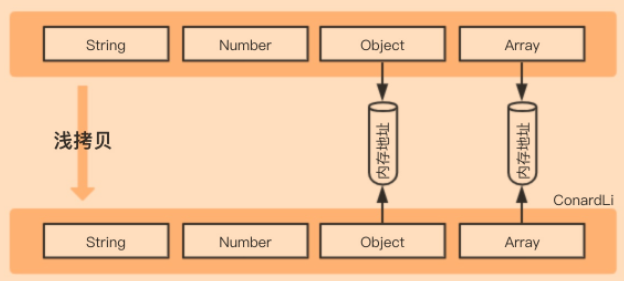
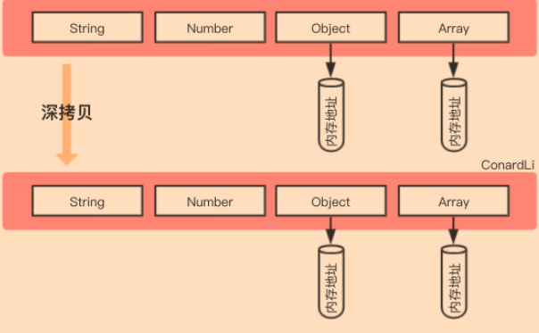
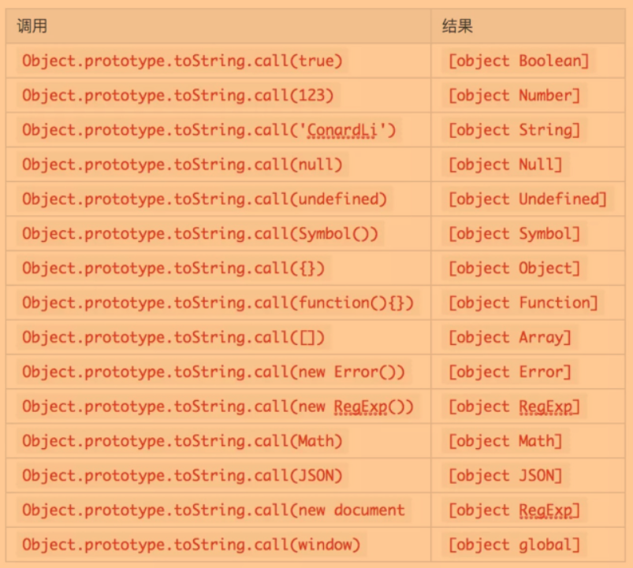

[TOC]


## apply 、bind、call

> 前置知识：
>
> **function中的this一般有两种情况，**
>
> - 第一种，是作为对象的内部的函数调用，则this指向这个对象
> - 第二种，作为全局的函数被调用，则this指向window

---

this指向:

- 永远指向最后调用它的对象
- 


### 手写call

```js
    function show(...args){
        console.log(args)
        console.log(this.name);
    }
```

由于show是一个函数，在javascript中，所有的函数都是有Funcition这个构造函数进行是实例化的对象

接下来我们要调用一下`show`这个方法，但是由于内部内有定义name这个属性，故会报错

- 怎么办 ?  - 【  自己手写一个apply 修改show函数内部this 的指向 】

  ```js
      Function.prototype.myCall = function(ctx,...args){
          // this 是Function生成的构造函数
           //   Function中的this ƒ show(...args){
           //   console.log(args)
          //    console.log(this.name);
         //       }
           // 步骤
          // 1  - 将方法挂载到我们传入的ctx
          // 2 -  将挂载以后的方法调用
          // 3 - 将我们添加的这个属性删除
          
          console.log('Function中的this',this);
          ctx.fn = this
          ctx.fn(...args)
      }
  	//  一般call函数需要接收2个参数，第一个参数是，所调用函数this的上下文，第2个参数就是所调用函数的形参
  
  ```

调用一下`show`函数

```js
	show.myCall({name:'chamberlain'},'call1','call2','call3')

```


### 手写apply

```js
    function show(...args){
        console.log(args)
        console.log(this.name);
    }

    Function.prototype.myApply = function(ctx,args = []){
        ctx.fn = this
        ctx.fn(...args)
        delete ctx.fn
    }

    show.myApply({name:'chucheng'},['jack','allen','martain'])

```

### 手写bind

```js
    Function.prototype.myBind = function(ctx,...args1){
        console.log(...args1,'args1')

        return (args2)=>{
            ctx.fn = this
            ctx.fn(...args1.concat(args2))
            delete ctx.fn
        }
    }

    let bind =  show.myBind({name:'danina'},'jack','allen','martain')
    console.log(bind,'bind')

```


## 深拷贝 & 浅拷贝

浅拷贝：



> 创建一个新对象，这个对象有着原始对象属性值的一份精确拷贝。如果属性是基本类型，拷贝的就是基本类型的值，如果属性是引用类型，拷贝的就是内存地址 ，所以如果其中一个对象改变了这个地址，就会影响到另一个对象。

深拷贝：

​	

> 将一个对象从内存中完整的拷贝一份出来,从堆内存中开辟一个新的区域存放新对象,且修改新对象不会影响原对象


那么如何进行浅拷贝和深拷贝呢？

### 入门版本 - 浅拷贝

```js
JSON.parse(JSON.stringify());

```

这种写法非常简单，而且可以应对大部分的应用场景，但是它还是有很大缺陷的，比如拷贝其他引用类型、拷贝函数、循环引用等情况。

### 基础版本

```js

function clone(target) {
    let cloneTarget = {};
    for (const key in target) {
        cloneTarget[key] = target[key];
    }
    return cloneTarget;
};

```

创建一个新的对象，遍历需要克隆的对象，将需要克隆对象的属性依次添加到新对象上，返回。

如果是深拷贝的话，考虑到我们要拷贝的对象是不知道有多少层深度的，我们可以用递归来解决问题，稍微改写上面的代码：

- 如果是原始类型，无需继续拷贝，直接返回
- 如果是引用类型，创建一个新的对象，遍历需要克隆的对象，将需要克隆对象的属性执行**深拷贝后**依次添加到新对象上。

很容易理解，如果有更深层次的对象可以继续递归直到属性为原始类型，这样我们就完成了一个最简单的深拷贝：

```js
function clone(target) {
    if (typeof target === 'object') {
        let cloneTarget = {};
        for (const key in target) {
            cloneTarget[key] = clone(target[key]);
        }
        return cloneTarget;
    } else {
        return target;
    }
};
```

这是一个最基础版本的深拷贝，这段代码可以让你向面试官展示你可以用递归解决问题，但是显然，他还有非常多的缺陷，比如，还没有考虑数组。

---

### 考虑数组

在上面的版本中，我们的初始化结果只考虑了普通的`object`，下面我们只需要把初始化代码稍微一变，就可以兼容数组了

```js
module.exports = function clone(target) {
    if (typeof target === 'object') {
        let cloneTarget = Array.isArray(target) ? [] : {};
        for (const key in target) {
            cloneTarget[key] = clone(target[key]);
        }
        return cloneTarget;
    } else {
        return target;
    }
};
```

### 循环引用 - ( 导致栈内存溢出 )

说到循环引用，可能你会觉得有疑问、什么是循环引用？

循环引用就是对象的属性值应用了这个对象本身，就叫做循环引用，举个栗子：

```js
let obj2 = {
  name: '循环引用测试'
}
obj2.cycle = obj2
let objClone2 = deepClone(obj2); // 报错栈溢出 Uncaught RangeError: Maximum call stack size exceeded
```

- **栈溢出：**

​		`ECStack执行环境栈`又叫`调用栈`，是JS引擎为了运行js代码在计算机中开辟的一块栈内存空间，用来管理函数调用关系。栈内存遵循**先进后出**的规律，并且这段栈内存**空间是有限的**。
当我们进行函数调用的时候，JS引擎会创建一个`执行上下文`并推进调用栈中供函数执行。当函数执行完毕，这个执行上下文会自动推出执行栈、释放空间。

​		但是当我们执行上边的代码，因为深克隆会进行递归函数调用，在深层递归内的deepClone函数没执行完毕前，先推进执行栈的函数就不能结束、不能出栈。
又因为我们现在obj2循环引用了自己，我们的deepClone就要不停的循环递归。这就导致了一直往栈中塞数据、但从不释放。栈空间就像一个水杯一样，被我们一直“加水”直至“溢出”并报错。


**解决方案：**

​	解决循环引用导致的栈溢出问题，就需要我们判断要拷贝的对象，是不是已经拷贝过，而不要循环拷贝。

​	我们可以利用缓存的思想，额外创建一个哈希映射表（字典集合，其实就是**一个缓存对象**），来存储当前对象和拷贝对象的对应关系。
​	`哈希映射表`需要`key: value`这种**键值对结构**，并且要满足key可能是引用类型的要求（一般情况下key是字符串类型）。
​	后续使用时，每拷贝一个引用值，就记录（缓存）到集合中。下次拷贝时，先检查是否在缓存中：
​	|  -  若有，直接取缓存；
​	|  -  若无，实行拷贝并缓存。


**解决方向：**

​	  --  因为我们实际是要**创建一个缓存对象**，但我们的key又要可以是引用类型。
​	  --  JS提供的原生对象虽然就是键值对的集合，但是传统上对象只能用字符串当作键。不太满足我们的条件。
​	  --  为此，我们的解决方向上，可以考虑用ES6新增的数据结构：Map、WeakMap

> ES6 提供了 `Map` 数据结构。它类似于对象，也是键值对的集合，但是“键”的范围不限于字符串，各种类型的值（包括对象）都可以当作键。也就是说，Object 结构提供了“字符串—值”的对应，**Map 结构提供了“值—值”的对应，是一种更完善的 Hash 结构实现**。如果你需要“键值对”的数据结构，Map 比 Object 更合适。
> WeakMap结构与Map结构类似，也是用于生成键值对的集合。
> 来源：https://es6.ruanyifeng.com/#docs/set-map#Map

但是`WeakMap`比Map有两个不同：

1、【特殊点】WeakMap**只接受引用类型（对象）作为键名**；
2、【优点】WeakMap的键名所指向的对象都是**弱引用，不计入垃圾回收机制，不用考虑内存泄漏。** 当引用对象被清除，其所对应的WeakMap记录就会自动被移除。（具体请看ES6相关解释，这里不展开。）

为什么要这样做呢？，先来看看`WeakMap`的作用：

> WeakMap 对象是一组键/值对的集合，其中的键是弱引用的。其键必须是对象，而值可以是任意的。

什么是弱引用呢？

> 在计算机程序设计中，弱引用与强引用相对，是指不能确保其引用的对象不会被垃圾回收器回收的引用。 一个对象若只被弱引用所引用，则被认为是不可访问（或弱可访问）的，并因此可能在任何时刻被回收。

我们默认创建一个对象：`const obj = {}`，就默认创建了一个强引用的对象，我们只有手动将`obj = null`，它才会被垃圾回收机制进行回收，如果是弱引用对象，垃圾回收机制会自动帮我们回收。

举个例子：

如果我们使用`Map`的话，那么对象间是存在强引用关系的：

```js
let obj = { name : 'ConardLi'}
const target = new Map();
target.set(obj,'code秘密花园');
obj = null;
```

虽然我们手动将`obj`，进行释放，然是`target`依然对`obj`存在强引用关系，所以这部分内存依然无法被释放。

再来看`WeakMap`：

```js
let obj = { name : 'ConardLi'}
const target = new WeakMap();
target.set(obj,'code秘密花园');
obj = null;
```

如果是`WeakMap`的话，`target`和`obj`存在的就是弱引用关系，当下一次垃圾回收机制执行时，这块内存就会被释放掉。

设想一下，如果我们要拷贝的对象非常庞大时，使用`Map`会对内存造成非常大的额外消耗，而且我们需要手动清除`Map`的属性才能释放这块内存，而`WeakMap`会帮我们巧妙化解这个问题。


<div style="background-color:#7cf">简而言之就是：Map是高级版的Object，WeakMap是高级版的Map</div>


**Map \ weakMap**:

综合所有考量，我们启用**最优解——WeakMap**来实现这个缓存字典。

伪代码思路：
		1、检查 weakMap 中有无克隆过的对象。
		2、有，直接返回
		3、没有，将当前对象作为key，克隆对象作为value进行存储
		4、继续克隆

```js
       /*
        * @param {object} obj 
        * @param {*} hashMap WeakMap数据，用于缓存克隆过的对象
        * @returns obj_new / 克隆的obj
        */

    function deepClone(obj,hashMap = new WeakMap()){
        if (obj === null) return
        if (obj instanceof Date) return new Date(obj);
        if (obj instanceof RegExp) return new RegExp(obj);
        if (typeof obj!=="object" ) return obj
        // 查缓存字典中是否已有需要克隆的对象，有的话直接返回同一个对象
        //（同一个引用，不用递归无限创建进而导致栈溢出了）
        if (hashMap.has(obj)) return hashMap.get(obj);
        hashMap.set(origin, result); // 哈希表缓存新值
        let obj_new = Array.isArray(obj)?{}:[]
        // 遍历对象中的元素
        for(let k in obj){
            if(typeof obj[k]=='object' || typeof obj[k]=='array'){
                obj_new[k]  = deepClone(obj[k])
            }else {
                obj_new[k] = obj[k]
            }
        }
        return obj_new
    }

```

### 其他数据类型

在上面的代码中，我们其实只考虑了普通的`object`和`array`两种数据类型，实际上所有的引用类型远远不止这两个，还有很多，下面我们先尝试获取对象准确的类型

#### 合理的判断引用类型

首先，判断是否为引用类型，我们还需要考虑`function`和`null`两种特殊的数据类型：

```js
function isObject(target) {
    const type = typeof target;
    return target !== null && (type === 'object' || type === 'function');
}
```

```js
if (!isObject(target)) {
    return target;
}
// ...
```

我们可以使用`toString`来获取准确的引用类型：

> 每一个引用类型都有`toString`方法，默认情况下，`toString()`方法被每个`Object`对象继承。如果此方法在自定义对象中未被覆盖，t`oString()` 返回 `"[object type]"`，其中type是对象的类型。

注意，上面提到了如果此方法在自定义对象中未被覆盖，`toString`才会达到预想的效果，事实上，大部分引用类型比如`Array、Date、RegExp`等都重写了`toString`方法。

我们可以直接调用`Object`原型上未被覆盖的`toString()`方法，使用`call`来改变`this`指向来达到我们想要的效果。

```js
function getType(target) {
    return Object.prototype.toString.call(target);
}
```



下面我们抽离出一些常用的数据类型以便后面使用：

```js
const mapTag = '[object Map]';
const setTag = '[object Set]';
const arrayTag = '[object Array]';
const objectTag = '[object Object]';

const boolTag = '[object Boolean]';
const dateTag = '[object Date]';
const errorTag = '[object Error]';
const numberTag = '[object Number]';
const regexpTag = '[object RegExp]';
const stringTag = '[object String]';
const symbolTag = '[object Symbol]';
```

在上面的集中类型中，我们简单将他们分为两类：

- 可以继续遍历的类型
- 不可以继续遍历的类型


