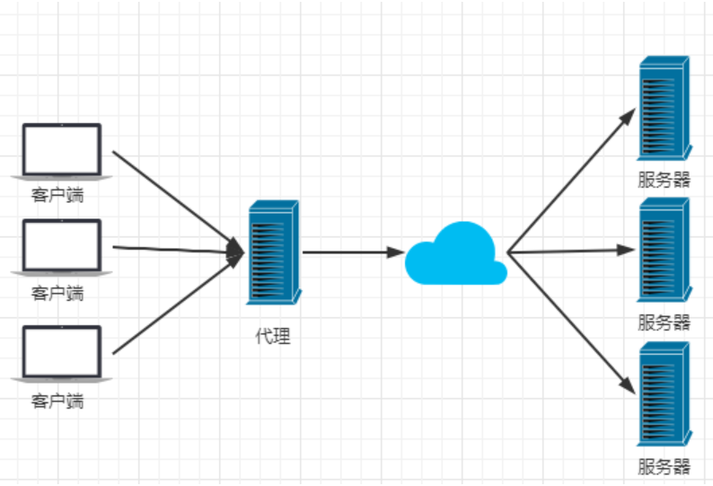
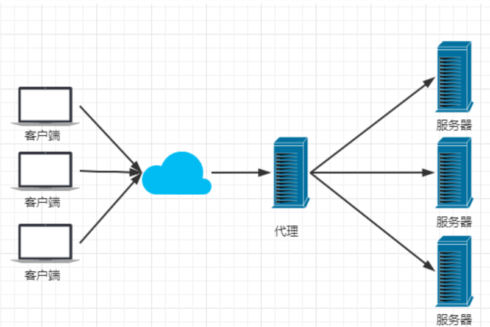
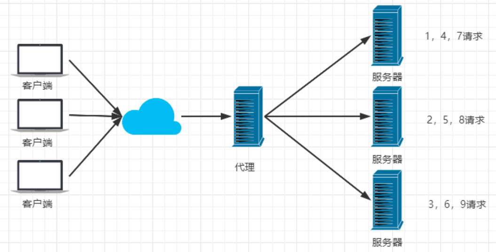
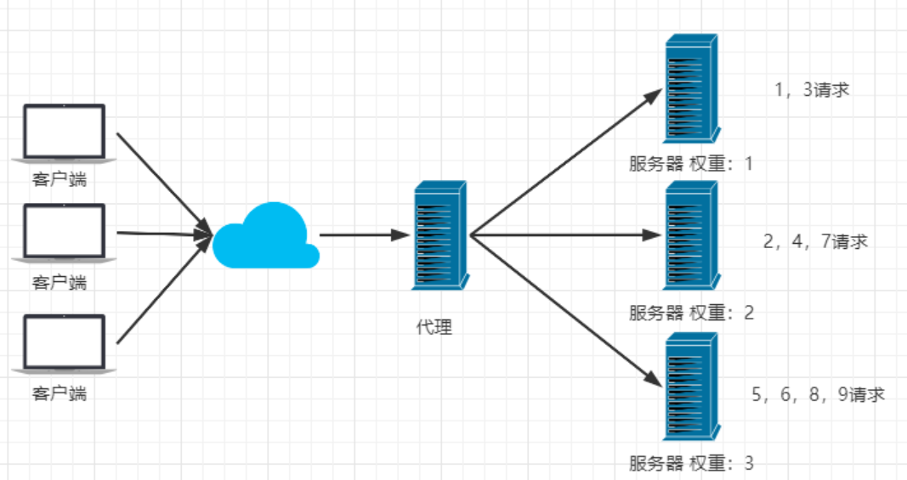
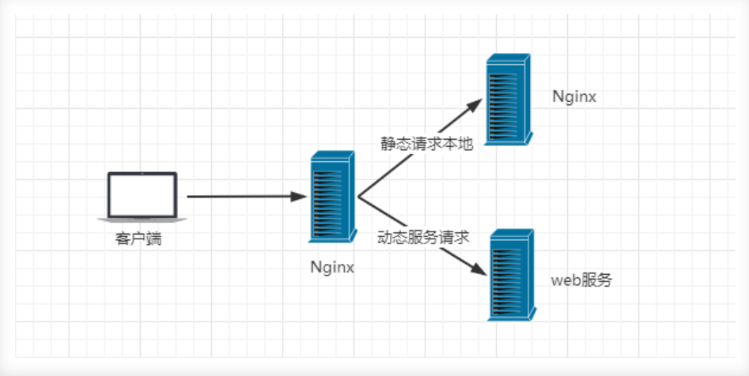
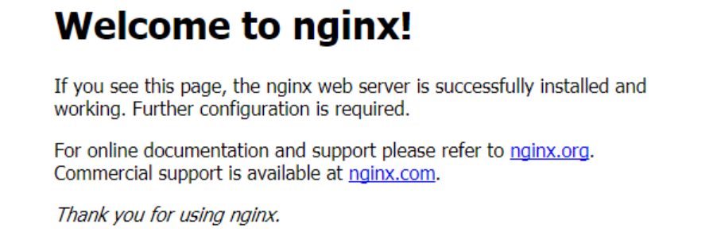
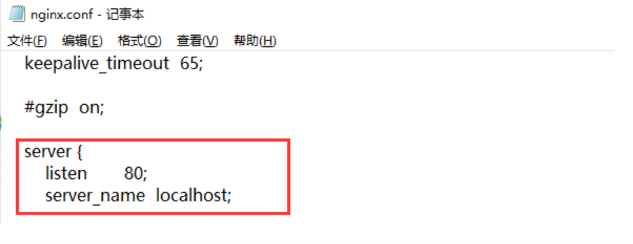
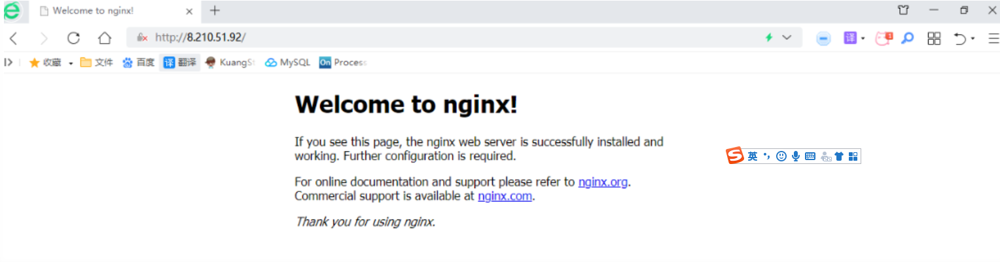

## ngnix快速入门

Nginx (engine x) 是一个高性能的HTTP和反向代理web服务器，同时也提供了IMAP/POP3/SMTP服务

**特点：**

* 占用内存小、并发能力强
* 安装简单、配置文件简洁、bug非常少的服务
* 启动容易、可以做到*不间断运行

**作用：**

> Http代理，反向代理：作为web服务器最常用的功能之一，尤其是方向代理

### 正向代理：

[ 代理客户端的请求，比如访问google， 需要借助vpn连接到香港的服务器，香港服务器请求回来数据，返回给浏览器]



###反向代理：

【代理服务器端，是无感知的】

eg：访问了百度，其实百度服务器会有很多台，让他们处理完数据，再让其中期待服务器将数据返回给客户端




>Nginx提供的负载均衡策略有2种：内置策略和扩展策略。内置策略为轮询，加权轮询，Ip hash。扩展策略，就天马行空，只有你想不到的没有他做不到的。

### 轮询




> Nginx提供的负载均衡策略2种，内置策略和扩展策略。内置策略为论述，Ip hash，扩展策略，就天马星空，只有你想不到的没有他做不到的

加权轮询

- 由于每一台服务器性能不同，将部分请求给性能较强的服务器处理，达到负载均衡的效果




### 动静分离

> 动静分离，在我们的软件开发中，有些请求是需要后台处理的，有些请求是不需要经过后台处理的(如：css、html、jpg、js等等文件)，这些就不需要经过后台处理的文件成为静态文件。让动态网站里面的动态网页根据一定规则把不便的资源和经常变的资源分开来，动静资源做好了拆分之后，我们就可以根据静态资源的特点将其做缓存操作，提高资源响应的速度



目前，通过使用Nginx大大提高了我们网站的响应速度，优化了用户体验，让网站的健壮性更上一层楼

## nginx的安装

### 下载nginx

http://nginx.org/en/download.html 下载稳定版本。

下载后，直接解压就可以使用，在文件管理器中的地址栏输入cmd，然后输入：nginx.exe 即可启动nginx服务

### 启动

在浏览器端，输入：localhost:80



### 配置监听

nginx的配置文件是conf目录下的nginx.conf，默认配置的nginx监听的端口为80，如果80端口被占用可以修改为未被占用的端口即可。



当我们修改了nginx的配置文件nginx.conf 时，不需要关闭nginx后重新启动nginx，只需要执行命令 `nginx -s reload` 即可让改动生效

### 关闭nginx

如果使用cmd命令窗口启动nginx， 关闭cmd窗口是不能结束nginx进程的，可使用两种方法关闭nginx

(1)输入nginx命令 `nginx -s stop`(快速停止nginx) 或 `nginx -s quit`(完整有序的停止nginx)

(2)使用taskkill `taskkill /f /t /im nginx.exe`

```javascript
taskkill是用来终止进程的，
/f是强制终止 .
/t终止指定的进程和任何由此启动的子进程。
/im示指定的进程名称 .
```


### nginx常用命令

```
cd /usr/local/nginx/sbin/
./nginx  启动
./nginx -s stop  停止
./nginx -s quit  安全退出
./nginx -s reload  重新加载配置文件
ps aux|grep nginx  查看nginx进程
```

启动成功访问 服务器ip:80




注意：如何连接不上，检查阿里云安全组是否开放端口，或者服务器防火墙是否开放端口！
相关命令：

```ts
# 开启
service firewalld start
# 重启
service firewalld restart
# 关闭
service firewalld stop
# 查看防火墙规则
firewall-cmd --list-all
# 查询端口是否开放
firewall-cmd --query-port=8080/tcp
# 开放80端口
firewall-cmd --permanent --add-port=80/tcp
# 移除端口
firewall-cmd --permanent --remove-port=8080/tcp
#重启防火墙(修改配置后要重启防火墙)
firewall-cmd --reload
# 参数解释
1、firwall-cmd：是Linux提供的操作firewall的一个工具；
2、--permanent：表示设置为持久；
3、--add-port：标识添加的端口；
```

演示

```js
upstream lb{
    server 127.0.0.1:8080 weight=1;
    server 127.0.0.1:8081 weight=1;
}
location / {
    proxy_pass http://lb;
}
```


