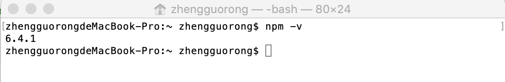
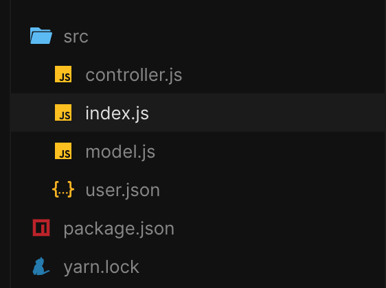

# Node进阶

## 模块化

把一些功能类似的代码，封装到一个单独的文件中去，这些单独抽离出来的代码文件，就能够提供各种各样好用的功能；这种通过代码功能分割文件的方式，叫做程序中的模块化；

模块化保证了每个文件的功能（职能）单一；需要什么特定的功能，直接调用某一个特定的模块；对将来程序开发和维护都有好处！

其实jQuery也可以理解为一个模块，他给我们提供方便操作DOM，在html中我们通过script标签引入jquery库。

```html
<script src="../assets/js/jquery-1.12.2.js"></script>
```

##  Node中的模块化

node由核心模块、第三方模块、用户模块组成。

### [#](https://heima-docs.vercel.app/node高级/#_2-1-核心模块)[2.1 核心模块](http://nodejs.cn/api/)

官方发现一些功能模块使用非常频繁，所以官方把这些模块，编译成了二进制可执行文件，打包到了Node的安装包中；这些核心模块就已经随着安装Node时候，被安装到了本地；

```js
// http和fs都是核心模块
const http = require('http');
const fs = require('fs');
```

### [#](https://heima-docs.vercel.app/node高级/#_2-2-第三方模块)2.2 第三方模块

除了官方提供的好用的核心模块之外，我们程序员发现，还有一些使用也很频繁的代码和方法，一些牛逼的团体、个人、公司，开发出了好用的模块，通过NPM官网，托管出去，供其他人下载使用的这些模块；统称为第三方模块；

```js
const moment = require('moment'); // 用于时间处理的一个第三方库
const express = require('express'); // 用于网络处理的第三方框架
```

### [#](https://heima-docs.vercel.app/node高级/#_2-3-用户模块)2.3 用户模块

除了第三方模块外，由于自身业务的需要还会存在业务代码，我们把功能相似的业务代码封装在一个JS中，称为用户模块。

```js
const myUtils = require('./utils/index'); // 自己封装的工具
```

如果我们用熟悉的html去表达他们三者的关系，可以理解为alert、document等内置方法是核心模块，jquery是第三方模块，而我们自己封装的utils/index.js是用户模块。

```html
<!DOCTYPE html>
<html lang="en">
<head>
    <meta charset="UTF-8">
    <meta name="viewport" content="width=device-width, initial-scale=1.0">
    <meta http-equiv="X-UA-Compatible" content="ie=edge">
    <!-- jQuery就是第三模块 -->
  	<script src="../assets/js/jquery-1.12.2.js"></script>
    <!-- utils是我们自行编写的代码，在node中叫用户模块 -->
  	<script src="../utils/index.js"></script>
    <script>
  		alert('test'); // alert其实就像node中的核心模块，是自带的
  	</script>
</head>
</html>
```

## 包管理工具的使用

我们知道引入jquery或者第三方库的方法是在页面通过`<script>`标签引入。但是大家想想，如果应用很复杂，依赖第三方库有数十个之多，你需要手动下载第三方库，如果第三方库版本出现更新，你同样需要更新，这样的管理方式过于繁琐。所以在node中，作者对第三方库使用一个叫npm(node package manager)包管理器进行管理。

### [#](https://heima-docs.vercel.app/node高级/#_3-1-包管理器的安装)3.1 包管理器的安装

npm是node默认的包管理器，只要安装node就会有npm工具，可以在控制台输入`npm -v`按回车，就会显示当前npm版本。



### [#](https://heima-docs.vercel.app/node高级/#_3-2-使用npm初始化项目)3.2 使用npm初始化项目

如果你的项目希望使用npm管理第三方库，那么在开发项目前需要进行初始化。

1. 使用`npm init`命令交互式生成
2. 使用`npm init -y`应用默认配置生成

两条命令其实效果差不多，最终都会生成一个名为package.json的文件，用于记录当前项目的名字、作者、第三方库等信息，同样你也可以手动创建这个文件，效果和用命令创建是一样的。

```json
{
  "name": "zhengguorong",
  "version": "1.0.0",
  "description": "",
  "main": ".mongorc.js",
  "scripts": {
    "test": "echo \"Error: no test specified\" && exit 1"
  },
  "keywords": [],
  "author": "",
  "license": "ISC"
}
```

### [#](https://heima-docs.vercel.app/node高级/#_3-3-使用npm命令安装第三方模块)3.3 使用npm命令安装第三方模块

#### [#](https://heima-docs.vercel.app/node高级/#_3-3-1-安装到当前目录)3.3.1 安装到当前目录

```bash
// 安装命令为npm install 第三方模块名字
npm install moment
```

执行上面的命令后，你会看到在执行命令的根目录有一个叫`node_module`的文件夹，里面就是用来存放我们的第三方模块的；另外还有一个`package-lock.json`用来记录第三方模块下载地址，下次安装或更新直接用记录地址，下载速度会比较快。

#### [#](https://heima-docs.vercel.app/node高级/#_3-3-2-记录依赖)3.3.2 记录依赖

node_module文件夹在大型项中往往非常庞大，如果你需要把项目拷贝给他人，通常会把node_module先删除。

但是删除node_module的项目没法直接运行，必须重新安装第三方依赖，那`package.json`的依赖记录就可以让他人快速安装项目依赖，只需要执行`npm install`即可把所有第三方依赖安装回来。

```json
// 安装完毕后，你的package.json的dependencies对象会增加moment记录,
{
  "dependencies": {
    // key值表示依赖的名字，^2.27.0表示版本号
    "moment": "^2.27.0",
  }
}
```

#### [#](https://heima-docs.vercel.app/node高级/#_3-3-3-全局安装（了解即可）)3.3.3 全局安装（了解即可）

有些第三方模块需要全局安装，可以通过`-g`参数，例如后面学习的vue-cli就要求全局安装。

```bash
npm install -g @vue/cli
```

#### [#](https://heima-docs.vercel.app/node高级/#_3-3-4-删除依赖)3.3.4 删除依赖

如果你希望移除某个第三方库，可以通过`npm uninstall`命令

```js
npm uninstall moment
```

### [#](https://heima-docs.vercel.app/node高级/#_3-4-如果你被墙了)3.4 如果你被墙了

使用npm安装依赖的时候，往往等待很久都没安装完毕，这是因为npm的资源存放在国外服务器，所以导致下载时间会很久甚至下载失败，可以使用nrm工具切换下载地址提升下载速度。

#### [#](https://heima-docs.vercel.app/node高级/#方法一：切换到国内请求源)方法一：切换到国内请求源

在cmd执行下面命令，把下载源切换到淘宝

```bash
npm config set registry https://registry.npm.taobao.org
```

执行命令查看是否设置成功，如果输出结果为https://registry.npm.taobao.org表示修改成功

```bash
npm config get registry
```

#### [#](https://heima-docs.vercel.app/node高级/#方法二：使用nrm切换)方法二：使用nrm切换

1.安装：

```js
npm install -g nrm
```

2.查看可用的源

```js
$ nrm ls
// * 代码当前源
* npm -----  https://registry.npmjs.org/
  yarn ----- https://registry.yarnpkg.com
  cnpm ----  http://r.cnpmjs.org/
  taobao --  https://registry.npm.taobao.org/
  nj ------  https://registry.nodejitsu.com/
  skimdb -- https://skimdb.npmjs.com/registry
```

3.切换到cnpm下载源

```js
$ nrm use cnpm  // 切换到cnpm
```

##  第三方模块的使用

使用模块第三方模块前，要确保已经下载完毕，在文件中通过`require`关键字加载第三方模块。

下面演示如果引用`moment`库帮助我们格式化时间

```js
// 1. 引入moment, 语法 require('模块名字')
const moment = require('moment')
// 2. 调用moment实现对日期数据的格式化处理
console.log(moment().format('YYYY-MM-DD HH:mm:ss'))
```

## 自定义模块

如果不使用**moment**，自己实现格式化时间格式，我们应该怎么做呢？下面演示通过自定义方法实现时间格式化并通过导出模块实现复用。

1. **导出模块** 在`utils`目录下创建名为`time.js`文件（目录和文件名非固定的）

```js
// time.js文件内容
function timeFormat() {
  const now = new Date();
  const year = now.getFullYear();
  const month = now.getMonth() + 1;
  const day = now.getDate();
  const hour = now.getHours();
  const min = now.getMinutes();
  const sec = now.getSeconds();
  return `${year}年${month}月${day}日 ${hour}时${min}分${sec}秒`;
}

// 模块导出的关键代码, module.exports可以等于一个对象，函数或者变量
module.exports = {
  timeFormat
};
// module.exports本身就是一个对象，也可以这样写
module.exports.timeFormat = timeFormat;
```

1. **引用模块**

```js
// 通过require引入模块，其中require接收的是模块路径
const time = require("./utils/time");
// 调用模块方法
time.timeFormat();
```

同学们可能有疑问，为什么nodejs要规定这样使用自定义模块呢，以前写HTML的时候，直接把代码放到一个文件，然后通过`script`标签引入就可以了，其实这种方式存在一个缺陷，就是变量污染，因为引入的代码变量都会放在全局中，这难免会出现变量互相覆盖。

因此在node中它使用了`CommonJS`标准来进行模块管理，你会在以后的项目中发现大家都在遵循这套模块管理规范。

**扩展知识**

> node还给我们提供另外一种导出模块的方式，通过exports关键字到导出，但是只做了解，不建议使用。
>
> ```js
> // 直接使用exports关键字导出
> exports.timeFormat = timeFormat
> // 和下面代码效果一致
> module.exports = {
>   	timeFormat
> };
> ```

扩展阅读：[exports、module.exports 和 export、export default 到底是咋回事](https://juejin.im/post/597ec55a51882556a234fcef)

## 全局对象global（了解即可）

在浏览器中全局对象时window，但在node中没有window对象，它的全局对象叫`global`它可以在不同模块间共享，而且不需要require导入。

```js
//a.js
global.name = "tom"
// b.js
console.log(global.name) // 输出tom
```

上面的例子可以看出，可以给global扩展属性，在别的模块直接读取，也可以利用该特性实现自定义模块共享，但是这是强烈不建议的手段。

## 模块加载顺序

```
const monent = require('moment')
```

当node发现上面的代码时，查找顺序是

1、先找当前文件夹下的`node_modules`文件夹下的`moment`文件夹下的`package.json`文件指定的main字段文件路径。

2、如果第一种情况没找到，找当前文件夹下的`node_modules`文件夹下的`moment.js` 文件

3、如果第二种情况没找到，找当前文件夹下的`node_modules`文件夹下的lt文件夹下的`index.js`文件

4、如果第三种情况没找到，找的上一级`node_modules`文件夹，查找顺序与上面一样。

5、如果都找不到，就会抛出异常`Error: Cannot find module 'XXX'`

⚠️**注意：如果第三方模块名字和核心模块同名，优先加载核心模块（不过基本不会出现这种情况，因为同名的第三方模块没法发布到npm）**

##  模块化练习

第一节就讲过，模块化就是将功能相似的内容放到一个文件。在这一节，我们通过一个案例学习如何把一个大功能划分到不同模块，如何通过MVC设计模式优化代码。

### [#](https://heima-docs.vercel.app/node高级/#_8-1-设计模式)8.1 设计模式

**设计模式**（Design Pattern）是前辈们对代码开发经验的总结，是解决特定问题的一系列套路。它不是语法规定，而是一套用来提高代码可复用性、可维护性、可读性、稳健性以及安全性的解决方案。

说个大白话，比如你要开一个酒店，但是你不懂开酒店需要什么人，这时候有个酒店老板给你提供一个叫“酒店经营设计模式”的方法，它说要开一个酒店需要招聘收银员，厨师，服务员。你就按这个模式去经营，结果就赚钱了，所以设计模式就是把成功的经验总结成一个固定套路的方法论。

> 1995 年，GoF（Gang of Four，四人组/四人帮）合作出版了《设计模式：可复用面向对象软件的基础》一书，共收录了 23 种设计模式，从此树立了软件设计模式领域的里程碑，人称「GoF设计模式」。


### [#](https://heima-docs.vercel.app/node高级/#_8-2-mvc模式)8.2 MVC模式

上面说了设计模式是一种讨论，那在开发后端应用时，最常用的一个设计模式就叫MVC模式。

**Model(模型) **是应用程序中用于处理应用程序数据逻辑的部分，通常模型对象负责在数据库中存取数据。

**View(视图) **是应用程序中处理数据显示的部分，通常视图是依据模型数据创建的。

**Controller(控制器) **是应用程序中处理用户交互的部分，通常控制器负责从视图读取数据，控制用户输入，并向模型发送数据。

### [#](https://heima-docs.vercel.app/node高级/#_8-3-使用mvc模式改造项目)8.3 使用MVC模式改造项目

下面我会通过一个简单案例，演示把验证用户名功能拆分到不同模块，验证用户名原始代码如下

```js
const http = require("http");
const fs = require("fs");
http
  .createServer(function(req, res) {
    res.setHeader("Content-type", "text/json;charset=utf-8");
    const url = req.url;
    if (url.indexOf("/validate") > -1) {
      // 获取URL中name的参数
      const queryString = url.substring(url.indexOf("?"), url.length);
      const queryObj = queryString.split("&");
      const name = queryObj[0].split("=")[1];
      
			// 读取user.json文件，查找用户是否存在
      fs.readFile(__dirname + "/user.json", "utf-8", (err, data) => {
        const users = JSON.parse(data);
        const user = users.find(item => item.name === name);
        if (user) {
          res.end("用户已存在，请修改用户名");
        } else {
          res.end("用户名可以使用");
        }
      });
    } else {
      res.end("没找到匹配路由");
    }
  })
  .listen(8080);
```

**1、创建相应文件。mode.js负责处理数据，controller.js负责逻辑处理，index.js负责全局配置**

> 同学们可能会有疑问，那MVC中的V在哪里，因为我们是基于前后端分离的架构，View视图其实就是我们的HTML页面。



**2、把负逻辑代码移动到controller.js**

```js
// controller.js文件代码

const fs = require("fs");
// 1、定义validate方法，把index.js文件处理逻辑代码复制到方法内
const validate = function(req, res) {
  const url = req.url;
  // 获取URL中name的参数
  const queryString = url.substring(url.indexOf("?"), url.length);
  const queryObj = queryString.split("&");
  const name = queryObj[0].split("=")[1];

  // 读取user.json文件，查找用户是否存在
  fs.readFile(__dirname + "/user.json", "utf-8", (err, data) => {
    const users = JSON.parse(data);
    const user = users.find(item => item.name === name);
    if (user) {
      res.end("用户已存在，请修改用户名");
    } else {
      res.end("用户名可以使用");
    }
  });
};

// 导出validate方法给外部使用
module.exports = {
  validate
};
// index.js文件代码
const http = require("http");
// 1、导入controller.js
const userController = require("./controller");
http
  .createServer(function(req, res) {
    res.setHeader("Content-type", "text/json;charset=utf-8");
    const url = req.url;
    if (url.indexOf("/validate") > -1) {
      //  调用validate方法并传递req,res参数
      userController.validate(req, res);
    } else {
      res.end("没找到匹配路由");
    }
  })
  .listen(8080); //the server object listens on port 8080
```

**3、把数据处理代码移动到model.js中**

```js
//model.js文件代码
const fs = require("fs");
// 1、定义foundUser函数，把controller.js中文件读取代码移动过来
const foundUser = function(name, callback) {
  fs.readFile(__dirname + "/user.json", "utf-8", (err, data) => {
    const users = JSON.parse(data);
    const hasFound = users.find(item => item.name === name);
    callback(hasFound);
  });
};

//2、导出foundUser方法
module.exports = {
  foundUser
};
// controller.js文件内容
// 1、引入用户数据处理model
const userModel = require("./model");
const querystring = require('querystring');

const validate = function(req, res) {
  const url = req.url;
  // 获取URL中name的参数
  const queryString = url.split('?')[1];
  const paramObject = querystring.parse(paramString);
  const name = paramObject.name;
	// 2、调用foundUser方法
  userModel.foundUser(name, user => {
    if (user) {
      res.end("用户已存在，请修改用户名");
    } else {
      res.end("用户名可以使用");
    }
  });
};

module.exports = {
  validate
};
```

[查看代码](https://codesandbox.io/s/mvc-znfeu)