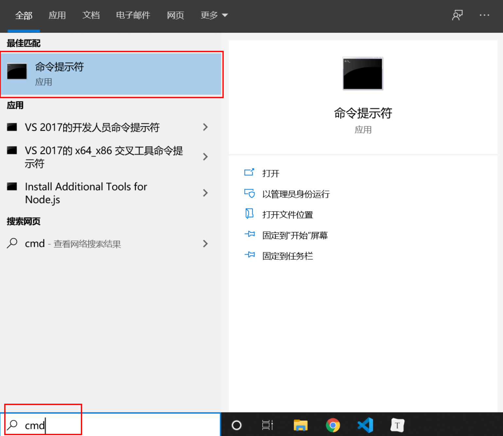
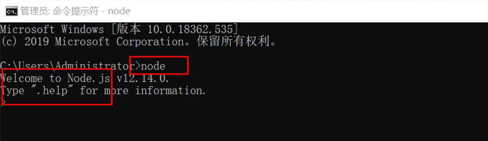
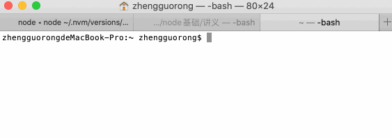
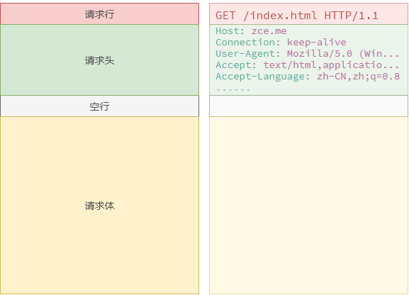
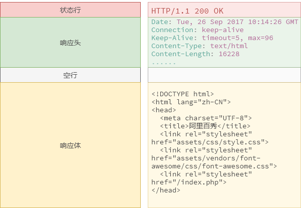

# 服务端编程基础

## 课程简介


Nodejs基础（2天）课程是一个重要的转折点，以前我们都是基于浏览器的编程，也就是编写一个html文件然后双击打开查看效果。现在我们需要学习服务端语言，像淘宝，百度那样，通过网址访问页面。

课程中包含较多的概念，例如HTTP协议、URL、服务器等，这些都是非常重要的概念，面试是必问的，而且后面Ajax课程都是基于这些概念开展的，所以同学们要认真掌握了。

## 前言


Node.js 是能够在服务器端运行 JavaScript 的开放源代码、跨平台 JavaScript **运行环境**。

在Node.js出现之前，JavaScript通常作为客户端语言使用，Node.js的出现使JavaScript也能用于服务端编程。

目前，Node.js已被IBM、Microsoft、Yahoo、SAP、LinkedIn、PayPal等企业采用。

[Node.js中文官网](http://nodejs.cn/api/) [英文](https://nodejs.org/en/)

### Node.js还可以做什么？


1. 服务端编程（REST API）
2. 前端工程化工具（webpack）
3. 第三方库管理（npm）
4. 桌面应用（Electron）
5. IoT物联网应用
6. 还有更多未知场景，因为node可以运行在任何地方

###  学习Node.js的必要性

1. 了解浏览器与服务端的交互过程，方便工作中与后端工程师沟通。
2. 了解服务端编程特性，在遇到问题时可快速定位问题，识别问题是由前端还是后端引起。
3. 了解服务端编程，为职业发展打下基础，成为全栈工程师。

##  环境安装

### window系统

1. [nodejs官网下载安装包](http://nodejs.cn/download/)

2. 双击运行安装包，一直点击**next**

3. 在左下角输入**cmd**运行**命令提示符**

   

4. 在命令提示符输入**node**，提示**Welcome to Nodejs** 表示安装成功

   

### OSX系统

**通过nvm安装**

1. 打开控制台，输入以下命令安装nvm

   ```bash
   curl -o- https://raw.githubusercontent.com/nvm-sh/nvm/v0.35.3/install.sh | bash
   ```

2. 使用nvm安装Node.js

   ```bash
   nvm install node # node表示最新版本的,如果需要安装特定版本，可以把node替换成版本号10.10.0, 8.9.1
   ```

3. 验证安装结果

   ```bash
   node -v # 输入后按回车，如果控制台输出版本号，表示安装成功
   ```

## 基础概念

### Nodejs和客户端js区别

客户端JavaScript由三个部分组成：**ECMAScript**控制编写规范、**DOM**操作网页内容、**BOM**操作浏览器

Node中的JavaScript由三部分组成：**ECMAScript**控制编写规范、**核心模块**、**第三方模块**

也就是说，在node环境中，语法和在浏览器的写法基本相同，但是不能使用DOM和BOM，例如document对象，window对象。

```bash
const name = "zgr"; # 基本语法和浏览器相同，语句能被node正常执行
alert('test') # 会提示ReferenceError: alert is not defined，因为node中没有BOM对象
console.log(document) # 提示：ReferenceError: document is not defined
```

### 运行Node.js程序

1、交互解释器（很少用）



2、终端命令执行（推荐做法）

```bash
node js文件路径 # 例如 node C:/test.js
```

## 核心模块

Nodejs由核心模块与第三方模块组成，其中核心模块给我们提供了像文件读写、系统信息读取、网络信息读取等功能，下面小节将给大家演示如何读写文件。

###  模块引用

Nodejs提供一个名为**fs(fileSystem)**用于与文件系统进行交互的模块，模块引用方法

```javascript
const fs = require('fs');
```

### 读取文件

```javascript
//1.导入文件模块
const fs = require('fs');
//2.异步读取文件
/**
 * 第一个参数：文件路径
 * 第二个参数：编码格式 （可选参数，默认为buffer二进制）
 * 第三个参数：读取回调操作（异步操作）
    * err:如果读取成功，err为null,  否则读取失败（一般文件路径错误或者找不到文件）
    * data:读取到的数据
 */
fs.readFile('./data/aaa.txt','utf-8',(err,data)=>{
    if(err){
        console.log(err);
        //抛出异常，throw的作用就是让node程序终止运行，方便调试
        throw err;
    }else{
        console.log(data);
    };
});

//3.同步读取文件(了解即可，几乎不用,一般在异步的api后面加上Sync就是同步)
const data = fs.readFileSync('./data/aaa.txt','utf-8');
console.log(data);
```

### 写入文件

```javascript
//1.导入文件模块
const fs = require('fs');
//2.异步写文件
/**
 * 第一个参数：文件路径
 * 第二个参数：要写入的数据
 * 第三个参数：文件编码 默认utf-8
 * 第四个参数： 异步回调函数
    * err:  如果成功，err为null.否则读取失败
 */
fs.writeFile('./data/bbb.txt','黑马程序员','utf-8',(err)=>{
    if(err){
        throw err;
    }else{
        console.log('写入成功');
    };
});
```

###  更方便的路径处理

上面读写文件中，我们通过相对路径获取文件，在Nodejs中 `./`表示执行node命令的目录，而不是当前运行文件的目录，这和浏览器解析方式是有区别的。为了防止不必要的错误，可通过**绝对路径**的形式读取。

下图演示node在不同目录下执行，`./`所指向的差异。


#### ### **绝对路径**


Nodejs提供一个`__dirname`的全局变量，用于获取当前执行js所处目录。

下面例子演示通过绝对路径读取文件，这样就不会因node运行目录导致读取文件错误问题。

```javascript
const fs = require('fs');
const filePath = __dirname + '/bbb.txt'; //通过绝对路径读取文件
fs.writeFile(filePath,'黑马程序员','utf-8',(err)=>{
    if(err){
        throw err;
    }else{
        console.log('写入成功');
    };
});
```

#### [#](https://heima-docs.vercel.app/node基础/#_5-4-2-使用path工具处理路径)5.4.2 **使用path工具处理路径**

`path` 模块提供了一些实用方法，用于处理文件和目录的路径。 可以使用以下方式访问它：

```js
const path = require('path');
```

**path.join([...paths])**

`path.join()` 方法会将所有给定的 `path` 片段连接到一起（使用平台特定的分隔符作为定界符），然后规范化生成的路径。

**在不同系统路径连接符有差异，使用字符串连接会出现不兼容**

```js
const path = require('path');
// 绝对路径拼接，不需要关注分隔符，join方法自动处理
const filePath = path.join(__dirname, 'bbb.txt'); // 等效 const filePath = __dirname + '/bbb.txt'
```

**手动拼接路径无法读取上级目录文件，path.join可以处理返回上级操作**

```js
// 两种写法等效
const filePath = path.join(__dirname, '..', 'bbb.txt');
const filePath = path.join(__dirname, '../bbb.txt');
```

## 服务端编程


同学们小时候有没去过游戏厅玩《拳王》《三国志》这些**单机**游戏。后来学校隔壁开了家网吧，大家都去网吧上网，打网游。但是打**网游**的时候不是会碰到服务器停机维护，服务器维护的时候为什么游戏没法玩呢？这个服务器是用来干嘛的？服务器是用来储存我们的等级信息，装备信息，这样我们在不同电脑登录游戏账号，可以继续玩游戏而不会丢失数据。

除了玩游戏，我们还会浏览网页看新闻、视频。那提供网页服务是不是也要有相应有一个服务器用来存储新闻，视频，这种提供网页服务的叫**web服务器**。

**web服务器有什么好处？举个🌰**

现在我已经能够方便的读取我本地电脑中的资源文件了，如果电脑那一端的小伙伴（你们）也想访问我电脑上的文件我们应该怎么做呢？

1. 传统方式：我将文件发送给大家，大家在自己电脑上访问
   1. 不方便，每次都需要拷贝
   2. 如果我电脑上的文件更新了，需要重新发送，很麻烦
   3. 如果有新的小伙伴也想访问，我得再次发送
2. 更好的方式
   1. 将资源文件放置到一个我们都能访问的机器上，供我们远程访问
   2. 提供访问的地址，并让资源电脑能够提供资源请求的响应
   3. 如果资源文件更新了，直接更新资源电脑上的文件，而不用每个请求客户端自己来更新

###  客户端与服务端通讯

刚才我们了解到服务器是用来存储用户和处理信息的。那服务器是放在哪，又怎么找到它？他们之间是如何通讯的？

#### [#](https://heima-docs.vercel.app/node基础/#_6-1-1-url的组成)6.1.1 URL的组成

刚才我们访问页面是在浏览器输入地址http://192.168.1.2:3001/test.html，我们把这个地址称为**URL**(Uniform Resource Locator,统一资源定位符)。它的作用和我们平时写信需要填省市区、详细地址、姓名，目的是一样的，信件信息是为了找到收件人，URL为了找到服务器上的资源。

**http** 协议 规定了交流当中的内容格式与含义（写信的格式）

**192.168.1.2** ip 地址，标记一个电脑 （省市区）

- 广域网 188.122.8.4
- 局域网、内网：内部通信使用 192.168.8.123
- 本地 ip : 127.0.0.1 或者localhost
- 域名：例如淘宝是www.taobao.com 只是为了方便我们记忆地址的方法

**3001** 端口号 标记软件，如果端口是80，可省略填写 （门牌号）

**test.html** 服务器端的文件路径 （收货人姓名）

#### [#](https://heima-docs.vercel.app/node基础/#_6-1-2-http协议)6.1.2 HTTP协议

HTTP协议：Hypertext Transfer Protocol，超文本传输**协议**，用于客户端与服务端间通讯。

协议：就是指双方遵循的规范；http协议，就是浏览器和服务器之间进行“沟通”的一种规范。

HTTP协议诞生于1989年3月，是由CERN（欧洲核子研究组织）的蒂姆 • 伯纳斯 - 李（Tim BernersLee）博士提出了一种能让远隔两地的研究者们共享知识的设想。

**HTTP协议组成**

为了**高效**的通讯，HTTP协议在传输数据中做了一定约束，把传输数据划分为**请求行、请求头、请求体**，响应数据也分为**响应行、响应头、响应体**。

**请求报文结构图，从客户端请求服务端：**



请求行：[请求方式](https://developer.mozilla.org/zh-CN/docs/Web/HTTP/Methods)（GET/POST）、请求文件地址（/index.html）、协议版本（HTTP/1.1）

请求头：Host（请求域名）、User-Agent（浏览器信息）[还有更多](https://developer.mozilla.org/zh-CN/docs/Web/HTTP/Headers)

请求体：存放请求参数

**响应报文结构图，从服务端返回数据给客户端：**



响应行：协议版本（HTTP/1.1）、[状态码](https://developer.mozilla.org/zh-CN/docs/Web/HTTP/Status) 200表示成功、404表示资源找不到、500服务器出错了

[响应头](https://developer.mozilla.org/zh-CN/docs/Glossary/Response_header)： 响应数据类型（[Content-Type](https://developer.mozilla.org/zh-CN/docs/Web/HTTP/Headers/Content-Type)）常见的数据类型有text/html、text/css、text/plain、application/javascript

响应体：服务端返回给客户端数据

TODO 补充一个完整的浏览器和服务端数据交互图

#### [#](https://heima-docs.vercel.app/node基础/#_6-1-3-get和post请求)6.1.3 GET和POST请求

##### [#](https://heima-docs.vercel.app/node基础/#get请求)GET请求

```javascript
  <form action="/userLogin" method="get">
    <div>用户名：<input type="text" name="userName" id=""></div>
    <div>密码：<input type="password" name="userPwd" id=""></div>
    <div><input type="submit" value="登录"></div>
  </form>
```

GET请求参数格式：

1. 格式为：/get.html?userName=kunkun&password=12345
2. 参数不需要使用引号包括
3. 参数间没有空格

GET请求特点：

1. 提交参数拼接到URL后面
2. 传递数据量小，4KB左右（不同浏览器会有差异）

##### [#](https://heima-docs.vercel.app/node基础/#post请求)POST请求

```javascript
  <form action="/userLogin" method="post">
    <div>用户名：<input type="text" name="userName" id=""></div>
    <div>密码：<input type="password" name="userPwd" id=""></div>
    <div><input type="submit" value="登录"></div>
  </form>
```

POST请求特点

1. 参数放在请求体内
2. 传输数据量大，常用于登录/上传文件场景

##  使用Nodejs创建服务器

### 创建web服务器

Node.js 提供了 http 模块用于搭建 HTTP 服务端，最简单的创建方式：

```js
//1.导入模块
const http = require('http');

//2.创建服务器
/*createServer
    参数：回调函数
        req:request  客户端请求对象
        res:response 服务端响应对象
 */
const server = http.createServer((req,res)=>{
    console.log('服务器收到请求'); 
  	//响应客户端数据，否则浏览器会一直等待状态
  	res.end('hello world');
});

//3.添加请求端口的监听
/*
第一个参数：端口号
第二个参数：ip地址   默认不写，就是本机ip（127.0.0.1）
第三个参数：一个回调函数，启动时会调用
 */
server.listen(3000,'127.0.0.1',(err)=>{
     console.log('服务器开启成功');
});
```

### 响应客户端页面

这个例子要实现返回一个html页面，通过fs读取文件，读取完毕调用res.end返回给浏览器

```js
const http = require('http');
const fs = require('fs');
const path = require('path');

const server = http.createServer((req,res)=>{
    // 读取views/index.html文件返回给客户端
    fs.readFile(path.join(__dirname,'../views/index.html'), (err, data) => {
      res.end(data)
    })
});

server.listen(3000,'127.0.0.1',(err)=>{
     console.log('服务器开启成功');
});
```

### 使用[writeHead](http://nodejs.cn/api/http.html#http_response_writehead_statuscode_statusmessage_headers)修改响应头

当我们使用res.end方法响应数据时，会出现中文乱码，我们需要调用`res.writeHead`方法设置响应头信息，其中响应头中的`content-type`可以设置中文字符集。

```js
const http = require('http');

const server = http.createServer((req,res)=>{
  // writeHead(状态码, 响应头对象)
  res.writeHead(200, { 'content-type': 'text/plain;charset=utf-8' })
  // 如果返回中文，会出现乱码
	res.end('返回中文内容') 
});

server.listen(3000,'127.0.0.1',(err)=>{
     console.log('服务器开启成功');
});
```

如果返回一段HTML而且需要浏览器解析，需要把`content-type`设置为`text/html`

```js
const http = require('http');

const server = http.createServer((req,res)=>{
  res.writeHead(200, { 'content-type': 'text/html;charset=utf-8' })
	res.end('<h1>返回一段html代码</h1>') 
});

server.listen(3000,'127.0.0.1',(err)=>{
     console.log('服务器开启成功');
});
```

### 根据请求URL响应不同页面

在上一个例子中，请求任何地址，都会返回index.html内容，本例我们希望服务端能根据用户请求地址，返回不同页面。

```js
const http = require('http');
const fs = require('fs');
const path = require('path');

const server = http.createServer((req, res) => {
  // req.url:可以获取当前用户请求的url,如果客户端没有指定url,那么它默认为/
  const url = req.url;
  // 我们可以看到，用户的不同请求，url是不一样的，所以我们需要判断当前的url以决定返回什么样的页面
  // 对于url的判断，我们在开发的时候一般是在后台进行约定，前端需要遵守
  // 这里我们约定    /或/index   就是要请求首页,   /login   就是要请求登陆页
  if (url === '/' || url === '/index.html') {
    fs.readFile(path.join(__dirname, '../views/index.html'), (err, data) => {
      if (err) {
        // 响应头的状态码设置为404
				res.writeHead(404);
        res.end();
      } else {
        res.end(data);
      }
    });
  } else if (url === '/login.html') {
    fs.readFile(path.join(__dirname, '../views/login.html'), (err, data) => {
      if (err) {
				res.writeHead(404);
        res.end();
      } else {
        res.end(data);
      }
    });
  } else {
    res.writeHead(404);
    res.end();
  }
});

server.listen(3000, '127.0.0.1', (err) => {
  console.log('服务器开启成功');
});
```

### 更方便的处理静态资源

上面的方法虽然可以实现文件读取功能，但是每次增加一个文件就需要增加一个判断，我们可以对上面功能做一个优化，通过url参数直接读取本地文件。

```js
const http = require('http');
const path = require('path');
const fs = require('fs');

const server = http.createServer((req, res) => {
  // 当访问地址为http://localhost:3000/login.html的时候，req.url参数为/login.html
  const url = req.url;
  // 因为req.url为/login.html，但是我们文件是存放在views/login.html下的
  const filePath = path.join(__dirname, 'views', url);
  fs.readFile(filePath, (err, data) => {
    if (err) {
      // 如果找不到文件，返回404
      res.writeHead(404, { 'content-type': 'text/plain;charset=utf-8' });
      res.end('抱歉，页面找不到');
    } else {
      res.end(data);
    }
  })
})

server.listen(3000, (err) => {
  if (err) {
    console.log('服务器启动失败')
  } else {
    console.log('服务器启动成功')
  }
})
```

### 服务端响应数据

在浏览网页的时候，除了显示一个页面外，往往还有登录、注册、支付等操作。这些操作实际上是客户端与服务端进行数据的交互。例如最常见的登录功能，登录页面login.html通过form表单收集用户的用户名（username）和密码（password），提交给服务端接口（/userLogin），服务端验证用户名和密码是否正确，如果正确返回success否则返回fail。

**什么是接口**

客户端与服务端通讯的地址，也叫API（英语：Application Programming Interface，缩写：API；又称为应用程序编程接口），接口一般由后端开发提供。

login.html

```html
<!DOCTYPE html>
<html lang="en">
<head>
  <meta charset="UTF-8">
  <meta name="viewport" content="width=device-width, initial-scale=1.0">
  <title>login</title>
</head>
<body>
  登录页面
  <form action="/userLogin" method="get">
    <input type="text" name="username" id="">
    <input type="text" name="password" id="">
    <button type="submit">登录</button>
  </form>
</body>
</html>
```

服务端关键代码：

```js
else if (url.indexOf('/userLogin') > -1) {
    // url为/login?username=zgr&password=123 通过substring截取username=zgr&password=123
    const queryString = url.substring(url.indexOf('?'), url.length);
    // 把username=zgr&password=123放到数组中 queryObj = [username=zgr, password=123]
    const queryObj = queryString.split('&');
    // 通过数组下标分别获取username和password的值
    const username = queryObj[0].split('=')[1];
    const password = queryObj[1].split('=')[1];
    // 判断用户名和密码是否正确，返回给客户端
    if(username === 'admin' && password === '123456') {
      res.end('success')
    } else {
      res.end('fail')
    }
  }
```

### 更简单的参数处理

`querystring` 模块提供用于解析和格式化 URL 查询字符串的实用工具。 可以使用以下方式访问它：

```js
const querystring = require('querystring');
```

`querystring.parse()` 方法将 URL 查询字符串 `str` 解析为键值对的集合

```js
const querystring = require('querystring');
const paramString = "name=tom&age=18"
const paramObject = querystring.parse(paramString)
console.log(paramObject) // { name: 'tom', age: 18 }
```

### 处理POST请求

因为POST请求参数是存放在请求体中，在服务端获取数据的时候有别于GET请求。

```js
else if (url.indexOf('/register') > -1) {
    let postData = '';
    // 获取post请求参数
    req.on('data', (chuck) => {
      postData += chuck;
    });
    req.on('end', () => {
      // 使用querystring.parse把请求字符串转换为对象
			const postObject = querystring.parse(postData)
      if (postObject.username && postObject.password) {
        res.end('注册成功');
      } else {
        res.end('用户名和密码不能为空');
      }
    });
  }
```