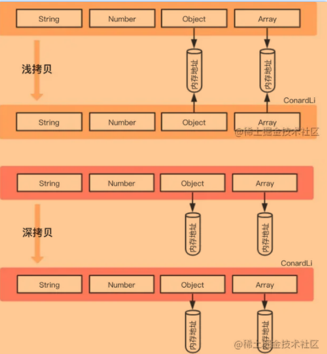

## 引用类型

### 数组总结

```js

slice(起始位置 ，[结束位置]) // 切分数组，返回新数组，新数组不包含结束位置的项
splice(起始位置，删除的个数，[插入的元素]) // 删除|插入|替换数组，返回删除的元素组成的数组，会修改原数组

reduce(fn(prev,cur,index,array){ return ... },initValue)
1.fn返回的值会作为第一个参数传递给下一项
2.initValue做为归并基础的初始值

```

### RegExp对象


### 对象总结

- 浅拷贝 

`浅拷贝`是创建一个新对象，这个对象有着原始对象属性值的一份精确拷贝。如果属性是基本类型，拷贝的就是基本类型的值，如果属性是引用类型，拷贝的就是内存地址 ，所以**如果其中一个对象改变了这个地址，就会影响到另一个对象**。


浅拷贝只复制指向某个对象的指针，而不复制对象本身，**新旧对象还是共享同一块内存**

> 浅拷贝方式1： `Object.assign()`

```js
<script>
    var obj = {
        name:'chucheng',
        score:12,
        friend:{
            name:'shunjie',
            age:28 
        }
    }
    var target = {}
    Object.assign(target,obj)
    obj.name = 'chucheng1'
    obj.friend.name = "shunjie_new"

    /* 
        当修改了原始对象的属性后，Object.assgin生成的目标对象target 并未受影响
        也就是说Object.assign的第一层属性时深拷贝
    */
    console.log(target,'target'); // {friend: {name: "shunjie_new", age: 28} name: "chucheng" score: 12}

    /**
     *  当修改了obj的内部的对象时，也就是obj的属性是个对象，其值被修改后
     *   Object。assign生成的targe也同步收影响了
     *   因为Object.assign在生成目标对象target时，只是引用 Obj.friend的地址
     *   当obj.friend.name发生了变化后，则Object.assign生成的目标对象也 随即发生变化
     *  
     * 
     */

     console.log(obj,'obj');  // {friend: {name: "shunjie_new", age: 28} name: "chucheng1" score: 12}
    

</script>
```

> 浅拷贝方式2：

```js
// 对象赋值
let obj1 = {
    name : '浪里行舟',
    arr : [1,[2,3],4],
};
let obj2 = obj1;
obj2.name = "阿浪";
obj2.arr[1] =[5,6,7] ;
console.log('obj1',obj1) // obj1 { name: '阿浪', arr: [ 1, [ 5, 6, 7 ], 4 ] }
console.log('obj2',obj2) // obj2 { name: '阿浪', arr: [ 1, [ 5, 6, 7 ], 4 ] }

```

> 浅拷贝方式3   - 展开运算符...

```js
let obj1 = { name: 'Kobe', address:{x:100,y:100}}
let obj2= {... obj1}
obj1.address.x = 200;
obj1.name = 'wade'
console.log('obj2',obj2) // obj2 { name: 'Kobe', address: { x: 200, y: 100 } }

```

> 浅拷贝方式4： `Array.prototype.concat()`

```js
let arr = [1, 3, {
    username: 'kobe'
    }];
let arr2 = arr.concat();    
arr2[2].username = 'wade';
console.log(arr); //[ 1, 3, { username: 'wade' } ]

```


---


- **深拷贝**

`深拷贝`是将一个对象从内存中完整的拷贝一份出来,从堆内存中开辟一个新的区域存放新对象,且**修改新对象不会影响原对象**。

> 深拷贝方式1：`JSON.parse(JSON.stringify())`

```js
let arr = [1, 3, {
    username: ' kobe'
}];
let arr4 = JSON.parse(JSON.stringify(arr));
arr4[2].username = 'duncan'; 
console.log(arr, arr4)

```

这也是利用JSON.stringify将对象转成JSON字符串，再用JSON.parse把字符串解析成对象，一去一来，新的对象产生了，而且对象会开辟新的栈，实现深拷贝

<div style="background-color:#99ff66">
    <h1>这种方法虽然可以实现数组或对象深拷贝,但不能处理函数和正则<h1>
    <p>因为这两者基于JSON.stringify和JSON.parse处理后，得到的正则就不再是正则（变为空对象），得到的函数就不再是函数（变为null）了。</p>

   

> 深拷贝方式2:  `函数库lodash的_.cloneDeep方法`

该函数库也有提供_.cloneDeep用来做 Deep Copy

```js
var _ = require('lodash');
var obj1 = {
    a: 1,
    b: { f: { g: 1 } },
    c: [1, 2, 3]
};
var obj2 = _.cloneDeep(obj1);
console.log(obj1.b.f === obj2.b.f);// false

```

> 深拷贝方式3：手写递归方法


**总结：**

|        | 和原数据是否指向同一对象 | 第一层数据为基本数据类型 | 原数据中包含子对象 |
| ------ | ------------------------ | ------------------------ | ------------------ |
| 赋值   | yes                      | 改变后 -  原数据 - 改变  | 会                 |
| 浅拷贝 | no                       | 不会                     | 会                 |
| 深拷贝 | no                       | 不会                     | 不会               |





