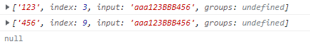

---


title: 常见问题总结
date: 2022-03-16 20:17:45
permalink: /pages/879be7/
categories:
  - note
  - problem
tags:
  - 
---

# 一、javscript部分
## 如何判断一个对象是否为空对象？

* **方法1**：
```javascript
let obj1 = {}
let obj2 = {a:1}
function empty(obj){
  for (let key in obj){
    return false;    //非空
}
  return true;       //为空
}
console.log(empty(obj1)) //true为空
console.log(empty(obj2)) //false非空
```
* **方法2**

```javascript
let obj1 = {}
let obj2 = {a:1}
function empty(obj){
  for (let key in obj){
    return false;    //非空
}
  return true;       //为空
}
console.log(empty(obj1)) //true为空
console.log(empty(obj2)) //false非空
```
* **方法3**

```javascript
let obj1 = {}
let obj2 = {a:1}
function empty(obj){
  for (let key in obj){
    return false;    //非空
}
  return true;       //为空
}
console.log(empty(obj1)) //true为空
console.log(empty(obj2)) //false非空
```
* **方法4**
```javascript
Object.keys(obj).length == 0
```

* **方法5**
通过将对象转换吃哼json字符串，进而判断是否为空对象。

```javascript
function ObjectIsNullOrNot02(param){
    return JSON.stringify(param)==="{}"?true:false;
}
```

## 2、如何判断一个对象是否有某一属性?
* **方法1：**
 . 或 [ ]   当此属性的值为false、undefined、NaN、null、0、"" 时，此方法不适用。


```javascript
if (obj2.a){
   console.log("对象有此属性")
}else {
   console.log("对象无此属性")
}
```
* **方法2**
in运算符   如果某属性在指定对象或其原型链上则返回true，只需判断自身属性时，此方法不适用。
```javascript
if (obj2.a){
   console.log("对象有此属性")
}else {
   console.log("对象无此属性")
}
```

* 方法3：
obj.hasOwnProperty() 对象自身属性中含有某属性，返回true。

```javascript
let obj2 = {a:1}if (obj2.hasOwnProperty("a")){
   console.log("对象上有此属性")
}else {
   console.log("对象上无此属性")
}
```

## 关于数组一些常用方法总结

 - map方法


> map()方法根据回调函数映射一个新数组

```javascript
Array.prototype.map=function(fn){
    const result=[];
    for(let i=0;i<this.length;i++){
      if(!this.hasOwnProperty(i)) continue; //处理是稀疏数组的情况
      result.push(fn(this[i],i,this));
    }
    return result;
  }
// 使用
  // const arr_m=[1,2,3,,5];
  // const mapArr=arr_m.map(item=>item * 2);
  // console.log(mapArr);
  
```

 - filter方法


> filter()方法返回一个数组，返回的每一项是在回调函数中执行结果true。

```javascript
  Array.prototype.filter=function(fn){
    const result=[];
    for(let i=0;i<this.length;i++){
      if(!this.hasOwnProperty(i)) continue;
      fn(this[i],i,this) && result.push(this[i]);
    }
    return result;
  }
  // 使用
  // const arr_f=[1,2,3,,5];
  // const fliterArr=arr_f.filter(item=>item > 2);
  // console.log(fliterArr);
  
```

 - every方法


> every() 方法测试一个数组内的所有元素是否都能通过某个指定函数的测试。它返回一个布尔值

```javascript
  Array.prototype.every=function(fn){
    let bool=true;
    for(let i=0;i<this.length;i++){
      if(!this.hasOwnProperty(i)) continue;
      if(!fn(this[i],i,this)){
        bool=false;
        break;
      }
    }
    return bool;
  }
  // 使用
  // const arr_e=[1,2,3,5];
  // const everyArr=arr_e.every(item=>item>3);
  // console.log(everyArr);
```

 - some方法


> some() 方法测试数组中是不是至少有1个元素通过了被提供的函数测试。它返回的是一个Boolean类型的值。

```javascript
 Array.prototype.some=function(fn){
    let bool=false;
    for(let i=0;i<this.length;i++){
      if(!this.hasOwnProperty(i)) continue;
        if(fn(this[i],i,this)){
          bool=true;
          break;
        }
    }
    return bool;
  }
  
  // const arr_s=[1,2,3,5];
  // const someArr=arr_s.some(item=>item>3);
  // console.log(someArr);
  
```

 - find方法


> find() 方法返回数组中满足提供的测试函数的第一个元素的值。否则返回 undefined。

```javascript
  Array.prototype.find=function(fn){
    let result;
    for(let i=0;i<this.length;i++){
      if(!this.hasOwnProperty(i)) continue;
      if(fn(this[i],i,this)){
        result=this[i];
        break;
      }
    }
    return result;
  }
  
  // const arr_f=[1,2,3,5];
  // const findArr=arr_f.find(item=>item>6);
  // console.log(findArr);
  
```

 - reduce方法


```javascript
  Array.prototype.reduce=function(fn,initValue){
    let result=initValue?initValue:this[0];
    for(let i=initValue ? 1:0;i<this.length;i++){
      if(!this.hasOwnProperty(i)) continue;
      result=fn(result,this[i],i,this);
    }
    return result;
  }
  // 使用
  // const arr_r=[1,2,3,,5];
  // const reduceArr=arr_r.reduce((a,b)=>a*b,2);
  // console.log(reduceArr);
  
```

 

 - **拉平数组**
将嵌套的数组扁平化，在处理业务数据场景中是频率出现比较高的。那如何实现呢？

方法1：利用ES6语法flat(num)方法将数组拉平
	
该方法不传参数默认只会拉平一层，如果想拉平多层嵌套的数组，需要传入一个整数，表示要拉平的层级。该返回返回一个新的数组，对原数组没有影响。
 	

```javascript
  // 利用flat方法封装
  function flattening(arr,num=1){
    if(!Array.isArray(arr)) return;
    return arr.flat(num);
  }
  
```
方法2：利用reduce()方法将数组拉平。

利用reduce进行迭代，核心的思想是递归实现。

```javascript
  // 利用reduce实现
  function flattening(arr){
    if(!Array.isArray(arr)) return;
    return arr.reduce((a,b)=>a.concat(Array.isArray(b)?flattening(b):a),[]);
  }
  
```
方法3：模拟栈实现数组拉平

该方法是模拟栈，在性能上相对最优解

```javascript
  // 栈实现拉平
  function flattening(arr){
    if(!Array.isArray(arr)) return;
    const stack=[...arr];
    const res=[];
    while(stack.length){
        let value=stack.shift();
        Array.isArray(value)?stack.push(...value): res.push(value)
    }
    return res;
  }
```

## 8个常用的Javascript对象方法

 - object.is

> Object.is() 是一种判断两个值是否相同的方法。

> **语法**：Object.is(value1, value2);
> **参数：**
> value1：要比较的第一个值。
> value2：要比较的第二个值。
> 返回值：一个布尔表达式，指示两个参数是否具有相同的值。

```javascript
// Case 1: Evaluation result is the same as using '==='
Object.is(25, 25);                // true
Object.is('foo', 'bar');          // false
Object.is(foo, foo);              // true
// Case 2: Signed zero
Object.is(0, -0);                 // false
Object.is(0n, -0n);               // true
// Case 3: NaN
Object.is(NaN, 0/0);              // true
Object.is(NaN, Number.NaN)        // true
```

 - Object.assign()


> Object.assign() 方法用于将所有可枚举的自身属性从一个或多个源对象复制到目标对象。

>语法：Object.assign(target, ...sources)

>参数：
>target：目标对象——应用源属性的对象，修改后返回。
>sources：源对象——包含你要应用的属性的对象。
>返回值：修改后的目标对象

```javascript
const target = { a: 1, b: 2 };
const source = { b: 4, c: 5 };
const returnedTarget = Object.assign(target, source);
console.log(target);
// expected output: Object { a: 1, b: 4, c: 5 }
console.log(returnedTarget);
// expected output: Object { a: 1, b: 4, c: 5 }
```
注意：如果源对象中的属性具有相同的键，则目标对象中的属性会被源中的属性覆盖。较晚来源的属性会覆盖较早来源的属性。

 - Object.entries()

> Object.entries() 方法返回给定对象自己的可枚举字符串键属性 [key, value] 对的数组。

> 它类似于使用 for...in 循环进行迭代，除了 for...in 循环还会枚举原型链中的属性。属性的顺序与通过手动循环对象的属性值给出的顺序相同

> 参数：
> obj：要返回其自己的可枚举字符串键属性 [key, value] 对的对象。
> 返回值：给定对象自己的可枚举字符串键属性 [key, value] 对的数组。

```javascript
const object1 = {name: "David", age: 23};
for (const [key, value] of Object.entries(object1)) {
  console.log(`${key}: ${value}`);
}
// "name: David"
// "age: 23"
```

 - Object.keys()


> Object.keys() 方法用于返回给定对象自己的可枚举属性名称的数组，以与普通循环相同的顺序迭代。

```javascript
const object1 = {
  a: 'somestring',
  b: 42,
  c: false
};
console.log(Object.keys(object1));
// expected output: Array ["a", "b", "c"]
```

 - Object.prototype.hasOwnProperty()

> hasOwnProperty() 方法返回一个布尔值，指示对象是否具有指定的属性作为它自己的属性。

> 如果指定的属性是对象的直接属性，则该方法返回 true — 即使值为 null 或未定义。如果该属性是继承的或根本没有声明，则返回 false。

```javascript
const object1 = {};
object1.property1 = 42;
console.log(object1.hasOwnProperty('property1'));
// expected output: true
console.log(object1.hasOwnProperty('toString'));
// expected output: false
console.log(object1.hasOwnProperty('hasOwnProperty'));
// expected output: false
```

 - Object.prototype.toString()


> toString() 方法返回一个表示对象的字符串。当对象将被表示为文本值或以期望字符串的方式引用对象时，将自动调用此方法 id。默认情况下，toString() 方法由从 Object 继承的每个对象继承。

```javascript
function Dog(name) {
  this.name = name;
}
const dog1 = new Dog('Gabby');
Dog.prototype.toString = function dogToString() {
  return `${this.name}`;
};
console.log(dog1.toString());
// expected output: "Gabby"
```

 - Object.values()


> Object.values() 方法返回给定对象自己的可枚举属性值的数组，其顺序与 for...in 循环提供的顺序相同。

```javascript
const object1 = {
  a: 'somestring',
  b: 42,
  c: false
};
console.log(Object.values(object1));
// expected output: Array ["somestring", 42, false]
```

## 图片懒加载 & 惰性函数
实现图片懒加载其核心的思想就是将img的src属性先使用一张本地占位符，或者为空。然后真实的图片路径再定义一个data-set属性存起来，待达到一定条件的时将data-img的属性值赋给src。
如下是通过scroll滚动事件监听来实现的图片懒加载，当图片都加载完毕移除事件监听，并且将移除html标签。

```javascript
const lazyLoad=function(imgs){
  let count=0;
  const deleteImgs=[];
  const handler=()=>{
    imgs.forEach((img,index)=>{
      const react=img.getBoundingClientRect();
      if(react.top<window.innerHeight){
        img.src=dataset.src;
        count++;
        deleteImgs.push(index);
        if(count===imgs.length) document.removeEventListener('scroll',lazyLoad);
      }
    });
    imgs=imgs.filter((_,index)=>!deleteImgs.includes(index));
  }
  return handler();
}
```
scroll滚动事件容易造成性能问题。那可以通过 IntersectionObserver 自动观察img标签是否进入可视区域。
实例化 IntersectionObserver 实例，接受两个参数：callback是可见性变化时的回调函数，option是配置对象（该参数可选）。
当 img 标签进入可视区域时会执行实例化时的回调，同时给回调传入一个 entries 参数，保存着实例观察的所有元素的一些状态，比如每个元素的边界信息，当前元素对应的 DOM 节点，当前元素进入可视区域的比率，每当一个元素进入可视区域，将真正的图片赋值给当前 img 标签，同时解除对其的观察。

```javascript
const lazyLoad=function(imgs){
  const observer=new IntersectionObserver((entries)=>{
    entries.forEach(entry=>{
      if(entry.intersectionRatio>0){
        entry.target.src=dataset.src;
        observer.unobserve(entry.target);
      }
    })
  })
  imgs.forEach(img=>observer.observe(img));
}
```
如上是懒加载图片的实现方式。

> 值得思考的是，懒加载和惰性函数有什么不一样嘛？
> 我所理解的懒加载顾名思义就是需要了才去加载，懒加载正是惰性的一种，但惰性函数不仅仅是懒加载，它还可以包含另外一种方向。
> 惰性函数的另一种方向是在重写函数，每一次调用函数的时候无需在做一些条件的判断，判断条件在初始化的时候执行一次就好了，即下次在同样的条件语句不需要再次判断了，比如在事件监听上的兼容

## 预加载

 1. **什么是预加载**

资源预加载是另一个性能优化技术，我们可以使用该技术来预先告知浏览器某些资源可能在将来会被使用到。预加载简单来说就是将所有所需的资源提前请求加载到本地，这样后面在需要用到时就直接从缓存取资源
	
 2. **为什么要用预加载**

在网页全部加载之前，对一些主要内容进行加载，以提供给用户更好的体验，减少等待的时间。否则，如果一个页面的内容过于庞大，没有使用预加载技术的页面就会长时间的展现为一片空白，直到所有内容加载完毕。

 3. **实现预加载的集中办法**

使用html标签

```javascript

```
使用Image对象

```javascript
<script src="./myPreload.js"></script>
```

```javascript
//myPreload.js文件
var image= new Image()
image.src="http://pic26.nipic.com/20121213/6168183 004444903000 2.jpg"

```
使用XMLHttpRequest对象,虽然存在跨域问题，但会精细控制预加载过程

```javascript
var xmlhttprequest=new XMLHttpRequest();
xmlhttprequest.onreadystatechange=callback;
xmlhttprequest.onprogress=progressCallback;
xmlhttprequest.open("GET","http://image.baidu.com/mouse,jpg",true);
xmlhttprequest.send();
function callback(){
  if(xmlhttprequest.readyState==4&& xmlhttprequest.status==200){
    var responseText=xmlhttprequest.responseText;
  }else{
     console.log("Request was unsuccessful:"+xmlhttprequest.status);
  }
}
function progressCallback(e){
e=e || event;
if(e.lengthComputable){
console.log("Received"+e.loaded+"of"+e.total+"bytes")
}
}

```
使用[PreloadJS库](https://createjs.com/preloadjs)
PreloadJS提供了一种预加载内容的一致方式，以便在HTML应用程序中使用。预加载可以使用HTML标签以及XHR来完成。默认情况下，PreloadJS会尝试使用XHR加载内容，因为它提供了对进度和完成事件的更好支持，但是由于跨域问题，使用基于标记的加载可能更好

```javascript
//使用preload.js
var queue=new createjs.LoadQueue();//默认是xhr对象，如果是new createjs.LoadQueue(false)是指使用HTML标签，可以跨域
queue.on("complete",handleComplete,this);
queue.loadManifest([
{id:"myImage",src:"http://pic26.nipic.com/20121213/6168183  0044449030002.jpg"},
{id："myImage2"，src:"http://pic9.nipic.com/20100814/2839526  1931471581702.jpg"}
]);
function handleComplete(){
  var image=queue.getResuLt("myImage");
  document.body.appendChild(image);
}

```

 

 - **懒加载和预加载的对比**
两者都是提高页面性能有效的办法，两者主要区别是一个是提前加载，一个是迟缓甚至不加载。懒加载对服务器前端有一定的缓解压力作用，预加载则会增加服务器前端压力。


## ES6中export和import


 - export


> export有2种导出模式
> 1、exoprt
> 2、export default [ 一个js模块只能有一个default ]

**导出变量：**
export 后边可以是一个变量声明表达式或者是一个{}里边包含变量名，但是不能直接输出一个变量， export default 后边可以直接跟一个常量或者变量，但是不能跟声明表达式

```javascript
export var a = 1 //正确
const age = 100
export { age } //正确
export age //错误
export default age //正确
export default 50 //正确
export default var name='abc ' //错误
```
**导出函数：**
export和export都可以直接导出函数声明语句，但是export后边不能跟匿名函数，如果直接导出函数名export 需要用{}包裹

```javascript
//正确
 export default function test () {
  console.log('test function')
}
   //正确
 export  function test2 () {
  console.log('test function')
}
//错误
 export  function  () {
  console.log('test function')
}
 //正确
 export default function  () {
  console.log('test function')
}

function test3(){
 console.log('test3 function')
}

//正确
expor {test3}
//正确
export default test3
错误
export  test3

```

  **使用 as别名导出**

```javascript
let a = 100

export {a as age }
```

 - import 导入


> 对于使用export default 导出的，倒入时不需要使用{},且名字可以任意定义
> 对于使用export 导出的，必须使用{}倒入，且名字必须一致
> 可以使用通配符* 方式全部导入 (import * as obj from '../a.js')

```javascript
//对于export default 导出的
import myFn from './a.js'

//对于使用export 导出的
import {test1,test2} from './a.js'
```

 - 按需加载

> 采用回调函数的方式，所有的引入直接在回调中

```javascript
   document.onclick = function() {
      import('./a.js').then(data => {
        console.log(data)
      })
    }

```

 - [ ] **小结 - 模块化写法优点：**
 - 防止作用域污染
 - 提高代码的复用性
 - 降低维护成本
 - [ ] **知识延伸：require 和 import的区别**
 - 导入require 导出 exports/module.exports 是 CommonJS 的标准，通常适用范围如 Node.js
 - import/export 是 ES6 的标准，通常适用范围如 React
 - require 是赋值过程并且是运行时才执行，也就是同步加载
 - require 可以理解为一个全局方法，因为它是一个方法所以意味着可以在任何地方执行
 - import 是解构过程并且是编译时执行，理解为异步加载
 - import 会提升到整个模块的头部，具有置顶性，但是建议写在文件的顶部
 - [ ] **require和import的性能**
 - require 的性能相对于 import 稍低。因为 require 是在运行时才引入模块并且还赋值给某个变量，而 import 只需要依据 import 中的接口在编译时引入指定模块所以性能稍高

## 正则表达式的引用

```js

RegExp

exec

replace


```


## JSON使用注意

https://juejin.cn/post/6844903511222648845

JavaScript 和 JSON 对转义字符的处理方式不同，导致了难以发现的 bug。JSON 遇到不能转义的字符直接抛出异常，而 JavaScript 遇到不能转义的字符直接解释为对应的非转义版本


## 正则表达式

正则表达式一直是困扰很多程序员的一门技术，当然也包括曾经的我。大多数时候我们在开发过程中要用到某些正则表达式的时候，都会打开谷歌或百度直接搜索然后拷贝粘贴。当下一次再遇到相同问题的时候，同样的场景又再来一遍。作为一门用途很广的技术，我相信深入理解正则表达式并能融会贯通是值得的。所以，希望这篇文章能帮助大家理清思路，搞懂正则表达式各种符号之间的内在联系，形成知识体系，当下次再遇到正则表达式的时候可以不借助搜索引擎，自己解决。

### 正则表达式到底是什么

正则表达式(Regular Expression)其实就是一门工具，**目的**是为了字符串模式匹配，从而实现搜索和替换功能。它起源于上个20世纪50年代科学家在数学领域做的一些研究工作，后来才被引入到计算机领域中。从它的命名我们可以知道，它是一种**用来描述规则的表达式**。而它的底层原理也十分简单，就是使用状态机的思想进行模式匹配。大家可以利用[regexper.com](https://link.juejin.cn?target=https%3A%2F%2Fregexper.com%2F)这个工具很好地可视化自己写的正则表达式:

如`/\d\w+/`这个正则生成的状态机图:


对于具体的算法实现，大家如果感兴趣可以阅读《算法导论》。

###  从字符出发

我们学习一个系统化的知识，一定要从其基础构成来了解。正则表达式的基本**组成元素**可以分为：

**字符和元字符**。字符很好理解，就是基础的计算机字符编码，通常正则表达式里面使用的就是`数字、英文字母。而元字符`，也被称为特殊字符，是一些用来表示特殊语义的字符。如`^表示非`，`|表示或`等。利用这些元字符，才能构造出强大的表达式模式(pattern)。接下来，我们就来从这些基本单位出发，来学习一下如何构建正则表达式。

###  单个字符

最简单的正则表达式可以由简单的数字和字母组成，没有特殊的语义，纯粹就是一一对应的关系。如想在'apple'这个单词里找到‘a'这个字符，就直接用`/a/`这个正则就可以了。

但是如果想要匹配特殊字符的话，就得请出我们第一个元字符**`\`**， 它是转义字符字符，顾名思义，就是让其后续的字符失去其本来的含义。举个例子：

我想匹配`*`这个符号，由于`*`这个符号本身是个特殊字符，所以我要利用转义元字符`\`来让它失去其本来的含义：

```js
/\*/
```

如果本来这个字符不是特殊字符，使用转义符号就会让它拥有特殊的含义。我们常常需要匹配一些特殊字符，比如空格，制表符，回车，换行等, 而这些就需要我们使用转义字符来匹配。为了便于记忆，我整理了下面这个表格，并附上记忆方式：

| 特殊字符   | 正则表达式 | 记忆方式                                     |
| ---------- | ---------- | -------------------------------------------- |
| 换行符     | \n         | **n**ew line                                 |
| 换页符     | \f         | **f**orm feed                                |
| 回车符     | \r         | **r**eturn                                   |
| 空白符     | \s         | **s**pace                                    |
| 制表符     | \t         | **t**ab                                      |
| 垂直制表符 | \v         | **v**ertical tab                             |
| 回退符     | [\b]       | **b**ackspace,之所以使用[]符号是避免和\b重复 |

### 多个字符

单个字符的映射关系是一对一的，即正则表达式的被用来筛选匹配的字符只有一个。而这显然是不够的，只要引入集合区间和通配符的方式就可以实现一对多的匹配了。

在正则表达式里，集合的定义方式是使用中括号`[`和`]`。如`/[123]/`这个正则就能同时匹配1,2,3三个字符。那如果我想匹配所有的数字怎么办呢？从0写到9显然太过低效，所以元字符`-`就可以用来表示区间范围，利用`/[0-9]/`就能匹配所有的数字, `/[a-z]/`则可以匹配所有的英文小写字母。

即便有了集合和区间的定义方式，如果要同时匹配多个字符也还是要一一列举，这是低效的。所以在正则表达式里衍生了一批用来同时匹配多个字符的简便正则表达式:

| 匹配区间                                      | 正则表达式 | 记忆方式            |
| --------------------------------------------- | ---------- | ------------------- |
| 除了换行符之外的任何字符                      | .          | 句号,除了句子结束符 |
| 单个数字, [0-9]                               | \d         | **d**igit           |
| 除了[0-9]                                     | \D         | **not** **d**igit   |
| 包括下划线在内的单个字符，[A-Za-z0-9_]        | \w         | **w**ord            |
| 非单字字符                                    | \W         | **not** **w**ord    |
| 匹配空白字符,包括空格、制表符、换页符和换行符 | \s         | **s**pace           |
| 匹配非空白字符                                | \S         | **not** **s**pace   |

### 循环与重复

一对一和一对多的字符匹配都讲完了。接下来，就该介绍如何同时匹配多个字符。要实现多个字符的匹配我们只要多次循环，重复使用我们的之前的正则规则就可以了。那么根据循环次数的多与少，我们可以分为0次，1次，多次，特定次

- **0 | 1**

元字符`?`代表了匹配一个字符或0个字符。设想一下，如果你要匹配`color`和`colour`这两个单词，就需要同时保证`u`这个字符是否出现都能被匹配到。所以你的正则表达式应该是这样的：`/colou?r/`。

- **>= 0**

元字符`*`用来表示匹配0个字符或无数个字符。通常用来过滤某些可有可无的字符串。

- **>= 1**

元字符`+`适用于要匹配同个字符出现1次或多次的情况。

- **特定次数**

在某些情况下，我们需要匹配特定的重复次数，元字符`{`和`}`用来给重复匹配设置精确的区间范围。如'a'我想匹配3次,那么我就使用`/a{3}/`这个正则，或者说'a'我想匹配至少两次就是用`/a{2,}/`这个正则。

以下是完整的语法：

```
- {x}: x次

- {min, max}： 介于min次到max次之间

- {min, }: 至少min次

- {0, max}： 至多max次
复制代码
```

由于这些元字符比较抽象，且容易混淆，所以我用了联想记忆的方式编了口诀能保证在用到的时候就能回忆起来。

| 匹配规则    | 元字符          | 联想方式                                                     |
| ----------- | --------------- | ------------------------------------------------------------ |
| 0次或1次    | ?               | 且**问**,此事**有**还**无**                                  |
| 0次或无数次 | *               | 宇宙洪荒,**辰宿**列张：宇宙伊始，从无到有，最后星宿布满星空  |
| 1次或无数次 | +               | **一加**, +1                                                 |
| 特定次数    | {x}, {min, max} | 可以想象成一个数轴，从一个点，到一个射线再到线段。min和max分别表示了左闭右闭区间的左界和右界 |

### 位置边界

上面我们把字符的匹配都介绍完了，接着我们还需要位置边界的匹配。在长文本字符串查找过程中，我们常常需要限制查询的位置。比如我只想在单词的开头结尾查找。

- 单词边界

单词是构成句子和文章的基本单位，一个常见的使用场景是把文章或句子中的特定单词找出来。如：

```
The cat scattered his food all over the room.
复制代码
```

我想找到`cat`这个单词，但是如果只是使用`/cat/`这个正则，就会同时匹配到`cat`和`scattered`这两处文本。这时候我们就需要使用边界正则表达式`\b`，其中b是boundary的首字母。在正则引擎里它其实匹配的是能构成单词的字符(\w)和不能构成单词的字符(\W)中间的那个位置。

上面的例子改写成`/\bcat\b/`这样就能匹配到`cat`这个单词了

- 字符串边界

匹配完单词，我们再来看一下一整个字符串的边界怎么匹配。元字符`^`用来匹配字符串的开头。而元字符`$`用来匹配字符串的末尾。注意的是在长文本里，如果要排除换行符的干扰，我们要使用多行模式。试着匹配`I am scq000`这个句子：

```
I am scq000.
I am scq000.
I am scq000.
复制代码
```

我们可以使用`/^I am scq000\.$/m`这样的正则表达式，其实m是multiple line的首字母。正则里面的模式除了m外比较常用的还有i和g。前者的意思是忽略大小写，后者的意思是找到所有符合的匹配。

最后，总结一下：

| 边界和标志 | 正则表达式 | 记忆方式                              |
| ---------- | ---------- | ------------------------------------- |
| 单词边界   | \b         | **b**oundary                          |
| 非单词边界 | \B         | **not** **b**oundary                  |
| 字符串开头 | ^          | 小**头尖尖**那么大个                  |
| 字符串结尾 | $          | **终结**者，美国科幻电影，美元符$     |
| 多行模式   | m标志      | **m**ultiple of lines                 |
| 忽略大小写 | i标志      | **i**gnore case, case-**i**nsensitive |
| 全局模式   | g标志      | **g**lobal                            |

### 子表达式

字符匹配我们介绍的差不多了，更加高级的用法就得用到子表达式了。通过嵌套递归和自身引用可以让正则发挥更强大的功能。

从简单到复杂的正则表达式演变通常要采用**分组、回溯引用和逻辑处理**的思想。利用这三种规则，可以推演出无限复杂的正则表达式。

- 分组

其中分组体现在：所有以`(`和`)`元字符所包含的正则表达式被分为一组，每一个分组都是一个**子表达式**，它也是构成高级正则表达式的基础。如果只是使用简单的`(regex)`匹配语法本质上和不分组是一样的，如果要发挥它强大的作用，往往要结合回溯引用的方式

- 回溯引用

所谓回溯引用（backreference）指的是模式的后面部分引用前面已经匹配到的子字符串。你可以把它想象成是变量，回溯引用的语法像`\1`,`\2`,....,其中`\1`表示引用的第一个子表达式，`\2`表示引用的第二个子表达式，以此类推。而`\0`则表示整个表达式。

假设现在要在下面这个文本里匹配两个连续相同的单词，你要怎么做呢？

```
Hello what what is the first thing, and I am am scq000.
复制代码
```

利用回溯引用，我们可以很容易地写出`\b(\w+)\s\1`这样的正则。

回溯引用在替换字符串中十分常用，语法上有些许区别，用`$1`,`$2`...来引用要被替换的字符串。下面以js代码作演示：

```
var str = 'abc abc 123';
str.replace(/(ab)c/g,'$1g');
// 得到结果 'abg abg 123'
复制代码
```

如果我们不想子表达式被引用，可以使用**非捕获**正则`(?:regex)`这样就可以避免浪费内存。

```
var str = 'scq000'.
str.replace(/(scq00)(?:0)/, '$1,$2')
// 返回scq00,$2
// 由于使用了非捕获正则，所以第二个引用没有值，这里直接替换为$2
复制代码
```

有时，我们需要限制回溯引用的适用范围。那么通过前向查找和后向查找就可以达到这个目的。

### 前向查找

前向查找(lookahead)是用来限制后缀的。凡是以`(?=regex)`包含的子表达式在匹配过程中都会用来限制前面的表达式的匹配。例如`happy happily`这两个单词，我想获得以`happ`开头的副词，那么就可以使用`happ(?=ily)`来匹配。如果我想过滤所有以`happ`开头的副词，那么也可以采用**负前向查找**的正则`happ(?!ily)`，就会匹配到`happy`单词的`happ`前缀。

### 后向查找

介绍完前向查找，接着我们再来介绍一下它的反向操作：后向查找(lookbehind)。后向查找(lookbehind)是通过指定一个子表达式，然后从符合这个子表达式的位置出发开始查找符合规则的字串。举个简单的例子： `apple`和`people`都包含`ple`这个后缀，那么如果我只想找到`apple`的`ple`，该怎么做呢？我们可以通过限制`app`这个前缀，就能唯一确定`ple`这个单词了。

```
/(?<=app)ple/
复制代码
```

其中`(?<=regex)`的语法就是我们这里要介绍的后向查找。`regex`指代的子表达式会作为限制项进行匹配，匹配到这个子表达式后，就会继续向**后**查找。另外一种限制匹配是利用`(?<!regex)` 语法，这里称为**负后向查找**。与正前向查找不同的是，被指定的子表达式不能被匹配到。于是，在上面的例子中，如果想要查找`apple`的`ple`也可以这么写成`/(?<!peo)ple`。

需要注意的，不是每种正则实现都支持后向查找。在javascript中是不支持的，所以如果有用到后向查找的情况，有一个思路是将字符串进行翻转，然后再使用前向查找，作完处理后再翻转回来。看一个简单的例子：

```
// 比如我想替换apple的ple为ply
var str = 'apple people';
str.split('').reverse().join('').replace(/elp(?=pa)/, 'ylp').split('').reverse().join('');
复制代码
```

> ps: 感谢评论区提醒，从es2018之后，chrome中的正则表达式也支持反向查找了。不过，在实际项目中还需要注意对旧浏览器的支持，以防线上出现Bug。详情请查看http://kangax.github.io/compat-table/es2016plus/#test-RegExp_Lookbehind_Assertions

最后回顾一下这部分内容：

| 回溯查找   | 正则                   | 记忆方式                                                     |
| ---------- | ---------------------- | ------------------------------------------------------------ |
| 引用       | \0,\1,\2 和 $0, $1, $2 | 转义+数字                                                    |
| 非捕获组   | (?:)                   | 引用表达式(()), 本身不被消费(?),引用(:)                      |
| 前向查找   | (?=)                   | 引用子表达式(())，本身不被消费(?), 正向的查找(=)             |
| 前向负查找 | (?!)                   | 引用子表达式(())，本身不被消费(?), 负向的查找(!)             |
| 后向查找   | (?<=)                  | 引用子表达式(())，本身不被消费(?), 后向的(<，开口往后)，正的查找(=) |
| 后向负查找 | (?<!)                  | 引用子表达式(())，本身不被消费(?), 后向的(<，开口往后)，负的查找(!) |

### 逻辑处理


计算机科学就是一门包含逻辑的科学。让我们回忆一下编程语言当中用到的三种逻辑关系，与或非。

在正则里面，默认的正则规则都是**与**的关系所以这里不讨论。

而**非**关系，分为两种情况：一种是字符匹配，另一种是子表达式匹配。在字符匹配的时候，需要使用`^`这个元字符。在这里要着重记忆一下：**只有在`[`和`]`内部使用的`^`才表示非的关系**。子表达式匹配的非关系就要用到前面介绍的前向负查找子表达式`(?!regex)`或后向负查找子表达式`(?<!regex)`。

或关系，通常给子表达式进行归类使用。比如，我同时匹配a,b两种情况就可以使用`(a|b)`这样的子表达式。

| 逻辑关系 | 正则元字符  |
| -------- | ----------- |
| 与       | 无          |
| 非       | [^regex]和! |
| 或       | \|          |

### 正则表达式的Method( 在js中应用 )

- reg.exec( )

> reg.exec()每次调用，返回一个匹配的结果，匹配结果和分组以数组的形式返回，不断的调用即可返回下一个结果，直到返回`null`

案例如下：

```js

var patt=/\d+/g
var str="aaa123BBB456"
console.log(patt.exec(str))
console.log(patt.exec(str))
console.log(patt.exec(str)) 
```



---

-  `str.replace()`

> replace也是字符串的方法，它的基本用法是`str.replace(reg,replace|function)`，第一个参数是正则表达式，代表匹配的内容，第二个参数是替换的字符串或者一个回掉函数。

**注意，replace不会修改原字符串，只是返回一个修改后的字符串;除此外，正则表达式如果没有使用`g`标志，也和`match`一样，只匹配/替换第一个**

```js
- 需求：替换一个序列中的元音字母(aeiou)，将其替换成一个double。 比如x->xx 
- 注意，第二个参数必须是字符串; 注意不要忘记加g

var s = "Hello,My name is Vincent."
var result = s.replace(/([aeiou])/g,"$1$1")
//"Heelloo,My naamee iis Viinceent."


```

**function函数的应用**：（将正则匹配到的数据，传入到函数中，执行对应逻辑后，再返回去）

```js
var s = "Hello,My name is Vincent. What is your name?"
var newStr = s.replace(/\b\w{4}\b/g,replacer)
console.log(newStr)
function replacer(match) {
    console.log(match);
    return match.toUpperCase();
}
/*
name
What
your
name
Hello,My NAME is Vincent. WHAT is YOUR NAME?
*/

```

所以，函数的参数是匹配到的内容，返回的是需要替换的内容。好了，基本示例解释了基本用法，那么之前讨论的分组怎么办？如何实现分组呢？

```js
//分组
function replacer(match,group1,group2) {
    console.log(group1);
    console.log(group2);
}
```

---

- `reg.test(str)`

> 正则表达式本身有一个test的方法，这个方法只能测试是否包含，返回一个bool变量

```js
var r = /\d{3}/;
var a = '123';
var b = '123ABC';
var c = 'abc';

r.test(a)  //true
r.test(b) //true
r.test(c) //false

// 其中a，b，c就是表示带验证的字符串
```

---

- `str.match()`

> 与test()不同，不只是返回bool变量，它会返回你所匹配到的内容

```js
var r = /compus/
var reg = /\w+/g
var s = "compus, I know something about you"
console.log(r.test(s))    //true
console.log(s.match(r) ); //["compus"]
console.log(s.match(reg));    // ['compus', 'I', 'know', 'something', 'about', 'you']


// 注意：match返回匹配的是第一个满足条件的内容，如果需要匹配多个，则需要再整个表达式后加g ( 表示全局匹配 )
```

---

- `str.split`

> 现在来到了更强的功能上，先说下split，我们知道split是将字符串按照某个字符分隔开，比如有以下一段话，需要将其分割成单词。

```js
result = s.split(/[,\s]+/);
// ["unicorns", "and", "rainbows", "And", "Cupcakes"]

```

**单词的分割：**

好了，拓展一下，实现一个段落的单词分割，一个正则表达式就是

```js
result = s.split(/[,.!?\s]+/)
```

当然，有个最简单的方法，我们可以这样去做

```js
result = s.split(/\W+/);
```

接着，如果我们想将一个段落的句子都分隔开，一个可以实现的表达式就是

```js
result = s.split(/[.,!?]+/)
```

最后，有一个小需求，就是在分割句子的同时，还想把相应的分隔符保留下来。

```json
var s = 
"Hello,My name is Vincent. Nice to Meet you!What's your name? Haha."
```

这是一个小小的ponit，记住**如果想要保留分隔符，只要给匹配的内容分组即可**

```js
var result = s.split(/([.,!?]+)/)
//["Hello", ",", "My name is Vincent", ".", " Nice to Meet you", "!", "What's your name", "?", " Haha", ".", ""]
```

可以看到，这样就会把分隔符也存储起来


### 总结

对于正则来说，符号之抽象往往让很多程序员却步。针对不好记忆的特点，我通过分类和联想的方式努力让其变得有意义。我们先从一对一的单字符，再到多对多的子字符串介绍，然后通过分组、回溯引用和逻辑处理的方式来构建高级的正则表达式。

在最后，出个常用的正则面试题吧：请写出一个正则来处理数字千分位，如`12345`替换为`12,345`。请尝试自己推理演绎得出答案，而不是依靠搜索引擎:)。代码如下：

```js
    let str = '12345'
    str=str.replace(/(\d{2})(?=\d{3})/,'$1,');
```


过一张图表来对正则表达式的基本进行一个回顾

| single char                               | quantifiers(数量)             | position(位置)             |
| ----------------------------------------- | ----------------------------- | -------------------------- |
| \d 匹配数字                               | * 0个或者更多                 | ^一行的开头                |
| \w  匹配word(数字、字母)                  | + 1个或更多，至少1个          | $一行的结尾                |
| \W 匹配**非**word(数字、字母)             | ? 0个或1个,一个Optional       | \b 单词"结界"(word bounds) |
| \s 匹配white space(包括空格、tab等)       | {min,max}出现次数在一个范围内 |                            |
| \S 匹配**非**white space(包括空格、tab等) | {n}匹配出现n次的              |                            |
| . 匹配任何，任何的字符                    |                               |                            |

`[]`的作用，用英文表达就是"alternation",表达一个或的逻辑；

`/[-.(]/` 在符号中的连字符`-`放在第一位表示连字符本身，如果放在中间，表示"从..到.."，比如`[a-z]`表示a-z

`[.)]` 括号中的特殊符号不需要转义，就表示其本身

```
[^ab]` 括号中的`^`表示非，anythings except `a` and `b
```

`(a|b)`也可表示选择，但是它有更强大的功能....


# 二、css部分
## 遇到的问题小结

 - ### 如果父组件没有些样式，style，则组件内部的背景颜色默认为透明色 transparent
 -  ### 如果要修改组件内部的背景颜色，可以直接这样设置`<conponent style="{background-color:#fff}">`
 - ### 如果页面内容高度不确定，可以给div盒子写高度，但是不需要写死高度，理由1：如果写死了高度，则当内容超出盒子高度后，超出部分无法正常显示；理由2：如果不写高度的话，背景或者盒子的高度则被被内容自动撑开，从而实现自适应的效果


	1、如果盒子有内容，但是没有设置高度，则盒子会被内容自动撑开如果盒子有内容，设置我min-height，则会根据内容自动撑开如果盒子有内容，有设置高度height，如果内容小于height则正常在盒子内显示，其余会溢出盒子
	
	2、如果盒子没有内容，但是没有设置高度，则盒子是空白，就没有任何显示如果盒子没有内容，但是有设置min-height，则会按照min-height的高度进行显示如果盒子没有内容，有设置height，则会按照height的高度进行显示

 -  ### 文本过长，超出div宽度，怎么办？


 -  ### css 样式调试语法注意事项
 
 -  ### css样式无法生效的时候，可能是因为权重问题，可以设置 !important


```javascript
/deep/ .el-checkbox { .el-checkbox__label{ color: #fff; } } /deep/ .el-checkbox.is-checked{ .el-checkbox__label{ color: #38FFF2!important; } }
```

 - 如何引入在线iconfont
    

 - 父组件改变子组件样式：

  **（1）第一种方式：自定义element-ui样式**

  现在我们来说说怎么覆盖 element-ui 样式。由于 element-ui 的样式我们是在全局引入的，所以你想在某个页面里面覆盖它的样式就不能加 scoped，但你又想只覆盖这个页面的 element 样式，你就可在它的父级加一个 class，用命名空间来解决问题。

  ```js
  .article-page {
    /* 你的命名空间 */
    .el-tag {
      /* element-ui 元素*/
      margin-right: 0px;
    }
  }
  ```

  **（2）第二种方式：深度选择器**

  当你子组件使用了 `scoped` 但在父组件又想修改子组件的样式可以 通过 `>>>` 来实现：

  ```css
  <style scoped>
  .a >>> .b { /* ... */ }
  </style>
  ```

​	将会编译成：

```css
    .a[data-v-f3f3eg9] .b {
      /* ... */
    }
```

---

​		如果你使用了一些预处理的东西，如 `sass` 你可以通过 `/deep/` 来代替 `>>>` 实现想要的效果。

​        所以你想覆盖某个特定页面 `element` 的 button 的样式，你可以这样做：

```css
.xxx-container >>> .el-button{
  xxxx
}
```


 - ### 关于组件内部插槽样式如何编写的问题?
    

 - ### 如果chrome控制台审查样式的时候，发现有一些样式并非自己写的，而是写着user agent style

  [user agent stylesheet如何修改？](https://blog.csdn.net/hello_hxx/article/details/80996398)

 - ### css 样式选择器
    

 - CSS字体图标 | 字体渐变如何实现？


```javascript
background-image:-webkit-linear-gradient(bottom,red,#ff5f60,#f0c41b);
-webkit-background-clip:text;
-webkit-text-fill-color:transparent;
```

 - height:100%  & height:inherd 有何区别

 -   ### 当内容超出盒子的宽度或者高度的时候，如何设置滚动条、滚动槽
     
    
 -  ### 如何将页面手动滚动到最顶部？
 通过scrollTop即可实现，获取dom元素，然后修改其`scrollTop = 0;`
## web自适应方案
 - 通过scss提供的函数
 


# 三、vue常见开发技巧

## vue.proptype 全局挂载

```js
import dayjs from 'dayjs';
Vue.prototype.$dayjs = dayjs;
```

可以引入外部js文件挂载到vue的原型对象上，这样，就可以在全局进行使用了

## 父子组件间使用v-model实现数据双向绑定

```vue

// 父组件
<parent v-model="data"/>
```

```vue
// 子组件
<template>
	<div @click="btnClick"> 按钮 </div>
</template>
<script>
    export default {
        data(){
            return {
                data:[]
            }
        },
        methods:{
            btnClick(){
                this.$emit('input','123')
            }
        }
    }

</script>

```

子组件通过`$emit`修改父组件的变量data


