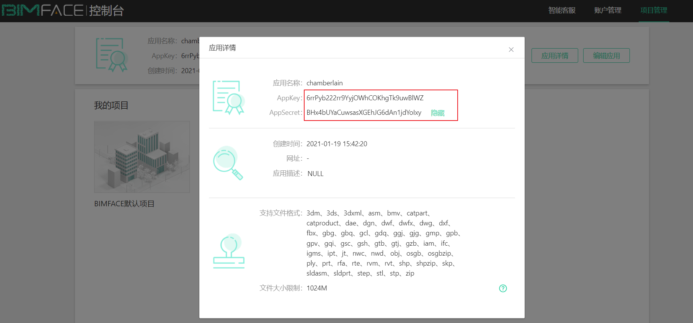
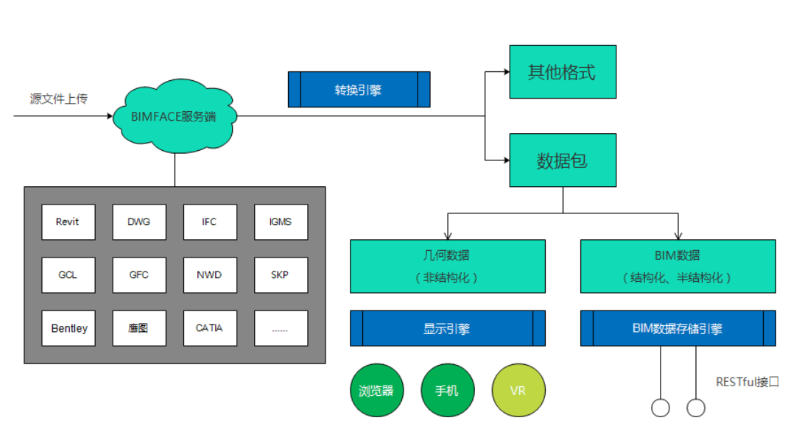

# bimface小结

## bimface Api 服务API接口

### 应用访问权限获取

所有的RESTful API都有对应的鉴权机制保护，目前支持2中鉴权方式：

- Access Token

  代表自身应用的身份，注册为开发者 并 创建应用后，会得到bimface颁发的安全校验app 证书 （含appKey，secret）

  **获取方式**  - 调用`/oauth2/token`接口获取	

  

  > 有效期7天

  ```JS
  // 通过授权信息 获取bimface AccessToken
  export const getAccessToken = lwAuthExp => {
    let Authorization = `Basic ${btoa(lwAuthExp['app-key'] + ':' + lwAuthExp['app-secret'])}`
    return axios({
      url: '/bimface-api/oauth2/token',
      method: 'post',
      headers: {
        Authorization
      }
    }).then(res => {
      res = res.data
      if (res.code === 'success') {
        return Promise.resolve(res.data.token)
      } else {
        return Promise.reject(res)
      }
    }).catch(res => {
      return Promise.reject(res)
    })
  }
  ```

  这里的`app-key`和`app-secret`是通过bimface的设计账号生成的，通过上述接口可以获取访问接口的`accessToken`

  ---

  

  - view token（只有在文件模型或模型集成任务成功后，才能获取view Token）

    代表对单个模型/集成模型/模型对比的访问权限，使用Access Token

    通过调用`GET https://api.bimface.com/view/token`或其他相关接口获得

      View Token必须通过有效的Access Token并提供对应`源文件Id`以及`集成模型Id`信息来获取

    > 有效期：12h 、主要是临时访问凭证
    >
    > **获取到`view Token`后的能做的事情  :**  文件上传、下载、删除、文件转换、模型集成、文件对比
    
    ```js
    // 通过AccessToken获取viewToken
    export const getViewToken = (lwAuthExp, fileId, integrateId) => {
      return getAccessToken(lwAuthExp).then(accessToken => {
        // header Authorization: bearer [Access Token]
        let Authorization = `bearer ${accessToken}`
        let params = { fileId, integrateId }
        // 通过AccessToken 获取policy凭证
        return axios({
          url: '/bimface-api/view/token',
          method: 'get',
          params,
          headers: {
            Authorization
          }
        }).then(res => {
          res = res.data
          if (res.code === 'success') {
            return Promise.resolve(res.data)
          } else {
            return Promise.reject(res)
          }
        }).catch(res => {
          return Promise.reject(res)
        })
      }).catch(res => {
        return Promise.reject(res)
      })
    }
    ```

    

    <h1> 小结</h1>

    ​	1、先通过注册的账号获取access Token

    ​	2、通过1获得的access Token、转换生成的源文件ID、集成模型ID信息   = > `获取访问模型的view Token`

    ​		后续调用bimface提供的API接口时、需要携带view Token

    
    
    <div style="width:10px;height:10px;background-color:#dd001b" ></div>

## bimface系统架构

BIMFACE内部由3个核心的引擎组成。



* **转换引擎**

  ​	职责：解析原始文件格式，生成BIMFACE的数据包；

* Bim数据存储引擎

  ​	职责：存储海量异构的BIM数据，并提供便捷快速的查询接口；

* **显示引擎**

​          职责：通过浏览器显示模型或图纸。

​    

​    