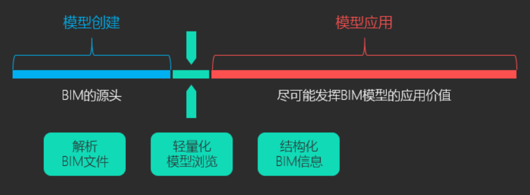
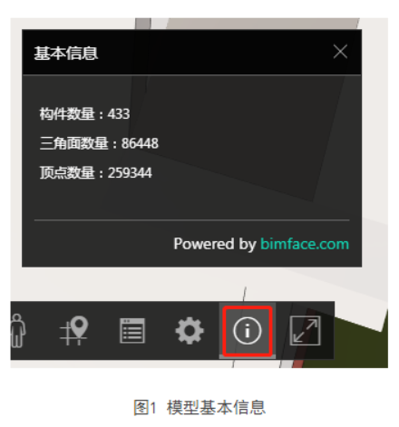
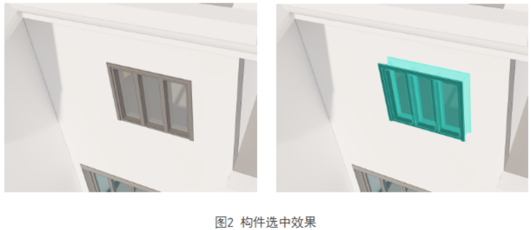
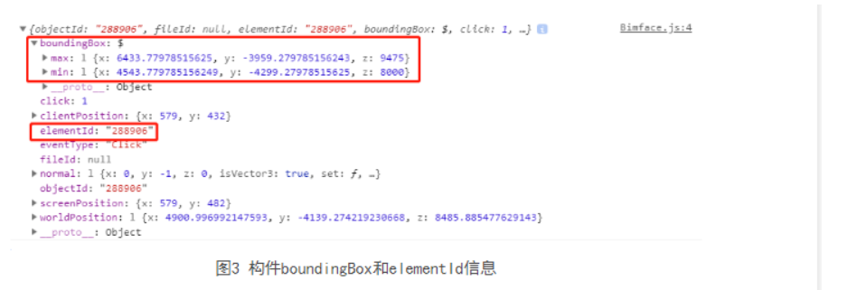
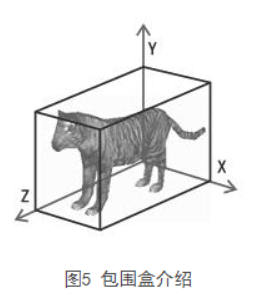
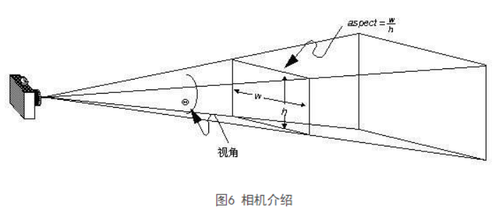

# bimface小结

## BIMFACE 是什么

bimface  =  国内领先的bim轻量化引擎



### bimface基本概念

#### 专业名词解释

- **构件** - 在bimface中，所有模型都是由有限数量的构件组成的，通过默认Toolbar的基本信息按钮可以查看该模型的总构件数量，如下图



- 构件直观上来说是用户可以选中的最小单元，如图二中的窗户

  



- 包围盒（boundingBox）

​	包围盒是规则的立方体，是一个物体（一个模型、一个构件、一组构件）在视图中的最大边界。如下图。

​	 

一般来说，BoundingBox的数据结构是两个三维坐标[x, y, z]，分别是包围盒左下角的坐标及右上角的坐标。

```json
{
  "min": {
    "x": 20174.197245435877,
    "y": 60867.47840650141,
    "z": 2946.249999999989
  },
  "max": {
    "x": 20824.197245435877,
    "y": 61517.47840650142,
    "z": 3046.249999999989
  }
}
```

- 相机（Camera）

​	相机是三维场景的一个对象，相机捕捉视野中的模型内容，并展示在屏幕上。



#### 条件筛选

Viewer3D中多个接口提供了按条件筛选构件的功能，以便于对构件进行隐藏、隔离、获取构件列表等操作，用户可利用相应的字段来实现筛选

**筛选条件支持两种情况：**

- 交集：既满足条件A，又满足条件B；
- 并集：满足条件A，或者满足条件B。

**筛选示例**

##### 1. 构件信息

为便于用户进行构件筛选，BIMFACE针对三维模型构件定义了objectData，包含了5个字段，分别为categoryId、levelName、specialty、family及familyType。

用户可通过Viewer3D类中的getObjectDataById的方法获取构件的objectData信息

```json
{
  "objectId": "924639232728032.45851200",
  "fileId": "924639232728032",
  "elementId": "45851200",
  "objectData": {
    "categoryId": -2001340,
    "levelName": "F01",
    "specialty": "AR",
  "family": "Single Window",
  "familyType": "Standard"
  },
  "boundingBox": {
    "min": {
      "x": 20174.197245435877,
      "y": 60867.47840650141,
      "z": 2946.249999999989
    },
    "max": {        
      "x": 20824.197245435877,        
      "y": 61517.47840650142,        
      "z": 3046.249999999989    
    }
  }
}
```

##### 2. 交集

交集的条件筛选格式是一个包含多个字段的JSON对象。

- 如果想要隔离出 categoryId = -2001340，且 levelName = "F01" 的构件(交集)，则条件输入如下:

```json
[
  {
    "categoryId": -2001340,
    "levelName": "F01"
  }
]
```


##### 3. 并集

并集的条件筛选格式是一个包含多个JSON对象的数组。

- 如果要隔离出 categoryId = -2001340，且 levelName = "F01" 的构件(交集)，或者 levelName = "F02" 的构件(并集)，则条件输入如下:

```json
[
  {
    "categoryId":-2001340,
    "levelName":"F01"
  },
  {
    "levelName":"F02"
  }
]
```


## bimface Api 服务API接口

### 应用访问权限获取

所有的RESTful API都有对应的鉴权机制保护，目前支持2中鉴权方式：

- Access Token

  代表自身应用的身份，注册为开发者 并 创建应用后，会得到bimface颁发的安全校验app 证书 （含appKey，secret）

  **获取方式**  - 调用`/oauth2/token`接口获取	

  

  > 有效期7天

  ```JS
  // 通过授权信息 获取bimface AccessToken
  export const getAccessToken = lwAuthExp => {
    let Authorization = `Basic ${btoa(lwAuthExp['app-key'] + ':' + lwAuthExp['app-secret'])}`
    return axios({
      url: '/bimface-api/oauth2/token',
      method: 'post',
      headers: {
        Authorization
      }
    }).then(res => {
      res = res.data
      if (res.code === 'success') {
        return Promise.resolve(res.data.token)
      } else {
        return Promise.reject(res)
      }
    }).catch(res => {
      return Promise.reject(res)
    })
  }
  ```

  这里的`app-key`和`app-secret`是通过bimface的设计账号生成的，通过上述接口可以获取访问接口的`accessToken`

  ---

  

  - view token（只有在文件模型或模型集成任务成功后，才能获取view Token）

    代表对单个模型/集成模型/模型对比的访问权限，使用Access Token

    通过调用`GET https://api.bimface.com/view/token`或其他相关接口获得

      View Token必须通过有效的Access Token并提供对应`源文件Id`以及`集成模型Id`信息来获取

    > 有效期：12h 、主要是临时访问凭证
    >
    > **获取到`view Token`后的能做的事情  :**  文件上传、下载、删除、文件转换、模型集成、文件对比
    
    ```js
    // 通过AccessToken获取viewToken
    export const getViewToken = (lwAuthExp, fileId, integrateId) => {
      return getAccessToken(lwAuthExp).then(accessToken => {
        // header Authorization: bearer [Access Token]
        let Authorization = `bearer ${accessToken}`
        let params = { fileId, integrateId }
        // 通过AccessToken 获取policy凭证
        return axios({
          url: '/bimface-api/view/token',
          method: 'get',
          params,
          headers: {
            Authorization
          }
        }).then(res => {
          res = res.data
          if (res.code === 'success') {
            return Promise.resolve(res.data)
          } else {
            return Promise.reject(res)
          }
        }).catch(res => {
          return Promise.reject(res)
        })
      }).catch(res => {
        return Promise.reject(res)
      })
    }
    ```

    

    <h1> 小结</h1>

    ​	1、先通过注册的账号获取access Token

    ​	2、通过1获得的access Token、转换生成的源文件ID、集成模型ID信息   = > `获取访问模型的view Token`

    ​		后续调用bimface提供的API接口时、需要携带view Token

    
    
    <div style="width:10px;height:10px;background-color:#dd001b" ></div>

## bimface系统架构

BIMFACE内部由3个核心的引擎组成。


* **转换引擎**

  ​	职责：解析原始文件格式，生成BIMFACE的数据包；

* **Bim数据存储引擎**

  ​	职责：存储海量异构的BIM数据，并提供便捷快速的查询接口；

* **显示引擎**

​          职责：通过浏览器显示模型或图纸。

​    

​    