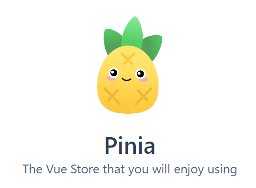

# vue-router4

> vue升级vue3之后，配套的vue-router也升级为vue-router@4.x版本  
>
> vue-router4的语法和3的版本语法基本一致，但是有一些细微的修改。

vue-router官网：https://router.vuejs.org/

## 基本使用

(1)创建组件Home.vue和Login.vue

(2)创建文件`router/index.js`

```js
import {
  createRouter,
  createWebHashHistory,
  createWebHistory,
} from 'vue-router'

// 创建路由
const router = createRouter({
  // 创建history模式的路由
  history: createWebHistory(),
  // 创建hash模式的路由
  history: createWebHashHistory(),
  // 配置路由规则
  routes: [
    { path: '/home', component: () => import('../pages/Home.vue') },
    { path: '/login', component: () => import('../pages/Login.vue') },
  ],
})

export default router

```

（3）在main.js中引入

```js
import { createApp } from 'vue'
import App from './App.vue'
import router from './router'

createApp(App).use(router).mount('#app')

```

(4)App.vue中使用

```vue
<template>
  <ul>
    <li>
      <router-link to="/home">首页</router-link>
    </li>
    <li>
      <router-link to="/login">登陆</router-link>
    </li>
  </ul>

  <!-- 路由出口 -->
  <router-view></router-view>
</template>

<script>
export default {
  setup() {},
}
</script>

```

## 组件中使用route与router

> 由于组件中无法访问this,因为无法访问this.$route与this.$router

（1）通过useRoute()可以获取route信息

```js
<script>
import { useRoute } from 'vue-router'

export default {
  setup() {
    const route = useRoute()
    console.log(route.path)
    console.log(route.fullPath)
  },
}
</script>
```

（2）通过useRouter()可以获取router信息

```js
<script>
import { useRouter } from 'vue-router'

export default {
  setup() {
    const router = useRouter()
    const login = () => {
      router.push('/home')
    }
    return {
      login,
    }
  },
}
</script>
```

# Pinia



## 基本介绍

> Pinia 是 Vue.js 的轻量级状态管理库

官方网站：https://pinia.vuejs.org/

为什么学习pinia?

+ pinia和vuex4一样，也是vue官方的状态管理工具(作者是 Vue 核心团队成员）
+ pinia相比vuex4，对于vue3的兼容性更好
+ pinia相比vuex4，具备完善的类型推荐
+ pinia同样支持vue开发者工具,最新的开发者工具对vuex4支持不好
+ **Pinia** 的 API 设计非常接近 `Vuex 5` 的[提案](https://link.segmentfault.com/?enc=bzgtx6D37f7ZjuOSGfXM2g%3D%3D.Anbb%2BsTaBijhbf0botKHz0NRal7UrociDtXE3qxoLjZTZb9eHUphdj1aeU96KLV8IczFvQ74HSuMxmKZ6I3R5acIrZrKY8I4FBi6G%2Bufe10A%2FkNDziBeRY8hkZ1bnN8x)。

pinia核心概念

+ state: 状态
+ actions: 修改状态（包括同步和异步，pinia中没有mutations）
+ getters: 计算属性

## 基本使用与state

> 目标：掌握pinia的使用步骤

（1）安装

```
yarn add pinia
# or
npm i pinia
```

（2）在main.js中挂载pinia

```js
import { createApp } from 'vue'
import App from './App.vue'

import { createPinia } from 'pinia'
const pinia = createPinia()

createApp(App).use(pinia).mount('#app')
```

（3）新建文件store/counter.js

```js
import { defineStore } from 'pinia'
// 创建store,命名规则： useXxxxStore
// 参数1：store的唯一表示
// 参数2：对象，可以提供state actions getters
const useCounterStore = defineStore('counter', {
  state: () => {
    return {
      count: 0,
    }
  },
  getters: {
   
  },
  actions: {
    
  },
})

export default useCounterStore
```

(4) 在组件中使用

```vue
<script setup>
import useCounterStore from './store/counter'

const counter = useCounterStore()
</script>

<template>
  <h1>根组件---{{ counter.count }}</h1>
</template>

<style></style>
```

## actions的使用

> 目标：掌握pinia中actions的使用

在pinia中没有mutations，只有actions，不管是同步还是异步的代码，都可以在actions中完成。

（1）在actions中提供方法并且修改数据

```js
import { defineStore } from 'pinia'
// 1. 创建store
// 参数1：store的唯一表示
// 参数2：对象，可以提供state actions getters
const useCounterStore = defineStore('counter', {
  state: () => {
    return {
      count: 0,
    }
  },
  actions: {
    increment() {
      this.count++
    },
    incrementAsync() {
      setTimeout(() => {
        this.count++
      }, 1000)
    },
  },
})

export default useCounterStore
```

（2）在组件中使用

```vue
<script setup>
import useCounterStore from './store/counter'

const counter = useCounterStore()
</script>

<template>
  <h1>根组件---{{ counter.count }}</h1>
  <button @click="counter.increment">加1</button>
  <button @click="counter.incrementAsync">异步加1</button>
</template>
```

## getters的使用

> pinia中的getters和vuex中的基本是一样的，也带有缓存的功能

（1）在getters中提供计算属性

```js
import { defineStore } from 'pinia'
// 1. 创建store
// 参数1：store的唯一表示
// 参数2：对象，可以提供state actions getters
const useCounterStore = defineStore('counter', {
  state: () => {
    return {
      count: 0,
    }
  },
  getters: {
    double() {
      return this.count * 2
    },
  },
  actions: {
    increment() {
      this.count++
    },
    incrementAsync() {
      setTimeout(() => {
        this.count++
      }, 1000)
    },
  },
})

export default useCounterStore

```

(2)在组件中使用

```vue

  <h1>根组件---{{ counter.count }}</h1>
  <h3>{{ counter.double }}</h3>
```

## storeToRefs的使用

> 目标：掌握storeToRefs的使用

如果直接从pinia中解构数据，会丢失响应式， 使用storeToRefs可以保证解构出来的数据也是响应式的

```js
<script setup>
import { storeToRefs } from 'pinia'
import useCounterStore from './store/counter'

const counter = useCounterStore()
// 如果直接从pinia中解构数据，会丢失响应式
const { count, double } = counter

// 使用storeToRefs可以保证解构出来的数据也是响应式的
const { count, double } = storeToRefs(counter)
</script>
```

## pinia模块化

> 在复杂项目中，不可能吧多个模块的数据都定义到一个store中，一般来说会一个模块对应一个store，最后通过一个根store进行整合

（1）新建store/user.js文件

```js
import { defineStore } from 'pinia'

const useUserStore = defineStore('user', {
  state: () => {
    return {
      name: 'zs',
      age: 100,
    }
  },
})

export default useUserStore

```

(2)新建store/index.js

```js
import useUserStore from './user'
import useCounterStore from './counter'

// 统一导出useStore方法
export default function useStore() {
  return {
    user: useUserStore(),
    counter: useCounterStore(),
  }
}

```

（3）在组件中使用

```js
<script setup>
import { storeToRefs } from 'pinia'
import useStore from './store'
const { counter } = useStore()

// 使用storeToRefs可以保证解构出来的数据也是响应式的
const { count, double } = storeToRefs(counter)
</script>

```

# 综合案例-todomvc

## 列表展示功能

（1） 在main.js中引入pinia

```js
import { createApp } from 'vue'
import App from './App.vue'
import { createPinia } from 'pinia'
import './styles/base.css'
import './styles/index.css'

const pinia = createPinia()
createApp(App).use(pinia).mount('#app')

```

(2)新建文件 store/modules/todos.js

```js
import { defineStore } from 'pinia'

const useTodosStore = defineStore('todos', {
  state: () => ({
    list: [
      {
        id: 1,
        name: '吃饭',
        done: false,
      },
      {
        id: 2,
        name: '睡觉',
        done: true,
      },
      {
        id: 3,
        name: '打豆豆',
        done: false,
      },
    ],
  }),
})

export default useTodosStore

```

(3)新建文件store/index.js

```js
import useTodosStore from './modules/todos'

export default function useStore() {
  return {
    todos: useTodosStore(),
  }
}

```

(4)在src/components/TodoMain.vue中渲染

```vue
<script setup>
import useStore from '../store'

const { todos } = useStore()
</script>

<template>
  <section class="main">
    <input id="toggle-all" class="toggle-all" type="checkbox" />
    <label for="toggle-all">Mark all as complete</label>
    <ul class="todo-list">
      <li
        :class="{ completed: item.done }"
        v-for="item in todos.list"
        :key="item.id"
      >
        <div class="view">
          <input class="toggle" type="checkbox" :checked="item.done" />
          <label>{{ item.name }}</label>
          <button class="destroy"></button>
        </div>
        <input class="edit" value="Create a TodoMVC template" />
      </li>
    </ul>
  </section>
</template>
```

## 修改任务状态

> 目标：完成任务修改状态

(1)在actions中提供方法

```js
actions: {
  changeDone(id) {
    const todo = this.list.find((item) => item.id === id)
    todo.done = !todo.done
  },
},
```

(2)在组件中注册事件

```vue
<input
  class="toggle"
  type="checkbox"
  :checked="item.done"
  @change="todos.changeDone(item.id)"
/>
```

## 删除任务

> 目标：完成任务删除功能

（1）在actions中提供方法

```js
actions: {
  delTodo(id) {
    this.list = this.list.filter((item) => item.id !== id)
  },
},
```

(2)在组件中注册事件

```vue
<button class="destroy" @click="todos.delTodo(item.id)"></button>
```

## 添加任务

> 目标：完成任务添加功能

（1）在actions中提供方法

```js
actions: {
  addTodo(name) {
    this.list.unshift({
      id: Date.now(),
      name,
      done: false,
    })
  },
},
```

(2)在组件中注册事件

```vue
<script setup>
import { ref } from 'vue'
import useStore from '../store'
const { todos } = useStore()
const todoName = ref('')
const add = (e) => {
  if (e.key === 'Enter' && todoName.value) {
    todos.addTodo(todoName.value)
    // 清空
    todoName.value = ''
  }
}
</script>

<template>
  <header class="header">
    <h1>todos</h1>
    <input
      class="new-todo"
      placeholder="What needs to be done?"
      autofocus
      v-model="todoName"
      @keydown="add"
    />
  </header>
</template>
```

## 全选反选功能

> 完成todos的全选和反选功能

（1）在getters中提供计算属性，在actions中提供方法

```js
const useTodosStore = defineStore('todos', {

  actions: {
 
    checkAll(value) {
      this.list.forEach((item) => (item.done = value))
    },
  },
  getters: {
    // 是否全选
    isCheckAll() {
      return this.list.every((item) => item.done)
    },
  },
})
```

（2）在组件中使用

```js
<input
  id="toggle-all"
  class="toggle-all"
  type="checkbox"
  :checked="todos.isCheckAll"
  @change="todos.checkAll(!todos.isCheckAll)"
/>
```

## 底部统计与清空功能

> 目标：完成底部的统计与清空功能

（1）在getters中提供计算属性

```js
const useTodosStore = defineStore('todos', {

  actions: {
    clearTodo() {
      this.list = this.list.filter((item) => !item.done)
    },
  },
  getters: {
    leftCount() {
      return this.list.filter((item) => !item.done).length
    },
  },
})


```

（2）在组件中使用

```js
<span class="todo-count">
  <strong>{{ todos.leftCount }}</strong> item left
</span>

<button class="clear-completed" @click="todos.clearTodo">
  Clear completed
</button>
```

## 底部筛选功能

（1）提供数据

```js
state: () => ({
  filters: ['All', 'Active', 'Completed'],
  active: 'All',
}),
```

（2）提供actions

```js
actions: {

  changeActive(active) {
    this.active = active
  },
},
```

（3）在footer中渲染

```vue
<ul class="filters">
  <li
    v-for="item in todos.filters"
    :key="item"
    @click="todos.changeActive(item)"
  >
    <a :class="{ selected: item === todos.active }" href="#/">{{ item }}</a>
  </li>
</ul>
```

(4)提供计算属性

```js
showList() {
  if (this.active === 'Active') {
    return this.list.filter((item) => !item.done)
  } else if (this.active === 'Completed') {
    return this.list.filter((item) => item.done)
  } else {
    return this.list
  }
},
```

（5）组件中渲染

```vue
<ul class="todo-list">
  <li
    :class="{ completed: item.done }"
    v-for="item in todos.showList"
    :key="item.id"
  >
```


## 持久化

（1）订阅store中数据的变化

```js
const { todos } = useStore()
todos.$subscribe(() => {
  localStorage.setItem('todos', JSON.stringify(todos.list))
})
```

（2）获取数据时从本地缓存中获取

```js
state: () => ({
  list: JSON.parse(localStorage.getItem('todos')) || [],
}),
```

