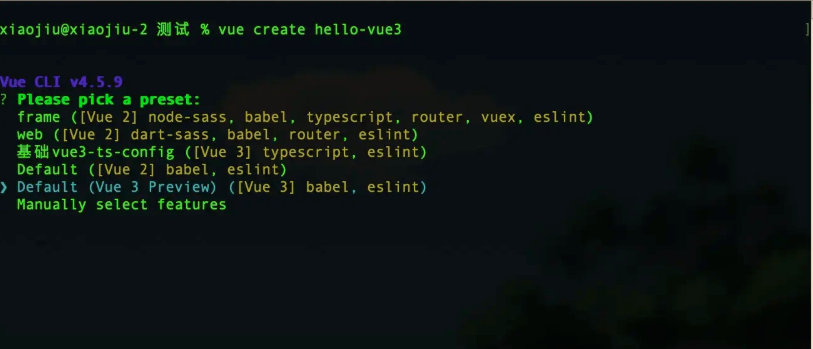

## 如何看待vue3？
vue2.x是一个比较稳定的版本，也是很长一段时间我们在使用的版本，社区生态已经十分完善了，所以，如果我们暂时还不必须去着急升级到vue3，毕竟等待vue3的生态成熟，还需要一段时间的积累，但是作为前端领域必不可少的一门技能，当然希望能够提前去接触到，毕竟前端的技术迭代更新就是这么快。
所以我们来看看vue3相对于vue2到底有哪些优势和特性吧。方便等到时候社区完善之后，我们可以直接在工作中去使用这些技术，毕竟自vue3一问世，就受到了行业各种大佬的关注。所以不管是单纯的作为api开发工程师去体验使用vue3，或者想要去学习尤大的编程思想，我们都有必要去了解学习一下，本文都将使用vue3的语法来写，下面是vue3的官网地

* [vue3.x官网地址](https://v3.cn.vuejs.org/)
* 也可以到当前版本的官网在左上角点击切换到3.x-beta版本

## 如何创建一个vue3项目

* 使用官方的最新版的vue-cli，升级之后在创建项目的时候会让你选择版本，选择vue3版本即可，如下图

  

  > 只需要选择3的版本然后和vue2一样的选择，一路绿灯即可完成项目创建，这样的项目和vue2并无太多区别，同样是利用webpack来构建项目，相信这样的上手方式将会非常简单，但是vue3还提供了另一种创建方式：

* 第二种就是**vite**的方式生成一个项目了，做过大项目的同学都知道，webpack在我们本地开发的过程中，每一次做细微的修改，都会造成很长时间的重新打包，对于很多大型项目，这样消耗的时间实在太久了，这也是长久以来的一个痛点，于是，vue3携带vite出世了，vite依然是基于node来工作的，原理是利用浏览器现在已经支持es6的import了，遇到import会发送一个http请求去加载文件，vite拦截这些请求，做一些预编译，省去了webpack冗长打包的时间，提升开发体验，让本地开发更为高效

* 这时候可能有人会问，这样webpack还有用么，那么这个其实毋庸置疑，当然是有用的，第一个vite的生态还不完善，暂时还不能保证其稳定性，第二依赖vite进行本地开发，在上线前的打包工作依然需要webpack的支持来使用，所以，webpack依然需要，当然vite这样的新颖模式依然是值得期待的，希望能够早点让这个技术更成熟，让我们的本地开发更为高效

  

  ### 项目目录

  > |-node_modules       -- 所有的项目依赖包都放在这个目录下
  > |-public             -- 公共文件夹
  > ---|favicon.ico      -- 网站的显示图标
  > ---|index.html       -- 入口的html文件
  > |-src                -- 源文件目录，编写的代码基本都在这个目录下
  > ---|assets           -- 放置静态文件的目录，比如logo.pn就放在这里
  > ---|components       -- Vue的组件文件，自定义的组件都会放到这
  > ---|App.vue          -- 根组件，这个在Vue2中也有
  > ---|main.ts          -- 入口文件，因为采用了TypeScript所以是ts结尾
  > ---|shims-vue.d.ts   -- 类文件(也叫定义文件)，因为.vue结尾的文件在ts中不认可，所以要有定义文件
  > |-.browserslistrc    -- 在不同前端工具之间公用目标浏览器和node版本的配置文件，作用是设置兼容性最低适配版本
  > |-.eslintrc.js       -- Eslint的配置文件，不用作过多介绍
  > |-.gitignore         -- 用来配置那些文件不上传到git的文件进行管理
  > |-package.json       -- 命令配置和包管理文件
  > |-README.md          -- 项目的说明文件，使用markdown语法进行编写
  > |-tsconfig.json      -- 关于TypoScript的配置文件
  > |-yarn.lock          -- 使用yarn后自动生成的文件，由Yarn管理，安装yarn包时的重要信息存储到yarn.lock文件中

```js
|-node_modules       -- 所有的项目依赖包都放在这个目录下
|-public             -- 公共文件夹
---|favicon.ico      -- 网站的显示图标
---|index.html       -- 入口的html文件
|-src                -- 源文件目录，编写的代码基本都在这个目录下
---|assets           -- 放置静态文件的目录，比如logo.pn就放在这里
---|components       -- Vue的组件文件，自定义的组件都会放到这
---|App.vue          -- 根组件，这个在Vue2中也有
---|main.ts          -- 入口文件，因为采用了TypeScript所以是ts结尾
---|shims-vue.d.ts   -- 类文件(也叫定义文件)，因为.vue结尾的文件在ts中不认可，所以要有定义文件
|-.browserslistrc    -- 在不同前端工具之间公用目标浏览器和node版本的配置文件，作用是设置兼容性最低适配版本
|-.eslintrc.js       -- Eslint的配置文件，不用作过多介绍
|-.gitignore         -- 用来配置那些文件不上传到git的文件进行管理
|-package.json       -- 命令配置和包管理文件
|-README.md          -- 项目的说明文件，使用markdown语法进行编写
|-tsconfig.json      -- 关于TypoScript的配置文件
|-yarn.lock          -- 使用yarn后自动生成的文件，由Yarn管理，安装yarn包时的重要信息存储到yarn.lock文件中

```


## vue3相关知识

Vue (读音 /vjuː/，类似于 view) 是一套用于构建用户界面的渐进式框架。与其它大型框架不同的是，Vue 被设计为可以自底向上逐层应用。Vue 的核心库只关注视图层，不仅易于上手，还便于与第三方库或既有项目整合。

传统的网站开发一般采用HTML+CSS+JS作为技术架构，而vue立足于其上，以模板语法为基础，以数据绑定和组件化开发为核心，极大的简化了开发流程。
使用vue技术栈，可以在几分钟内搭建出一个完整的前端项目。

现在，很多项目采用这样的架构，后台只负责数据的存储和组装，而前端负责业务逻辑层和视图层的全部工作。

* Vue 是利用模版语法来渲染页面的，这也称做声明式渲染。Vue 好上手的重要原因也是因为这个，因为它符合了前端开发者的习惯。
* Vue 将 HTML、CSS、JS 全部整合在同一个文件 .vue 中，以组件化应用构建的方式来组织代码，从语法特性上鼓励 "高内聚、低耦合" 的设计理念，让代码组织变得更加合理，提升了可读性与逻辑性。 1). 一位华裔前Google工程师(尤雨溪)开发的前端js库
2). 作用: 动态构建用户界面
3). 特点:
* 遵循MVVM模式
* 编码简洁, 体积小, 运行效率高, 移动/PC端开发
* 它本身只关注UI, 可以轻松引入vue插件和其它第三库开发项目
4). 与其它框架的关联:
* 借鉴angular的模板和数据绑定技术
* 借鉴react的组件化和虚拟DOM技术
5). vue包含一系列的扩展插件(库):
* vue-cli: vue脚手架-（帮我们下载依赖）
* vue-resource(axios): ajax请求
* vue-router: 路由
* vuex: 状态管理
* vue-lazyload: 图片懒加载
* vue-scroller: 页面滑动相关
* mint-ui: 基于vue的组件库(移动端)


##  创建应用基本介绍

基本使用：

* 引入vue.js;
* 创建Vue实例对象, 指定选项(配置)对象
* 在页面模板中使用{{}}或vue指令

将下面代码复制到html文件中，用谷歌浏览器打开即可执行。

```html

<html>
<head>
    <meta charset="utf-8">
    <title>Vue 测试实例</title>

    <script src="https://unpkg.com/vue@next"></script>
</head>

<body>
<div id="hello-vue" class="demo-st">
    {{ message }}
</div>

<script>
    const HelloVueApp = {
        data() {
            return {
                message: 'Hello Vue!!!'
            }
        }
    }
    Vue.createApp(HelloVueApp).mount('#hello-vue')
</script>
</body>
</html>
```

注意：

生命周期函数是指：在某一时刻会自动执行的函数。


##  vue常用模板语法

Vue 使用了基于 HTML 的模板语法，允许开发者声明式地将 DOM 绑定至底层 Vue 实例的数据。Vue 的核心是一个允许你采用简洁的模板语法来声明式的将数据渲染进 DOM 的系统。结合响应系统，在应用状态改变时， Vue 能够智能地计算出重新渲染组件的最小代价并应用到 DOM 操作上。

**插值**：在模板中输出变量，在插值表达式中是可以写JavaScript表达式的，例如： `{{ 2+3 }}`, 但是不能写语句。

<!-- 数据绑定最常见的形式就是使用 {{...}}（双大括号）的文本插值： -->

```html
<html>
<head>
  <meta charset="utf-8">
  <title>Vue 测试实例</title>
  <script src="https://unpkg.com/vue@next"></script>
</head>

<body>

<div id="hello-vue"> {{ message }} 

  <span v-once>这个将不会改变: {{ message }}</span>
</div>

<script>
  const HelloVueApp = {
    data() {
      return {
        message: 'Hello Vue!!!'
      }
    }
  }

  Vue.createApp(HelloVueApp).mount('#hello-vue')
</script>
</body>
</html>
```

v-html: 转义输出变量的html变量标签

```html
<html>
<head>
    <meta charset="utf-8">
    <title>Vue 测试实例</title>
    <script src="https://unpkg.com/vue@next"></script>
</head>

<style>
    .demo { color: blue; font-size: 15px; font-style: italic; }
</style>

<body>

<div id="example1" class="demo">
    <p>使用双大括号的文本插值: {{ rawHtml }}</p>
    <p>使用 v-html 指令: <span v-html="rawHtml"></span></p>
</div>

<script>
    const RenderHtmlApp = {
        data() {
            return {
                rawHtml: '这里会显示红色！'
            }
        }
    }
    Vue.createApp(RenderHtmlApp).mount('#example1')
</script>
</body>
</html>

```

v-bind: 绑定html标签中的属性值
原写法： ，
可简写为： 
动态事件绑定： , xxx是在data里定义的变量

v-on： 在模板中绑定事件
原写法： 
简写为： 
动态事件绑定： , xxx是在data里定义的变量

v-if: 在模板中进行判断；

v-show 根据变量负责DOM的展示与否

ref: 是获取dom节点/组件引用的一个语法
模板语法： 
程序写法： `this.$refs.count`

v-for可以直接在模板中循环打印数组和对象, vue要求循环时在模板中增加key值 `:key="index"`，避免重复渲染。
数组循环案例： `v-for="(item, index) in list"`
对象循环案例： `v-for="(value, key, index) in list"`

案例：遍历数组

```html
<html>

<head>
  <meta charset="UTF-8">
  <title>Vue App</title>
  <script src="https://unpkg.com/vue@next"></script>
</head>

<body>
  <div id="app">
    <div>
      <ol>
        <todo-item v-for="todo in todos" :key="todo.id" :todo="todo">
        </todo-item>
      </ol>
    </div>
  </div>
  <script>
    const App = {
      data() {
        return {
          todos: [
            { id: 1, description: "eat吃饭" },
            { id: 2, description: "drink" },
            { id: 3, description: "sleep" }
          ]
        };
      }
    };

    const app = Vue.createApp(App);

    app.component("todo-item", {
      props: ["todo"],
      template: `{{todo.description}}`
    });

    app.mount("#app");
  </script>
</body>
</html>
```

注意：循环和判断不能写在一个标签上，否则是没办法进行判断的。

 `push()` : 从数组尾部添加内容<br> `unshift()` ： 从数组头部添加内容<br> `pop()` ： 从数组末尾删除内容<br> `shift()` ： 从数组头部删除内容<br> `sort()` ： 对数组进行排序<br> `reverse()` ： 对数组进行取反<br> `split()`： 从数组中筛选具体的内容

案例：翻转字符串

```html
<html lang="en">

<head>
  <title>Vue App</title>
  <script src="https://unpkg.com/vue@next"></script>
</head>

<body>
  <div id="app">
    <p>原字符串：{{message}}</p>
    <p>翻转字符串：{{reversedMessage}}</p>
    <p>翻转结果用-连接{{reversedMessageJoin}}</p>
  </div>
  <script>
    const App = {
      data() {
        return {
          message: "hello world"
        };
      },
      computed: {
        reversedMessage() {
          return this.message.split("").reverse().join("");
        },
        reversedMessageJoin() {
          return this.message.split("").reverse().join("-");
        }
      }
    };

    const app = Vue.createApp(App);
    app.mount("#app");
 </script>
</body>
</html>

```
##  样式绑定语法

在data() 方法里定义一个变量，然后用v-bind在模板中绑定属性；

在data() 方法里声明一个对象

在data() 方法里定义一个数组

建议：建议在工作中使用对象的形式来编写模板中的行内样式动态绑定，因为这样更加直观，字符串拼接也不容易出错。


##  事件绑定

* `@click.stop` ：停止事件冒泡
* `@click.self` ：停止向下传递
* `@click.prevent` ：阻止默认行为
* `@click.capture` ：捕获模式修饰符
* `@click.once` ：事件只绑定一次
* `@click.passive` ：提升滚动性能

@click案例：

```html
<html lang="en">

<head>
  <title>Vue App</title>
  <script src="https://unpkg.com/vue@next"></script>
</head>

<body>
  <div id="app">
    <button @click="count++">increment</button>
    count: {{ count }}
  </div>
  <script>
    const Counter = {
      data() {
        return {
          count: 0
        };
      }
    };

    Vue.createApp(Counter).mount("#app");
  </script>
</body>
</html>
```

* `keydown` : 按键就可以触发事件
* `keydown.enter` : 按回车键就可以触发事件
* `keydown.tab` : 按tab键就可以触发
* `keydown.delete` : 按删除键可以触发
* `keydown.esc` : 按esc键时触发
* `keydown.up` : 按上键时触发
* `keydown.down` : 按下键时触发

* `click.left` : 点击鼠标左键时触发
* `click.right` : 点击鼠标右键时触发
* `click.middle` : 点击鼠标中键触发

* `click.ctrl.exact` : 按ctrl和鼠标键才会触发

v-model：双向绑定的最基本用法

* 双向数据绑定是建立在单向数据绑定(model==>View)的基础之上的
* 双向数据绑定的实现流程:
* 在解析v-model指令时, 给当前元素添加input监听
* 当input的value发生改变时, 将最新的值赋值给当前表达式所对应的data属性

修饰符：

* `v-model.lazy` ： 当失去焦点时才会触发双向绑定；
* `v-model.number` : 自动转变为number类型
* `v-model.trim` ： 去掉字符串前后的空格

##  组件

概念：就是把一个大功能，拆分成一个个子组件，组件是页面中的一部分。

注册全局组件并使用：

```html
<html>
<head>
    <meta charset="utf-8">
    <title>Vue 测试实例</title>
    <script src="https://unpkg.com/vue@next"></script>
</head>

<body>
<div id="app">

    <zidingyi></zidingyi>

    <button-counter></button-counter>
</div>

<script>

    const app = Vue.createApp({})

    app.component('zidingyi', {
        template: `自定义组件!`
    })

    app.component('button-counter', {
        data() {
            return {
                count: 0
            }
        },

        template: `点了 {{ count }} 次！`
    })
    app.mount('#app')
</script>
</body>

</html>

```

局部组件案例：

```html
<!-- <DOCTYPE html> -->
<html>
<head>
  <meta charset="utf-8">
  <title>Vue 测试实例 </title>
  <script src="../js/vue.global.js"></script>
</head>
<body>
<div id="app">
  <comp_a></comp_a>
  <comp_b></comp_b>
</div>
<script>

  var componentsA = {
    template: '自定义组件-A!'
  }
  var componentB = {
    template: '自定义组件-B!'
  }

  const app = Vue.createApp({
    components: {
      'comp_a': componentsA,
      'comp_b': componentB
    }
  })

  app.mount('#app')
</script>
</body>
</html>
```

组件传值案例：

```html
<html>
<head>
    <meta charset="utf-8">
    <title>Vue 测试实例 </title>
    <script src="https://unpkg.com/vue@next"></script>
</head>
<body>

<div id="app">
    <site-info
            v-for="site in sites"
            :id="site.id"
            :title="site.title"
    ></site-info>

</div>

<script>
    const Site = {
        data() {
            return {
                sites: [
                    { id: 1, title: 'Google' },
                    { id: 2, title: 'Douyin' },
                    { id: 3, title: 'Taobao' }
                ]
            }
        }
    }

    const app = Vue.createApp(Site)

    app.component('site-info', {
        props: ['id','title'],
        template: `{{ id }} - {{ title }}`
    })

    app.mount('#app')
</script>
</body>
</html>
```