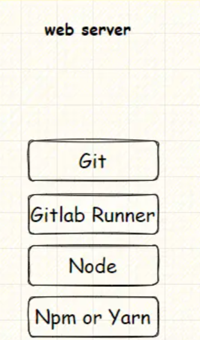
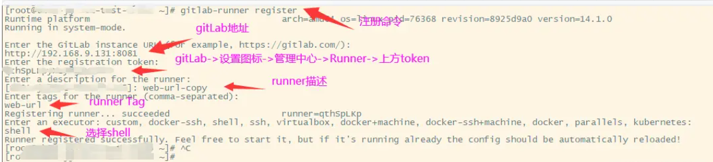
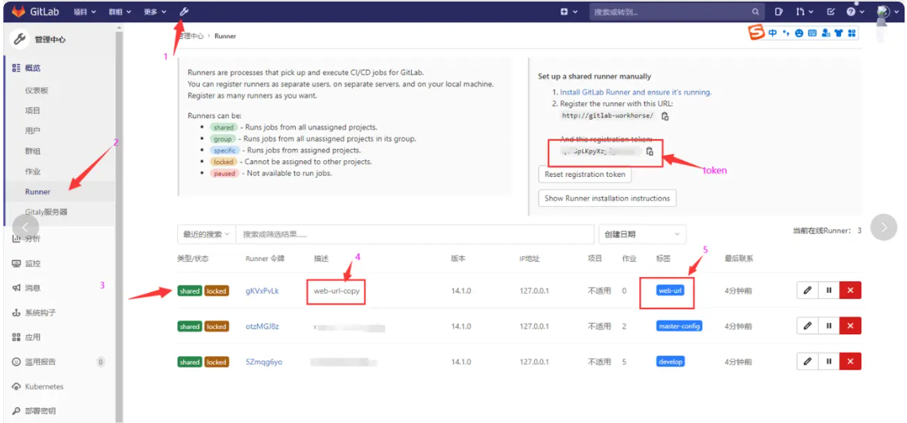
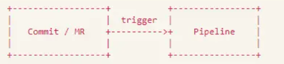
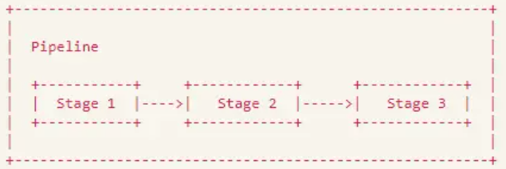
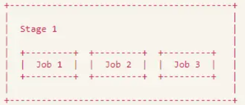
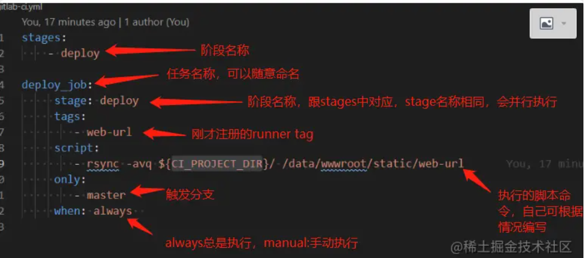
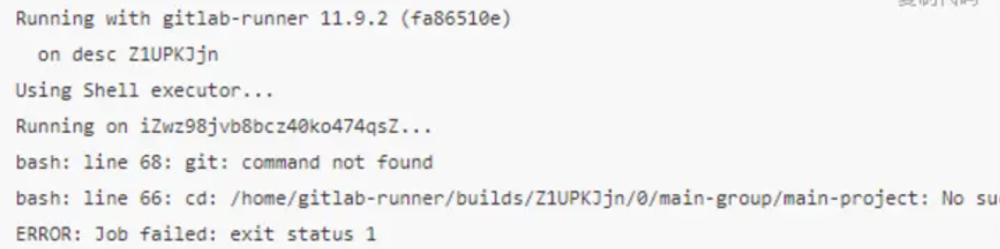

# gitlab-CICD自动化部署

```shell

##
# @Author RunXin
# @Date 2021/11/08 13:57
# @description
##
# 变量,NGINX映射的静态代码地址
variables:
  PROJECT_PATH: "/opt/app-service/zeen-safe-web-html"
  DIST_PATH: "/opt/app-service/zeen-safe-web-html/dist"
# 拉取项目 - 打包
ssh-build:
  stage: build
  before_script:
    - which npm || sudo yum install -y npm 
  script:
    - npm --registry https://registry.npm.taobao.org install
    - npm run build
    - rm -R ${DIST_PATH}.`date +"%Y%m%d"` || echo "目录不存在"
    - cp -R dist ${DIST_PATH}.`date +"%Y%m%d"` && rm ${DIST_PATH} || true
    - ln -s ${DIST_PATH}.`date +"%Y%m%d"` ${DIST_PATH}
   # 该关键字指定了需要缓存的文件夹或者文件，目的是为了加快执行速度。
  cache:
   untracked: true
   key: "$CI_COMMIT_REF_NAME"
   paths:
    - node_modules/    # 注意是相对路径
  tags:    # runner 标签(注册runner时设置的，可在 admin->runner中查看)
    - zeen-safe-html
    # 当提交的分支为master才会触发Pipelines
  only:   
    - develop #拉取分支
    - master
```

## gitlab CI/CD介绍

Gitlab CI/CD 是一款用于持续集成（CI），持续交付（CD）的工具，相似的工具有Jenkins、Travis CI、GoCD等。

持续集成，即Continuous Integration， 即在源代码变更后（git push）后自动检测（code lint）、构建和进行单元测试的过程，持续集成的目标是快速确保开发人员新提交的代码是好的（少bug），并且适合在代码库中进一步使用。

持续交付，即Continuous Delivery， 通常是指整个流程链（管道），它自动监测源代码变更并通过构建、测试、打包和相关操作运行它们以生成可部署的版本（可以是apk打包，也可以是网站部署），基本上没有任何人为干预。它包括持续集成，持续测试（保证代码质量），持续部署（自动发布版本，供用户使用）。

Gitlab的CI/CD算是比较简单的了，只需要依靠一份`".gitlab-ci.yml"`，将该文件随代码上传，Gitlab就会自动执行相应的任务，从而实现CI/CD，要像实现CI/CD，我们需要安装`gitlab-runner`，gitlab-runner相当于任务执行器

## 核心工具

### GitLab Runner

### Git

web服务器上需要安装`Git`来进行远程仓库的获取工作。

### Node

用于在web服务器上完成打包工作。

### NPM or Yarn or pnpm

用于在web服务器上完成依赖下载等工作（用`yarn`,`pnpm`亦可）。



## git-runner 

例如我们在测试服务器（9.138）上安装git-runner

>处于性能考虑，Gitlab Runner 与 GitLab 部署在不同服务器上
>
>- gitLab 在单独的仓库服务器上
>- gitlab Runner 部署在web应用服务器上
>
>`GitLab Runner`在与`GitLab`关联后，可以在服务器上完成诸如项目拉取、文件打包、资源复制等各种命令操作。

### 下载

首先我们下载安装git-runner

```shell
# 下载 
sudo curl -L --output /usr/local/bin/gitlab-runner https://gitlab-runner-downloads.s3.amazonaws.com/latest/binaries/gitlab-runner-linux-amd64 
# 给予执行权限 
sudo chmod +x /usr/local/bin/gitlab-runner
# 创建一个CI用户
sudo useradd --comment 'GitLab Runner' --create-home gitlab-runner --shell /bin/bash 
# 安装并且运行服务
sudo gitlab-runner install --user=gitlab-runner --working-directory=/home/gitlab-runner
sudo gitlab-runner start

```


### 注册runner



### gitLab查看runner




### 使用注册好的runner

编写`.gitlab-ci.yml`文件，先了解一些基本概念

#### Pipeline

一次 Pipeline 其实相当于一次构建任务，里面可以包含多个流程，如安装依赖、运行测试、编译、部署测试服务器、部署生产服务器等流程。 任何提交或者 Merge Request 的合并都可以触发 Pipeline，如下图所示：



#### Stages

Stages 表示构建阶段，说白了就是上面提到的流程。 我们可以在一次 Pipeline 中定义多个 Stages，这些 Stages 会有以下特点：

- 所有 Stages 会按照顺序运行，即当一个 Stage 完成后，下一个 Stage 才会开始
- 只有当所有 Stages 完成后，该构建任务 (Pipeline) 才会成功
- 如果任何一个 Stage 失败，那么后面的 Stages 不会执行，该构建任务 (Pipeline) 失败

因此，Stages 和 Pipeline 的关系就是：



#### Jobs


Jobs 表示构建工作，表示某个 Stage 里面执行的工作。 我们可以在 Stages 里面定义多个 Jobs，这些 Jobs 会有以下特点：

- 相同 Stage 中的 Jobs 会并行执行
- 相同 Stage 中的 Jobs 都执行成功时，该 Stage 才会成功
- 如果任何一个 Job 失败，那么该 Stage 失败，即该构建任务 (Pipeline) 失败

所以，Jobs 和 Stage 的关系图就是

下面我们来写一个简单的.gitlab-ci.yml



>注意：安装git-runner的服务器需要安装git，不然你可能看到一下错误：
>
>
>
>

## Gitlab-CI编写

`.gitlab-ci.yml`遵循YAML文件的语法，这份文件记录了你想要执行的各种指令，这些指令可以用来对你的代码进行规范检查（例如PEP8）、自动打包（例如Android自动打包）、自动部署等。

对于新手，如果不知道自己写的`.gitlab-ci.yml`是否有错误，可以通过Gitlab自带的`CI Lint`进行检查。


### `before_script`和`after_script`

- before_script关键字定义了一组在每个任务开始之前需要执行的命令，

- after_script则相反。例如可以在`before_script`做好`ssh`连接的准备，见下文。

> 注：before_script可以针对全部任务，也可以针对单个任务。

### tags

该关键字指定了使用哪个`Runner`（哪个机器）去执行我们的任务，注意与上文only关键字的tags进行区分。

### cache

该关键字指定了需要缓存的文件夹或者文件，目的是为了加快执行速度。

值得注意的是，cache不能缓存工作路径以外的文件。比如你的用户是yangan，项目是helloworld，默认的工作路径就是/build/yangan/helloworld, 如果你想缓存/root下的某个文件，就会出现“找不到文件”的错误。

另外，cache并不能保证每次都能命中，而且如果缓存的文件较大，有时候反而会适得其反，导致速度变慢。


# docker

## 手动部署-瓶颈

传统的方式部署静态资源的前端项目就是要经历以下几个过程：

- 下载：从Github下载代码，然后本地`npm install`
- 开发：`npm run dev`本地修改代码，测试
- 编译：`npm run build`使用 Webpack 进行编译，产出静态资源
- 上传：打开FTP软件，上传替换文件
- 测试：看看网站是否在线上工作正常

- 提交：将代码提交到 Github

哪怕我只是修改个错别字，都要十几分钟

网站太多，改动太频繁，而每次不管多小的改动都很麻烦。简直让我感觉自己在维护一个万级QPS的大型项目

> 《**问题总结**》
>
> - 手动部署成本太高，改错别字都很麻烦
> - 一台服务器由于时间累积导致环境变得“脏乱差”
> - 重装系统成本太高，难以迁移

后来，出现了`CI/CD`

`CI/CD` 是 `Continuous Intergration/Continuous Deploy` 的简称，翻译过来就是`持续集成/持续部署`。`CD` 也会被解释为持续交付（`Continuous Delivery`）

再具体一点就是：

- `持续集成`：当代码仓库代码发生变更，就会自动对代码进行测试和构建，反馈运行结果。
- `持续交付`：持续交付是在持续集成的基础上，可以将集成后的代码依次部署到测试环境、预发布环境、生产环境中


## 新的技术方案 - docker

### 镜像、容器

docker中有2个重要概念：<u>镜像、容器</u>

一个是容器（Container）：容器特别像一个虚拟机，容器中运行着一个完整的操作系统。可以在容器中装 Nodejs，可以执行`npm install`，可以做一切你当前操作系统能做的事情

---

另一个是镜像（Image）：镜像是一个文件，它是用来创建容器的。如果你有装过 Windows 操作系统，那么 Docker 镜像特别像“Win7纯净版.rar”文件

---

### 安装docker

安装 Docker 在你的电脑上就像安装 VS Code 一样简单


**参考链接：**

https://juejin.cn/post/6844903946234904583

[ 前端自动化部署：借助Gitlab CI/CD实现](https://juejin.cn/post/7037022688493338661)


