## 基础知识

### 基础概念

- 局域网：一个公司、一个家庭、一个学校······
- 城域网：一个地区、一个城市······
- 广域网：一个国家、全世界······

<!-- more -->

最原始的计算机是：1  - 2  、 1 - 3 、 1 - 4 

但是当计算机变多的时候：就变成了 1 -2 、1-3 、 2-3 、2-4

后来就有了：`转发` 、`标识`的概念

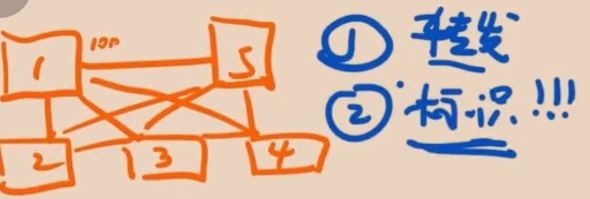

---

###  HUB集线器 转发 【物理层】

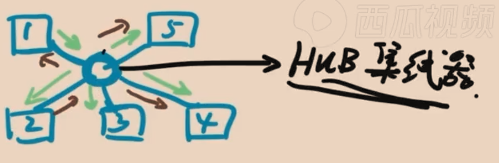

1，2，3，4，5 发给HUB集线器，集线器再转发给对应的计算机

**工作方式：**主机发送数据 （`广播`），从机侦听属于自己的数据 \ hub没有记录每台设备的标识

**问题：**当1发4，但同时发到了2、3、5

**解决方法：**4做一个标识，如果数据是发给自己的，就接受这个数据包，否则丢弃

### CSMA/ CD

**另一个问题：**如果2也要发送数据，最后其他计算机接收到的就是混乱的

**解决方案：**CSMA/ CD ，发送钱进行载波侦听、如果链路上没有发送数据的时候，才开始发送数据

**缺点**：利用率低，效率慢、无法满足大规模计算集群的通信需求

### sw交换机 【数据链路层】

功能类似与HUB集线器

功能特性：

	-	可记录地址[ `mac` ]与端口的映射关系
	-	交换机中存了一张表：mac与端口的映射关系
	-	全双工通信、8根线（1号发送同时、也可同时接收）

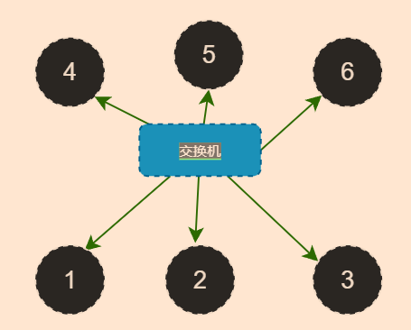

如果刚买的交换机，1号要发信息给6号设备，会经历下面的流程：

- 去交换机中寻找映射表的对应关系，找不到设备1，则把1的mac地址写入、并记录和端口号的关系
- 因为交换机中无路由表，则需要去广播各个端口去寻找目标`mac地址`所在设备位置、并将6号端口号、和对应`mac地址`存到路由表中

### 路由器

当网络与网络之间通信时，可以通过路由器

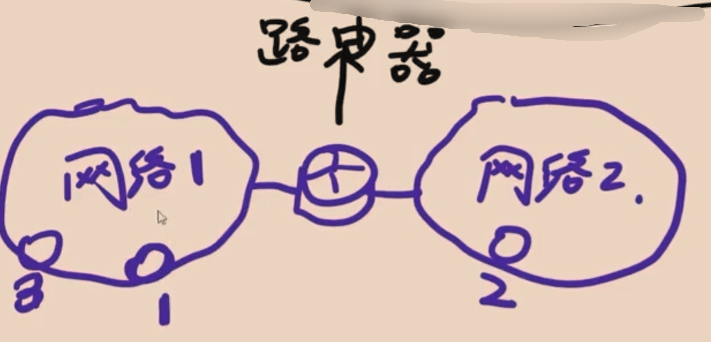

网络是一个抽象的概念

IP地址：

	- 用于标识网络、设备
	- 用于标记设备在哪个网络下、用于和抽象网络做一个关联

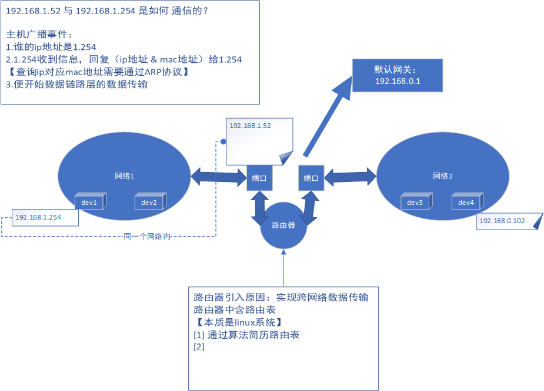

> **从1.52到 1.254 是如何通信的？**

|       |              | IP源地址  - 目标地址 | 源mac地址 - 目标mac地址    |
| ----- | ------------ | -------------------- | -------------------------- |
| 第1步 | 0.102 - 0.1  | 0.102 - 1.254        | mac [0.102 ] - mac[ 0.1 ]  |
| 第2步 | 0.1 - 1.52   | 不变                 | mac [0.1 ] - mac[ 1.52]    |
| 第3步 | 1.52 - 1.254 | 不变                 | mac [1.52 ] - mac[ 1.254 ] |

七层模型：

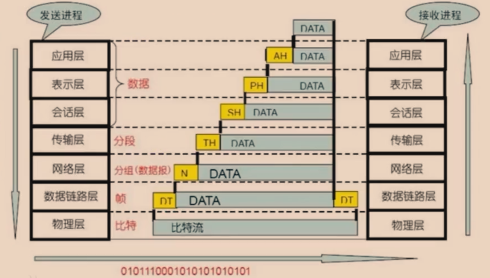

## 互联网协议、分布、设计

我在上面说了 Internet 协议，互联网协议按照功能的不同，分为 osi 七层， tcp / ip 五层， tcp / ip 四层协议。如下图：

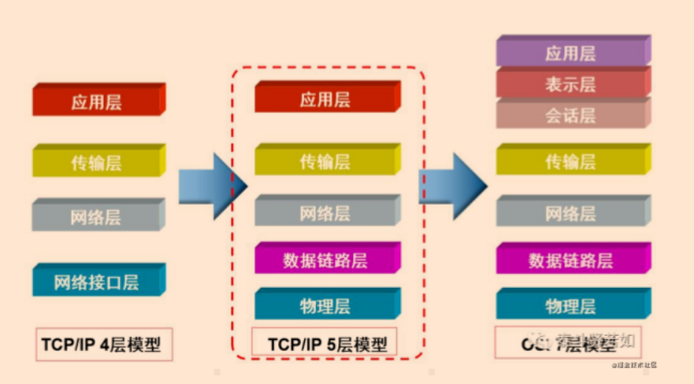

我们只需要弄明白 TCP / IP 五层协议 就能了解和明白计算机最底层的通信是怎么回事。

### TCP/IP五层协议

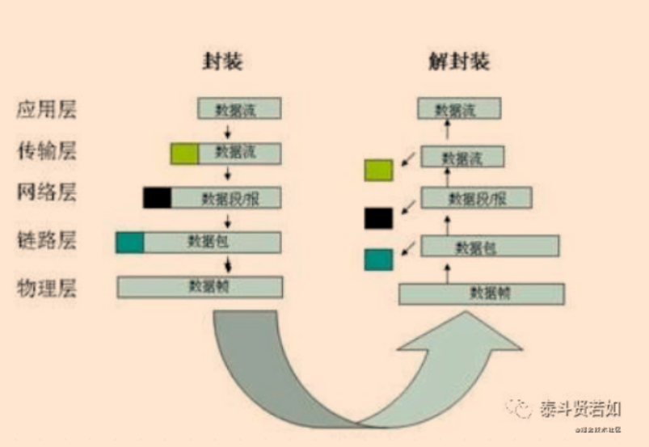

#### 物理层

物理层主要是由双绞线、光缆、电缆、无线电波组成，其作用很简单，就是连接不同的计算机，并传递底层电信号，高电压：1 ，低电压：0 。

#### 数据链路层

我们从物理层上接收或者发送单纯的 0 、 1 是没有意义的，为什么呢？想想哈，我想给女朋友发送一句话：“你好漂亮”，那我们要把“你好漂亮”转换成 01 之后，交给网卡，网卡就懵逼了，发给谁 ？？？不知道。那怎么办？必须要确定数据发给谁。就像我们的快递一样，是不是在外层包装上有商家地址和个人地址，这样我们不管是发还是收，都能准确定位了。网络传送数据也一样，我们就在数据前面加上目标地址，为了能接收到回信，也要把自己的地址也加上。但是，如果数据和地址放在一起，又乱了，比如，我给你一堆 01 ，1010101000101010101 ，你也分不清哪里是数据，哪里是地址。这时我们就要对要发送的 01 进行分组，规定前面 xxx 位是地址，后面 xxx 位是数据，并且，大家想互相都能通信，就必须都遵守这样的规则(协议)，这个协议叫以太网协议。在以太网协议出现之前，各个公司都有自己的分组规则，后来都统一使用以太网协议了。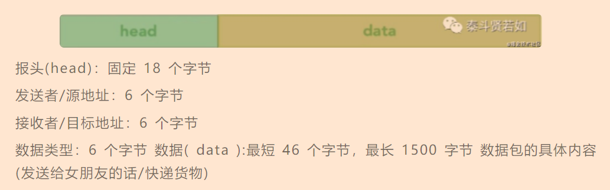以太网协议中的地址叫 `MAC 地址`， MAC 地址是每台计算机唯一的物理地址，是被写在网卡上的。以太网协议规定，每一台接收和发送数据的设备必须要装有网卡，负责发送和接收数据的设备，发送端和接收端的地址，指的就是网卡的地址，即 MAC 地址。

**交换机**

在这给大家介绍一个东西，我们说两个电脑要通信要先连根线，但是如果电脑多了之后，电脑间通信连的线也就多了，这样太乱了，我介绍的这个东西就是交换机，它是负责组件局域网，研究的是 MAC 地址，它有什么用你看下面图片中的接口就知道了

 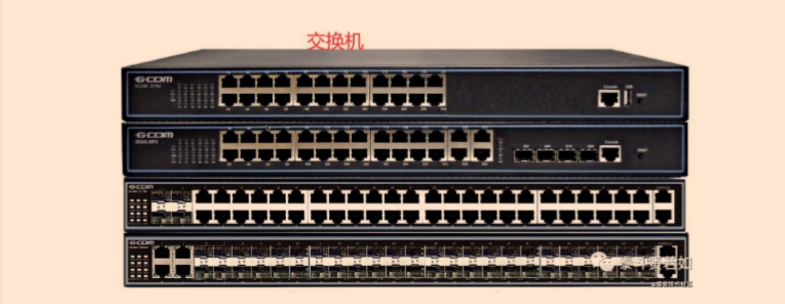

有了 MAC 地址，以太网就可以进行工作了.理论上讲，我们可以和世界上的每一台连接了互联网的计算机进行通信了，此时通信的方案是：广播

**广播**

广播又是怎么一回事？其实广播的方式很原始，基本通信就是靠吼。就像你想跟女朋友求婚一样，你会大喊：“ xxx ，嫁给我吧”，旁边能听到这句话的人有很多，但是只有你女朋友会回复你。其他人会把你当傻D一样看待。没错，广播就是这样进行通信的。首先组织好了一个数据包之后，把这个数据包通过电信号发出去，这时整个网络上所有的人都会收到你发的这条数据，然后看看这个数据是不是自己的。如果不是就当他不存在，如果是，就接收。虽然效率低点，但毕竟能通信了。

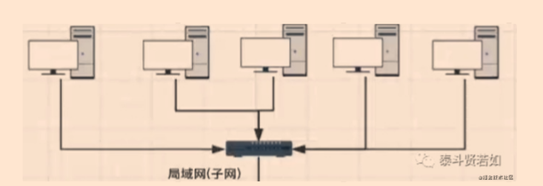

广播带来什么问题呢？如果是在一个小的网络环境里。比方说，你们宿舍几个人，一起玩 CS ，没问题，你喊一嗓子，你室友也能回应你，也就效率低点。但是如果你连接到全世界的互联网上，还使用广播的方式来通信，就不是效率问题了，而是一个巨大的通信灾难。全世界 60 多亿人，每个人吼一嗓子，每个人发送一条信息，那每个人都会收到 60 多亿条信息，网络瞬间瘫痪，这种问题被称为广播风暴，那如何解决呢？

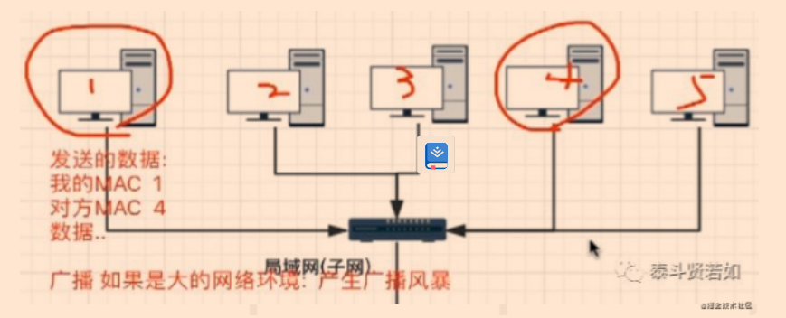

#### 网络层

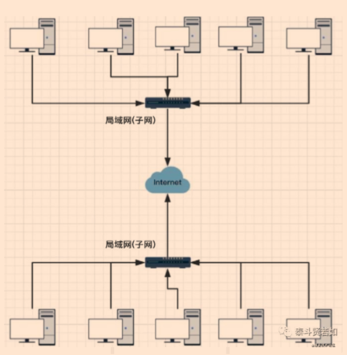

首先，我们要了解一个事情，世界大网络(广域网)是由一个一个的互相隔离的小型局域网(子网)组成的，不同的局域网之间使用路由来连接

##### 路由器

**`路由器`具有哪些属性？**

	*	路由器跟计算机一样内部拥有用于2张用于通信的网卡，WAN口 + LAN口
	*	具有各自的`MAC地址`

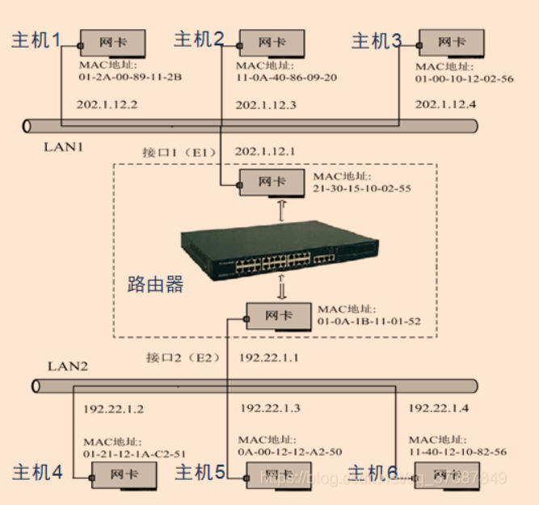

---

上面说的交换机是负责组建局域网，研究的是 MAC 地址，而路由器是负责组件广域网，研究的是 IP 地址，这个 IP 地址下面我再解释

[image-20220526125735716](计算机网络.assets/image-20220526125735716.png)

刚才说的广播，只能在一个局域网内进行通信，不可以在大网络上进行广播，有了路由器，就避免了广播风暴的问题。每个局域网被称为一个广播域，局域网和局域网之间使用路由的方式进行通信(向不同的广播域/子网发送数据包)，用路由器把一个局域 网里的所有计算机划分成一个个子网。

现在大家先想一想生活中，如果是之前说的广播，就相当于在一间教室里你正在上课，你要给某个女孩传纸条，那你要在纸条外面写上你和你要传的女孩的名字，再在里面写上你要写的话，写好后折起来，你和女孩的名字在外，内容在内，然后让同学一个一个帮你传，每个同学在传的时候都会看外面写的名字，如果不是他，就继续传，直到传到的人是你写的那个女孩为止。那这间教室就相当于一个局域网。好，现在我们要实现局域网和局域网之间的通信，比如此时位于青海的你要给河南的朋友送东西，你不可能用广播的方式了，你只能快递，这个青海和河南以及还有很多不同的省份是我国的土地划分中的一部分，每一个省也可以看作是一个个局域网，那在网络中，我国就相当于广域网，那不同的局域网是如何划分的呢？MAC 地址是没办法区分的，因为  MAC 地址上只有厂商的流水号，这就引出我要说的网络层，网络层引出了一套新的地址来区分不同的局域网/子网，这一套地址就是网络地址。

规定网络地址的协议叫 IP 协议，它定义的地址叫 IP 地址。其实跟我国的省份名差不多，继续说送快递，你要把送的东西包装好，在外面写上你自己的地址和省份地址，还有朋友的地址和省份地址，交给青海的快递公司，然后青海的快递公司转交给河南的快递公司，最后由河南的快递公司分配给你朋友，你朋友就收到快递了。在这有两点需要注意：

- 你要同时写两个地址，自己的地址( MAC 地址)和省份地址( IP 地址)，这样就能确定所要 接收和发送人的具体的位置了。
- 青海的快递公司和河南的快递公司就相当于路由器

##### 子网掩码

在这给大家普及一下子网掩码，我们上面说有了 IP 地址和 MAC 地址，我们就能让任何计算机之间进行通信了，那现在再想想，如果我要用我的计算机给另外一台计算机实现通信，我是不是要判断要通信的计算机是否和我的计算机在同一个 IP 地址中，相当于上面例子中我和我要送东西的朋友是否在一个省，这个时候就需要用子网掩码，我拿着我的 IP 地址和对方的子网掩码通过计算，判断是否在同一个 IP 地址下，如果在同一个IP 地址下，我可以用广播的形式进行通信，如果不在同一个 IP 地址下，我可以先把数据传给我方的路由器，再由我方的路由器把数据传给对方的路由器，最后由对方的路由器把数据传给要接收数据的计算机。这样说，再联系上面已经说过的，我想不难理解了。

> 子网掩码的核心作用就是：检查某个IP地址A , 是否与另一个已知IP处于同一个局域网内.
>
> 如果A地址的前32位，按位与子网掩码进行 & 与运算，

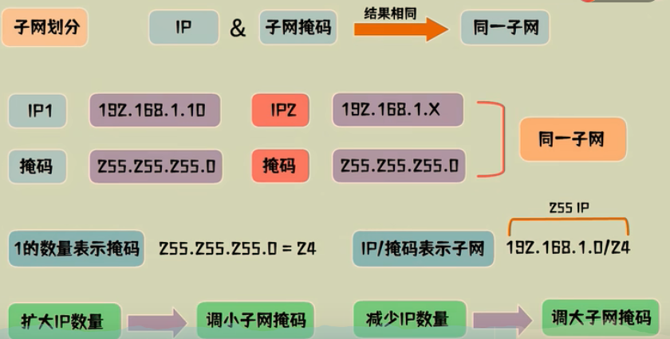

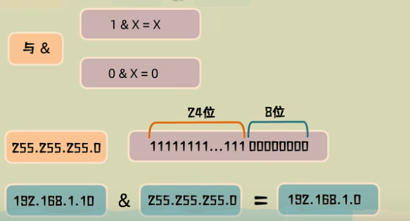

如果两个ip与`子网掩码`进行 `& `运算后，结果一样，则证明两个IP 同在一个`子网`当中

#####  IP地址

目前我们普遍使用的是 IPV4 ，它规定，一个网络地址由 32 位二进制组成，把 32 位平均分成四份，每一份  8 位， 8 位最大能表示的数据是 255 ，所以IP地址的范围：0.0.0.0255.255.255.255.

一个IP地址分为两部分，分别是网络位和主机位

网络位用来标识不同的子网主机位用来标识子网下主机的编号

为什么要分两部分呢？很简单，就好比你想写信给你的女朋友，假设你女朋友的地址是西宁市平安路128号，那么网络位就会直接找到西宁市，主机位帮你找到你的女朋友。

网络位和主机位是如何划分的？使用子网掩码来划分。子网掩码和IP地址差不多，都是由32位二进制数来表示，子网掩码也分为网络部分和主机部分，网络部分由1组成，主机部分由0组成。

那说了这么多，IP协议是如何发送数据的？协议规定，IP协议使用IP数据包进行发送 数据。IP数据包同样把数据分为了两部分，head和data，并且在发送数据的时候，直 接用IP数据包直接装载以太网的data部分。

head:长度为 20 到 600 字节

data:最长为 65515 字节

而以太网数据包的“数据”部分，最长只有 1500 字节，因此，如果IP数据包超过了 1500 字节，它就需要分割成几个以太网数据包，分开发送了。

再回顾一下啊，以太网的头是包含了自己的 MAC 地址和目标 MAC 地址的，那如何查 找目标 MAC 地址呢？前辈们弄了一个叫 ARP 协议的东西专门来解析目标 MAC 地址。它是如何工作的？首先，它是数据链路层的东西，在我们发送一个数据包的时候是包含着对方的 IP 地址的。例如我(172.13.4.58)想发送一条数据给女朋友(172.13.4.90),首 先，我得先拿到女朋友的MAC地址才可以通信。此时，我们会先计算一下我和女朋友 是否在一个子网内(子网掩码)

在一个子网内，直接广播发送一个数据包

子网内的计算机发现了这个包之后会返回一个数据包并且带有 MAC 地址，这样就通过 IP 地址找到了目标主机的 MAC 地址，接下来就可以进行数据传输了。

不在一个子网内，单纯的用广播就不行了，因为广播只是针对自己内网而言。那怎么办，此时会把数据包发给网关，由网关发给其它路由，这样在整个万维网里就可以找到你想要的那个计算机的 MAC 地址了。

---

#####  网关

**概念**：连接两个不同的网络的设备都可以叫做`网关`

- 路由器是一种设备
- 路由器可以实现网关的功能，但是路由器功能不仅仅是实现网关
- 网关可以由路由器实现，但是也不仅仅是由路由器实现

---

​	子网有什么意义呢？

​	在TCP/IP协议中，不同子网是不能直接通信的，如果要通信，需要通过网关来转发。

​	网关上有2张网卡，分别配置了属于两个`子网的IP地址`

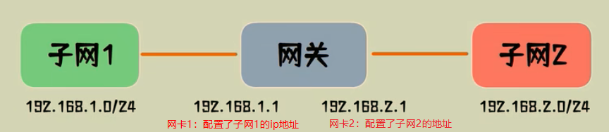

---

如果局域网内的计算机a，要发送数据，则先判断目标`目标ip`是否跟a属于同个子网

- 是，则直接从a的网卡发出

  

- 否，将数据包的目标mac改为网关mac发出

  - 网关 - 通过路由表查询 
  -  数据包属于子网2 （网关修改目标mac地址修改为计算机b的mac地址，修改源mac地址为自己的mac地址）
  - 最后数据从子网2的网卡发出

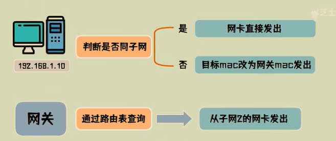

---

`什么是路由？`

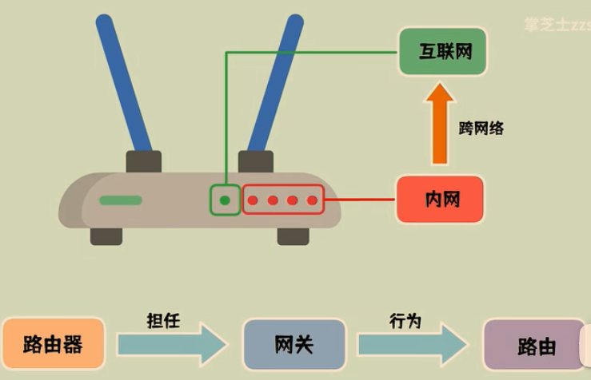

#####  默认网关

​	什么是`默认网关（IP层）`？

​	默认网关是局域网中每一台计算机都有的一个地址，这个地址的意义是用于当a要与b通信时，如果a与b不在一个局域网内的时候，那么a会将数据包发送给默认网关，由默认网关再转发到其他的子网

> [大白话带你重拾计算机网络](https://blog.csdn.net/agonie201218/article/details/112919887)

##### 总结

- ARP 就是通过 IP 地址来查找 MAC 地址的一套固定协议，它是数据链路层的内容。
- 网络层的意义：定义了子网， 区分各个局域网
- IP 地址：网络地址
- 子网掩码：计算是否是同一个子网

> 从节点角度看：
>
> ​	**计算机视角**
>
> - 首先我要知道我的 IP 以及对方的 IP
> - 通过子网掩码判断我们是否在同一个子网
> - 在同一个子网就通过 arp 获取对方 mac 地址直接扔出去
> - 不在同一个子网就通过 arp 获取默认网关的 mac 地址直接扔出去
>
> ---
>
> ​	**交换机视角：**
>
> - 我收到的数据包必须有目标 MAC 地址
>
> - 通过 MAC 地址表查映射关系
>
> - 查到了就按照映射关系从我的指定端口发出去
>
> - 查不到就所有端口都发出去
>
>   ---
>
>   **路由器视角：**
>
> - 我收到的数据包必须有目标 IP 地址
> - 通过路由表查映射关系
> - 查到了就按照映射关系从我的指定端口发出去（不在任何一个子网范围，走其路由器的默认网关也是查到了）
> - 查不到则返回一个路由不可达的数据包
>
> ---
>
> ​	**涉及到的三张表分别是**
>
> - 交换机中有 **MAC 地址**表用于映射 MAC 地址和它的端口
>
> - 路由器中有**路由表**用于映射 IP 地址(段)和它的端口
>
> - 电脑和路由器中都有** arp 缓存表**用于缓存 IP 和 MAC 地址的映射关系
>
>   **这三张表是怎么来的**
>
> - MAC 地址表是通过以太网内各节点之间不断通过交换机通信，不断完善起来的。
>
> - 路由表是各种路由算法 + 人工配置逐步完善起来的。
>
> - arp 缓存表是不断通过 arp 协议的请求逐步完善起来的。

网络层（IP协议）本身没有传输包的功能，包的实际传输是委托给数据链路层（以太网中的交换机）来实现的。

#### 传输层

到目前为止，前三层内容已经可以进行数据传输了。但是，我们的一台计算机上可以 一次性运行多个网络应用程序，比如， QQ 、微信 、 LOL 三个软件一起运行，都要进行网络传输，但是就前面学习的这三层内容，是没办法区分开数据是要发送给哪一个 软件的。那怎么办？引入第四层，传输层，传输层定义了端口的概念，每一个网络应 用程序占用一个网络端口，不同的程序就用端口把数据隔离，两两互相不影响。

- 端口：应用程序和网卡的关联编号
- 传输层：建立端口到端口的通信。
- 传输层有两种协议：TCP 和 UDP

##### TCP协议

TCP 协议：可靠传输， TCP 数据包没有长度限制，理论上可以无限长，但是为了保证网络的 效率，通常 TCP 数据包的长度不会超过 IP 数据包的长度，以确保单个 TCP 数据包不必再分割。

TCP 头放的主要是源端口和目标端口

##### UDP协议

UDP 协议：不可靠传输，“报头”部分一共只有 8 个字节，总长度不超过 65535 字节，正好放 进一个 IP 数据包。

其实和邮信是一样的，写好地址，写好接收人，直接装进信封里，丢进邮箱里就不用你管了，对方什么时候收，收没收到，你不知道。

#### 应用层

用户使用的都是应用程序，均工作于应用层，大家都可以开发自己的应用程序，数据多种多样，必须规定好数据的组织形式。对于用于而言最直观的就是应用层。

应用层：规定应用程序的数据格式

例：TCP 协议可以为各种各样的程序传递数据，比如 Email 、 WWW 、 FTP 等，那么， 必须有不同协议规定电子邮件、网页、 FTP 数据的格式，这些应用程序协议就构成了“应用层”。

##### 总结

以上是对TCP/IP5层协议的解读，总结一下：

发送数据其实就是一个封装数据的过程

最后从物理层发出，对方接收到了之后再自下而上一层一层打开拿到数据，以上内容就是一个网络传输的大致过程，其中还有好多细节没有阐述，但大家知道和了解以上内容，对开发而言足够了。

## 计算机网络应用篇

### 家庭网络如何通过路由器上网

不同家庭网络同一个服务器，为什么IP不会冲突

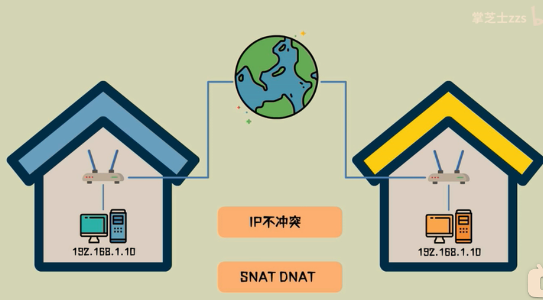

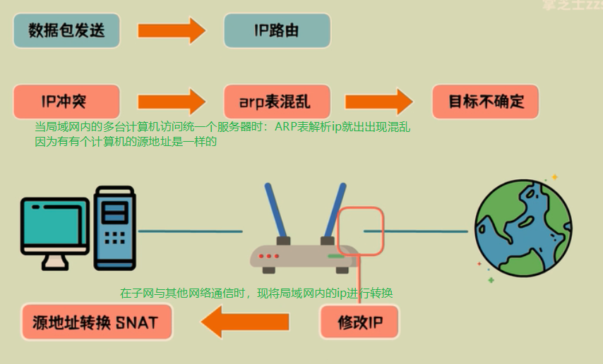

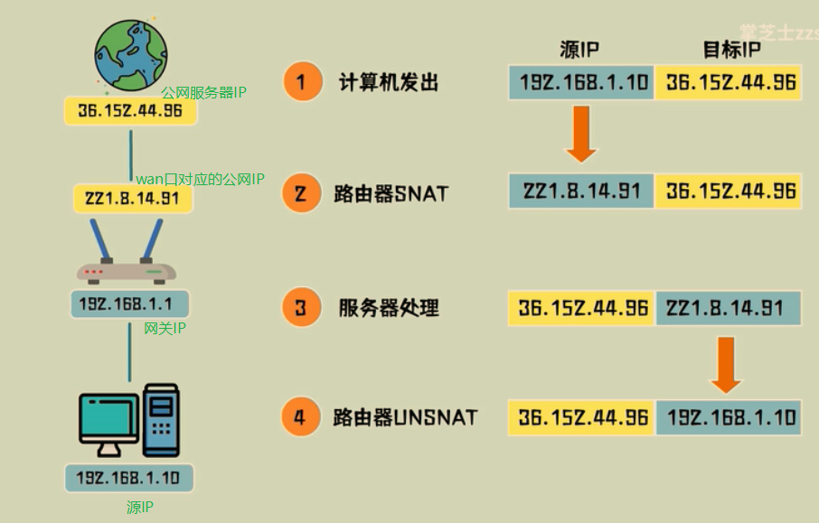

### SNAT 和 DNAT

NAT（Network Address Translation，网络地址转换）是将IP 数据包头中的IP 地址转换为另一个IP 地址的过程。

在实际应用中，NAT 主要用于实现私有网络访问公共网络的功能。这种通过使用少量的公有IP 地址代表较多的[私有IP](https://www.baidu.com/s?wd=私有IP&tn=44039180_cpr&fenlei=mv6quAkxTZn0IZRqIHckPjm4nH00T1Y4uHTYnywbPH6srjcYuWR40ZwV5Hcvrjm3rH6sPfKWUMw85HfYnjn4nH6sgvPsT6KdThsqpZwYTjCEQLGCpyw9Uz4Bmy-bIi4WUvYETgN-TLwGUv3En1ndPjm1rHcs) 地址的方式，将有助于减缓可用IP地址空间的枯竭

- DNAT Destination Network Address Translation 目的网络地址转换，

- SNAT Source Network Address Translation 源网络地址转换

其作用是将ip数据包的[源地址转换](https://www.baidu.com/s?wd=源地址转换&tn=44039180_cpr&fenlei=mv6quAkxTZn0IZRqIHckPjm4nH00T1Y4uHTYnywbPH6srjcYuWR40ZwV5Hcvrjm3rH6sPfKWUMw85HfYnjn4nH6sgvPsT6KdThsqpZwYTjCEQLGCpyw9Uz4Bmy-bIi4WUvYETgN-TLwGUv3En1ndPjm1rHcs)成另外一个地址，可能有人觉得奇怪，好好的为什么要进行[ip地址转换](https://www.baidu.com/s?wd=ip地址转换&tn=44039180_cpr&fenlei=mv6quAkxTZn0IZRqIHckPjm4nH00T1Y4uHTYnywbPH6srjcYuWR40ZwV5Hcvrjm3rH6sPfKWUMw85HfYnjn4nH6sgvPsT6KdThsqpZwYTjCEQLGCpyw9Uz4Bmy-bIi4WUvYETgN-TLwGUv3En1ndPjm1rHcs)啊，为了弄懂这个问题，我们要看一下局域网用户上公网的原理：

假设内网主机A（192.168.2.8）要和外网主机B（61.132.62.131）通信，A向B发出IP数据包，如果没有SNAT对A主机进行[源地址转换](https://www.baidu.com/s?wd=源地址转换&tn=44039180_cpr&fenlei=mv6quAkxTZn0IZRqIHckPjm4nH00T1Y4uHTYnywbPH6srjcYuWR40ZwV5Hcvrjm3rH6sPfKWUMw85HfYnjn4nH6sgvPsT6KdThsqpZwYTjCEQLGCpyw9Uz4Bmy-bIi4WUvYETgN-TLwGUv3En1ndPjm1rHcs)，A与B主机的通讯会不正常中断，因为当路由器将内网的数据包发到[公网IP](https://www.baidu.com/s?wd=公网IP&tn=44039180_cpr&fenlei=mv6quAkxTZn0IZRqIHckPjm4nH00T1Y4uHTYnywbPH6srjcYuWR40ZwV5Hcvrjm3rH6sPfKWUMw85HfYnjn4nH6sgvPsT6KdThsqpZwYTjCEQLGCpyw9Uz4Bmy-bIi4WUvYETgN-TLwGUv3En1ndPjm1rHcs)后，[公网IP](https://www.baidu.com/s?wd=公网IP&tn=44039180_cpr&fenlei=mv6quAkxTZn0IZRqIHckPjm4nH00T1Y4uHTYnywbPH6srjcYuWR40ZwV5Hcvrjm3rH6sPfKWUMw85HfYnjn4nH6sgvPsT6KdThsqpZwYTjCEQLGCpyw9Uz4Bmy-bIi4WUvYETgN-TLwGUv3En1ndPjm1rHcs)会给你的私网IP回数据包，这时，[公网IP](https://www.baidu.com/s?wd=公网IP&tn=44039180_cpr&fenlei=mv6quAkxTZn0IZRqIHckPjm4nH00T1Y4uHTYnywbPH6srjcYuWR40ZwV5Hcvrjm3rH6sPfKWUMw85HfYnjn4nH6sgvPsT6KdThsqpZwYTjCEQLGCpyw9Uz4Bmy-bIi4WUvYETgN-TLwGUv3En1ndPjm1rHcs)根本就无法知道你的私网IP应该如何走了。所以问它上一级路由器，当然这是肯定的，因为从公网上根本就无法看到私网IP，因此你无法给他通信。为了实现数据包的正确发送及返回，网关必须将A的址转换为一个合法的公网地址，同时为了以后B主机能将数据包发送给A，这个合法的公网地址必须是网关的外网地址，如果是其它公网地址的话，B会把数据包发送到其它网关，而不是A主机所在的网关，A将收不到B发过来的数据包，所以内网主机要上公网就必须要有合法的公网地址，而得到这个地址的方法就是让网关进行SNAT([源地址转换](https://www.baidu.com/s?wd=源地址转换&tn=44039180_cpr&fenlei=mv6quAkxTZn0IZRqIHckPjm4nH00T1Y4uHTYnywbPH6srjcYuWR40ZwV5Hcvrjm3rH6sPfKWUMw85HfYnjn4nH6sgvPsT6KdThsqpZwYTjCEQLGCpyw9Uz4Bmy-bIi4WUvYETgN-TLwGUv3En1ndPjm1rHcs)），将内网[地址转换](https://so.csdn.net/so/search?q=地址转换&spm=1001.2101.3001.7020)成公网址(一般是网关的外部地址），所以大家经常会看到为了让内网用户上公网，我们必须在routeros的firewall中设置snat，俗称[IP地址欺骗](https://www.baidu.com/s?wd=IP地址欺骗&tn=44039180_cpr&fenlei=mv6quAkxTZn0IZRqIHckPjm4nH00T1Y4uHTYnywbPH6srjcYuWR40ZwV5Hcvrjm3rH6sPfKWUMw85HfYnjn4nH6sgvPsT6KdThsqpZwYTjCEQLGCpyw9Uz4Bmy-bIi4WUvYETgN-TLwGUv3En1ndPjm1rHcs)或伪装（masquerade)

具体可`参考3.2`的模型图

文章参考来源：[万字大白话带你重拾计算机网络](https://blog.csdn.net/agonie201218/article/details/112919887)

